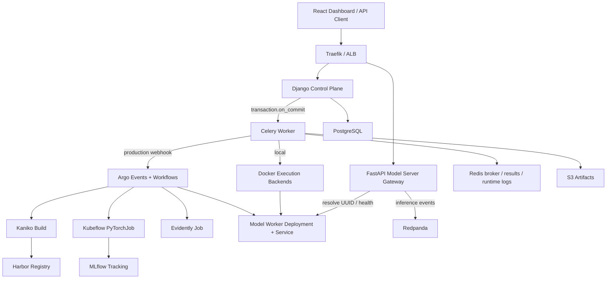
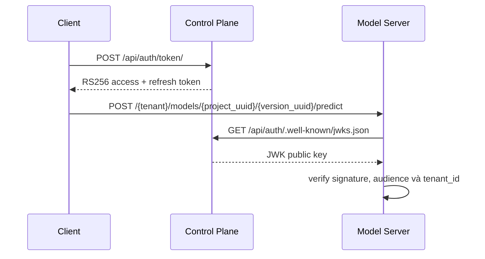
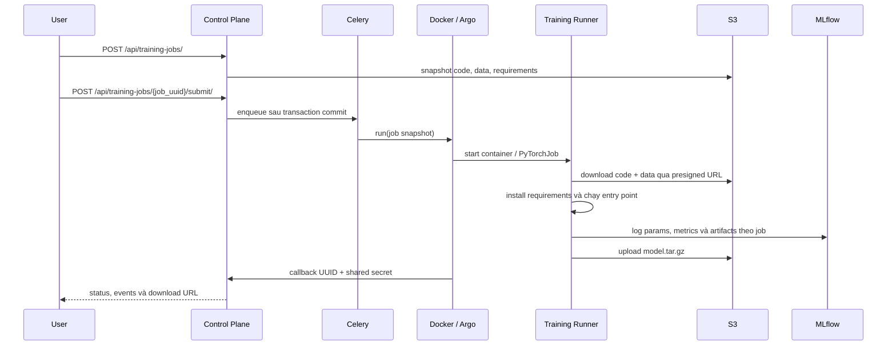
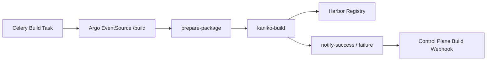
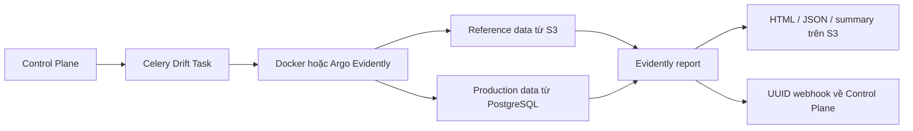
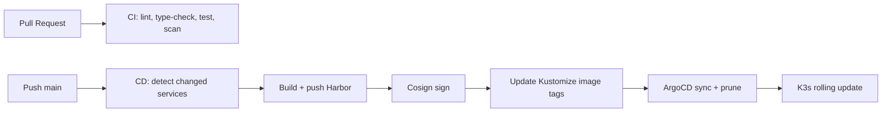

# Thiết kế Kiến trúc Hệ thống

Tài liệu này mô tả kiến trúc đang được triển khai trong repository. Các quyết định chi tiết của Control Plane được ghi tại [`docs/control-plane/`](docs/control-plane/) và [`docs/adr/`](docs/adr/); khi có khác biệt, mã nguồn và ADR đã được chấp nhận là nguồn sự thật.

---

## 1. Tổng quan

MLOps PaaS được chia thành hai mặt phẳng:

- **Control Plane**: Django REST Framework modular monolith quản lý identity, tenant, workspace, registry, training, build, deployment, drift và observability.
- **Data Plane**: các workload dài hạn chạy qua Docker ở local hoặc Argo Workflows/Kubeflow trên K3s production. Model inference đi qua model-server gateway trung tâm tới worker của từng version.



Control Plane không chạy workload dài trong HTTP worker. API chỉ validate command và commit trạng thái; Celery sở hữu background execution, retry và callback lifecycle.

---

## 2. Control Plane Modular Monolith

Mỗi Django app sở hữu bảng và write rules của capability tương ứng. Cross-domain read sử dụng selector; cross-domain write sử dụng service. API endpoint không gọi trực tiếp hạ tầng.

```text
HTTP request
  -> DRF endpoint + serializer
  -> selector / application service
  -> domain model + transaction
  -> transaction.on_commit
  -> Celery task
  -> execution backend
  -> Docker local hoặc Argo production
```

| App | Trách nhiệm | Entity chính |
| --- | --- | --- |
| `auth` | Identity, tenant, JWT, JWKS, OTP, OAuth, profile | `CustomUser`, `UserAvatar` |
| `access` | API key có thể scope theo project | `UserAPIKey` |
| `catalog` | Workspace mutable của model | `ModelProject`, `WorkspaceAsset` |
| `training` | Snapshot và một lần chạy training | `TrainingJob`, `TrainingJobEvent`, `TrainingOutput` |
| `registry` | Registry bất biến, artifact, metric, alias, lineage | `ModelVersion`, `ModelArtifact`, `ModelMetric`, `RegistryAlias`, `RegistryEvent` |
| `deployment` | Build image, rollout và runtime endpoint | `Build`, `Deployment`, `Endpoint` |
| `drift` | Cấu hình monitor và kết quả Evidently | `DriftMonitor`, `DriftRun` |
| `observability` | Health, model telemetry và transactional outbox | `EventOutbox` |

Mọi tài nguyên được expose ra ngoài dùng UUID `public_id`. Integer primary key chỉ tồn tại trong database và không xuất hiện trong URL hoặc S3 key.

### 2.1. API public

Các nhóm route hiện tại:

| Capability | Route gốc |
| --- | --- |
| Identity | `/api/auth/` |
| API keys | `/api/api-keys/` |
| Projects/workspace | `/api/models/` |
| Registry versions/aliases | `/api/registry/` |
| Training jobs | `/api/training-jobs/` |
| Builds | `/api/builds/` |
| Deployments | `/api/deployments/` |
| Endpoints | `/api/endpoints/` |
| Drift | `/api/drift-monitors/` |
| Model observability | `/api/observability/` |
| Operations | `/health/live`, `/health/ready`, `/health/metrics` |

API không có prefix `/v1` và không duy trì route alias legacy. Catalog đầy đủ nằm tại [`docs/control-plane/api-catalog.md`](docs/control-plane/api-catalog.md).

### 2.2. Authentication và tenant isolation

Control Plane phát hành access/refresh token RS256 qua `/api/auth/token/`. JWT chứa `tenant_id`, `audience=mlops-paas` và `kid`; public key được expose ở `/api/auth/.well-known/jwks.json`.



Model project có access mode. Gateway cho phép public access, project-scoped `X-API-Key`, hoặc Bearer JWT; tenant của credential phải khớp tenant sở hữu version. Tenant-facing ORM query bắt đầu từ selector đã scope theo user.

Internal callback sử dụng UUID URL và shared secret qua `X-Control-Plane-Secret` hoặc Bearer token. Callback terminal được xử lý idempotent.

---

## 3. Async Execution và Backend Selection

Redis là Celery broker/result backend. Service enqueue task bằng `transaction.on_commit`; task lock row cần thay đổi, lưu `celery_task_id`, retry lỗi kết nối tạm thời và cập nhật event/status trong transaction.

`EXECUTION_BACKEND` là cấu hình mặc định. Có thể override độc lập bằng:

- `BUILD_BACKEND`
- `DEPLOYMENT_BACKEND`
- `TRAINING_BACKEND`
- `DRIFT_BACKEND`

Giá trị hợp lệ là `docker` hoặc `argo`. Factory ánh xạ training `argo` sang workflow tạo Kubeflow workload; tên `kubeflow` cũ không còn là giá trị settings hợp lệ.

| Capability | Docker backend | Argo backend |
| --- | --- | --- |
| Build | Chạy `model-packager`, dùng Docker socket để build | Argo DAG chuẩn bị package, Kaniko build/push, callback |
| Training | Chạy `training-runner` container | Argo Workflow tạo Kubeflow `PyTorchJob` |
| Deployment | Tạo model worker container và health-check | Argo tạo Kubernetes Deployment/Service |
| Drift | Chạy Evidently container | Argo chạy Evidently Workflow |

---

## 4. Model Workspace, Training và Registry

### 4.1. S3 layout

```text
users/{tenant_id}/models/{project_uuid}/
├── code/                                  # Source editable mới nhất
├── data/                                  # Dataset editable mới nhất
├── training/jobs/{job_uuid}/
│   ├── input/code/source.zip              # Snapshot bất biến
│   ├── input/data/train.csv               # Snapshot bất biến
│   ├── output/model.tar.gz                 # Output của trainer
│   └── mlflow/                             # Artifact MLflow theo job
├── versions/{version_uuid}/artifacts/      # Artifact registry/build bất biến
└── drift/{monitor_uuid}/{run_uuid}/        # HTML, JSON và summary report
```

Không có global MLflow artifact root và không đặt editable code/data dưới version. Khi đăng ký output training, Control Plane ánh xạ snapshot và artifact của job vào metadata của immutable `ModelVersion` thay vì di chuyển workspace mutable.

### 4.2. Training flow



Training runner xuất `_mlops/` metadata bundle gồm stdout/stderr, metrics, params, warnings, model insights, artifact manifest và training summary. GPU job có resource selector/toleration để Karpenter cấp node phù hợp; tenant quota và multi-framework TFJob/XGBoostJob/MPIJob chưa được triển khai.

### 4.3. Registry flow

`ModelVersion` được tạo từ upload hoặc `TrainingOutput`, giữ requirements snapshot và lineage. Artifact, metric và event là dữ liệu thuộc version; alias trỏ tới version để hỗ trợ promotion/rollback mà không sửa version bất biến. Smoke test và alias prediction chỉ resolve endpoint khỏe mạnh thuộc đúng tenant.

---

## 5. Build, Deployment và Inference

### 5.1. Build

Local backend chạy image `mlops-paas-model-packager`; production backend gửi `/build` event vào Argo. Production pipeline:



Packager chọn base runtime theo flavor/model type: FastAPI runtime cho ML truyền thống và BentoML runtime cho deep learning. Artifact được đưa vào image để worker không cần tải model từ S3 khi khởi động.

### 5.2. Deployment và gateway trung tâm

Mỗi deployment tạo runtime worker riêng, nhưng **không tạo ingress riêng cho từng model**. Traefik có ingress dùng chung, rewrite public path vào model-server gateway:

```text
/{tenant_id}/models/{project_uuid}/{version_uuid}/predict
/{tenant_id}/models/{project_uuid}/{version_uuid}/health
                      │
                      ▼ rewrite
          /models/{version_uuid}/{action}
                      │
                      ▼
       model-server gateway -> healthy worker Service
```

Gateway đọc registry/deployment metadata, kiểm tra access mode/JWT/API key, resolve worker URL, forward payload và ghi prediction event sang Redpanda. Nó expose Prometheus counters/histograms theo tenant, model và status. Control Plane cũng có alias prediction route cho registry aliases.

---

## 6. Drift và Observability

Gateway gửi feature/prediction event tới topic Redpanda. Consumer ghi production data vào PostgreSQL. Một `DriftMonitor` liên kết model version và reference workspace asset; mỗi request tạo một `DriftRun` bất biến.



Hiện hệ thống cung cấp data drift, gateway traffic metrics, endpoint health và resource query qua Prometheus. Prediction drift chuẩn hóa, ground-truth feedback, quality metrics theo thời gian, GPU/DCGM metrics và frontend time-series dashboard vẫn là phần mở rộng tiếp theo.

Transactional `EventOutbox` lưu domain event trong cùng transaction và Celery publisher chuyển event pending sang Redpanda, tránh phát event trước khi database commit.

---

## 7. Database và State Ownership

```text
PostgreSQL
├── schema control_plane
│   ├── auth_*             # user/tenant/profile
│   ├── access_*           # API keys
│   ├── catalog_*          # projects/workspace assets
│   ├── training_*         # jobs/events/outputs
│   ├── registry_*         # versions/artifacts/metrics/aliases/events
│   ├── deployment_*       # builds/deployments/endpoints
│   ├── drift_*            # monitors/runs
│   └── observability_*    # event outbox
├── schema mlflow          # MLflow tracking metadata
└── production inference data do consumer quản lý
```

CloudNativePG cung cấp PostgreSQL trên production; Docker Compose dùng PostgreSQL 15 đơn node cho local. S3 là durable artifact store, PostgreSQL là domain state, Redis không phải nguồn sự thật cho lifecycle.

---

## 8. Hạ tầng Production

Terraform tạo các module:

- VPC, public/private subnets, IGW và NAT tùy feature flag.
- EC2 k3s master/worker, security groups và ALB.
- S3 artifact bucket.
- IAM cho worker, GitHub Actions OIDC và Karpenter.
- ACM/DNS và AWS Secrets Manager tùy feature flag.
- SQS interruption queue và EventBridge rules cho Karpenter.

Ansible cài common packages, k3s master/worker, Helm và platform add-ons. Root Kustomization triển khai CloudNativePG, Redis, Redpanda, ESO, storage, health, monitoring, Argo Workflows, MLflow, application overlay và Karpenter. Kubeflow Training Operator, ArgoCD, ESO, KEDA và các operator khác được bootstrap bằng scripts/Ansible trước GitOps sync.

AWS Secrets Manager được External Secrets Operator đồng bộ thành Kubernetes Secrets. Production workload dùng IAM role; local có thể dùng credentials trong `.env`, nhưng secret không được commit vào Git.

---

## 9. CI/CD và GitOps



CI kiểm tra frontend lint/build, backend Ruff/mypy/Django/pytest, Kustomize/Kubeconform, secret scanning và Trivy image scan. CD sử dụng GitHub OIDC để đọc deployment credentials từ AWS Secrets Manager, build các service thay đổi và tạo GitOps promotion PR.

---

## 10. Quy tắc phát triển kiến trúc

1. API public chỉ dùng UUID và phải validate tenant ownership.
2. Endpoint chỉ gọi serializer, selector và application service; không gọi trực tiếp Docker/S3/Argo.
3. Tác vụ dài phải chạy qua Celery, không tạo thread hoặc block HTTP worker.
4. Enqueue chỉ sau database commit; callback phải idempotent.
5. Workspace mutable thuộc project; job/version giữ snapshot bất biến.
6. Thêm execution engine mới bằng backend contract, không rẽ nhánh logic trong API.
7. Model worker không có public ingress riêng; inference đi qua gateway trung tâm.
8. PostgreSQL và S3 là nguồn sự thật; Redis dùng cho broker, result và runtime stream.

Xem thêm:

- [`docs/control-plane/architecture.md`](docs/control-plane/architecture.md)
- [`docs/control-plane/api-catalog.md`](docs/control-plane/api-catalog.md)
- [`docs/control-plane/webhooks.md`](docs/control-plane/webhooks.md)
- [`docs/control-plane/runbook.md`](docs/control-plane/runbook.md)
- [`docs/adr/`](docs/adr/)
