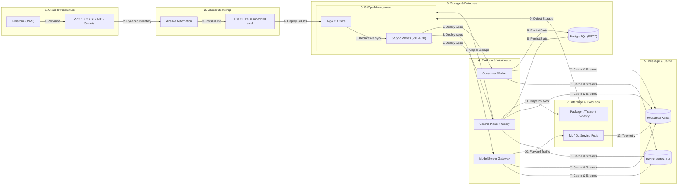
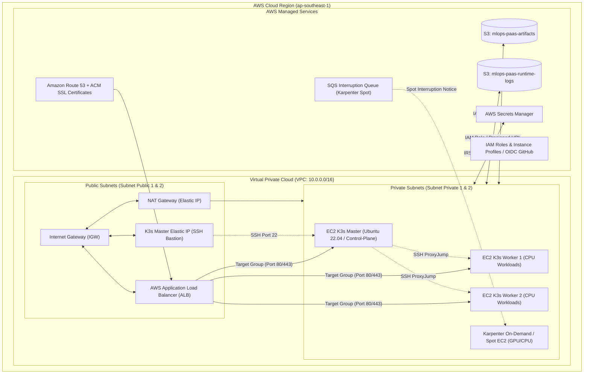
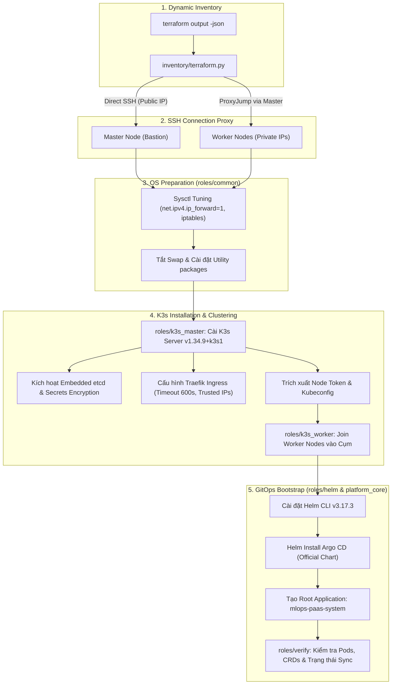
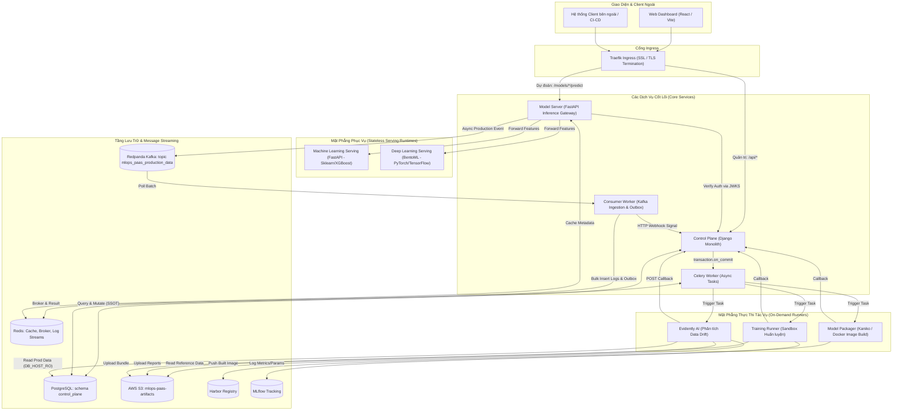
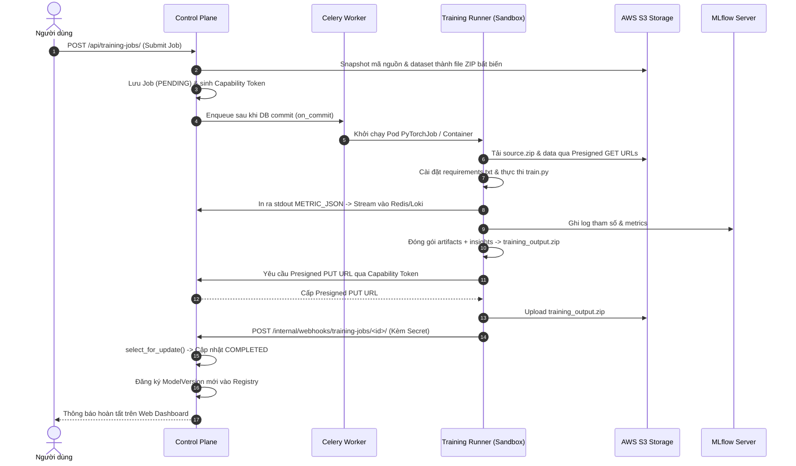
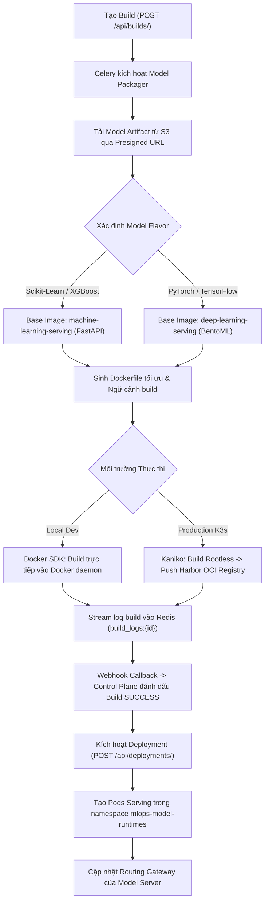
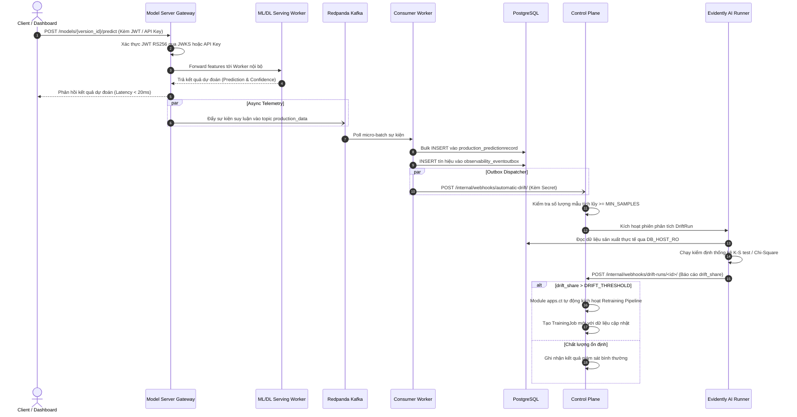

# Kiến Trúc Hệ Thống — MLOps PaaS

Tài liệu này trực quan hóa toàn bộ kiến trúc nền tảng **MLOps PaaS** thông qua các sơ đồ luồng (**Diagram-First**), đi từ tầng hạ tầng đám mây (Cloud IaaS), cài đặt cụm (Bootstrap), điều phối GitOps (Kubernetes/Argo CD) đến các ứng dụng vi dịch vụ (Application Microservices) và vòng đời dữ liệu.

---

## 1. Kiến Trúc Luồng Tổng Quan End-to-End

Sơ đồ thể hiện chuỗi liên kết toàn diện từ lúc khởi tạo hạ tầng đám mây đến khi phục vụ mô hình và tự động hóa tái huấn luyện:

```mermaid
flowchart LR
    subgraph S1["1. Cloud Infrastructure"]
        TF["Terraform (AWS)"]
        AWS_RES["VPC / EC2 / S3 / ALB / Secrets"]
    end

    subgraph S2["2. Cluster Bootstrap"]
        ANSIBLE["Ansible Automation"]
        K3S["K3s Cluster (Embedded etcd)"]
    end

    subgraph S3["3. GitOps Management"]
        ARGOCD["Argo CD Core"]
        WAVES["5 Sync Waves (-50 -> 20)"]
    end

    subgraph S4["4. Platform & Workloads"]
        CP["Control Plane + Celery"]
        GW["Model Server Gateway"]
        CS["Consumer Worker"]
    end

    subgraph S5["5. Message & Cache"]
        REDIS[("Redis Sentinel HA")]
        REDPANDA[("Redpanda Kafka")]
    end

    subgraph S6["6. Storage & Database"]
        PG[("PostgreSQL (SSOT)")]
        S3[("AWS S3 Artifacts")]
    end

    subgraph S7["7. Inference & Execution"]
        RUNTIMES["ML / DL Serving Pods"]
        WORKLOADS["Packager / Trainer / Evidently"]
    end

    %% Flow connections
    TF -->|"1. Provision"| AWS_RES
    AWS_RES -->|"2. Dynamic Inventory"| ANSIBLE
    ANSIBLE -->|"3. Install & Init"| K3S
    K3S -->|"4. Deploy GitOps"| ARGOCD
    ARGOCD -->|"5. Declarative Sync"| WAVES
    WAVES -->|"6. Deploy Apps"| CP & GW & CS
    CP & GW & CS -->|"7. Cache & Streams"| REDIS & REDPANDA
    CP & CS -->|"8. Persist State"| PG
    CP & WORKLOADS -->|"9. Object Storage"| S3
    GW -->|"10. Forward Traffic"| RUNTIMES
    CP -->|"11. Dispatch Work"| WORKLOADS
    RUNTIMES -->|"12. Telemetry"| REDPANDA
```

---

## 2. Tầng 1: Cloud Infrastructure (Terraform + AWS)

Tầng hạ tầng IaaS trên AWS được quản lý 100% bằng mã (Infrastructure as Code) thông qua Terraform:

```mermaid
flowchart TB
    subgraph AWS_CLOUD["AWS Cloud Region (ap-southeast-1)"]
        subgraph VPC["Virtual Private Cloud (VPC: 10.0.0.0/16)"]
            
            subgraph PUB_SUBNETS["Public Subnets (Subnet Public 1 & 2)"]
                IGW["Internet Gateway (IGW)"]
                ALB["AWS Application Load Balancer (ALB)"]
                NAT["NAT Gateway (Elastic IP)"]
                MASTER_IP["K3s Master Elastic IP (SSH Bastion)"]
            end

            subgraph PRIV_SUBNETS["Private Subnets (Subnet Private 1 & 2)"]
                MASTER["EC2 K3s Master (Ubuntu 22.04 / Control-Plane)"]
                WORKER1["EC2 K3s Worker 1 (CPU Workloads)"]
                WORKER2["EC2 K3s Worker 2 (CPU Workloads)"]
                KARPENTER_POOL["Karpenter On-Demand / Spot EC2 (GPU/CPU)"]
            end
        end

        subgraph MANAGED_SERVICES["AWS Managed Services"]
            S3_ARTIFACTS[("S3: mlops-paas-artifacts")]
            S3_LOGS[("S3: mlops-paas-runtime-logs")]
            SECRETS["AWS Secrets Manager"]
            IAM["IAM Roles & Instance Profiles / OIDC GitHub"]
            DNS["Amazon Route 53 + ACM SSL Certificates"]
            SQS["SQS Interruption Queue (Karpenter Spot)"]
        end
    end

    %% Networking
    IGW <--> ALB & NAT & MASTER_IP
    NAT --> PRIV_SUBNETS
    ALB -->|"Target Group (Port 80/443)"| MASTER & WORKER1 & WORKER2
    MASTER_IP -.->|"SSH Port 22"| MASTER
    MASTER -.->|"SSH ProxyJump"| WORKER1 & WORKER2

    %% Storage & Secrets
    PRIV_SUBNETS <-->|"IAM Role / Presigned URL"| S3_ARTIFACTS & S3_LOGS
    PRIV_SUBNETS <-->|"IRSA / External Secrets"| SECRETS
    DNS --> ALB
    SQS -.->|"Spot Interruption Notice"| KARPENTER_POOL
```

### Điểm nhấn kiến trúc:
- **Phân tách mạng:** Master/Worker nằm hoàn toàn trong Private Subnet (chỉ mở cổng qua ALB hoặc SSH ProxyJump qua Master).
- **Lưu trữ nhị phân:** S3 quản lý toàn bộ model artifacts, logs thực thi dài hạn với cơ chế `force_destroy`.
- **Đàn hồi tính toán:** Karpenter quản lý việc tự động cấp phát các node EC2 GPU (Spot/On-Demand) theo thời gian thực khi có bài toán huấn luyện phát sinh.

---

## 3. Tầng 2: Cluster Bootstrap (Ansible)

Ansible đóng vai trò cầu nối chuyển giao hạ tầng, tiếp nhận thông tin từ Terraform để chuẩn hóa máy chủ và khởi tạo cụm K3s:

```mermaid
flowchart TD
    subgraph INVENTORY["1. Dynamic Inventory"]
        TF_OUT["terraform output -json"]
        DYN_SCRIPT["inventory/terraform.py"]
        TF_OUT --> DYN_SCRIPT
    end

    subgraph PROXY["2. SSH Connection Proxy"]
        DYN_SCRIPT -->|"Direct SSH (Public IP)"| SSH_MASTER["Master Node (Bastion)"]
        DYN_SCRIPT -->|"ProxyJump via Master"| SSH_WORKERS["Worker Nodes (Private IPs)"]
    end

    subgraph OS_PREP["3. OS Preparation (roles/common)"]
        SSH_MASTER & SSH_WORKERS --> SYSCTL["Sysctl Tuning (net.ipv4.ip_forward=1, iptables)"]
        SYSCTL --> SWAP["Tắt Swap & Cài đặt Utility packages"]
    end

    subgraph K3S_INIT["4. K3s Installation & Clustering"]
        SWAP --> K3S_SERVER["roles/k3s_master: Cài K3s Server v1.34.9+k3s1"]
        K3S_SERVER --> ETCD["Kích hoạt Embedded etcd & Secrets Encryption"]
        K3S_SERVER --> TRAEFIK["Cấu hình Traefik Ingress (Timeout 600s, Trusted IPs)"]
        K3S_SERVER --> TOKEN["Trích xuất Node Token & Kubeconfig"]
        TOKEN --> K3S_AGENT["roles/k3s_worker: Join Worker Nodes vào Cụm"]
    end

    subgraph GITOPS_CORE["5. GitOps Bootstrap (roles/helm & platform_core)"]
        K3S_AGENT --> HELM["Cài đặt Helm CLI v3.17.3"]
        HELM --> ARGOCD_INSTALL["Helm Install Argo CD (Official Chart)"]
        ARGOCD_INSTALL --> ROOT_APP["Tạo Root Application: mlops-paas-system"]
        ROOT_APP --> VERIFY["roles/verify: Kiểm tra Pods, CRDs & Trạng thái Sync"]
    end
```

### Điểm nhấn kiến trúc:
- **Zero Hardcoded IPs:** `terraform.py` tự động đọc cấu trúc hạ tầng từ Terraform state.
- **Embedded etcd:** Tối ưu hóa kiến trúc không cần cụm etcd rời rạc, hỗ trợ snapshot tự động.
- **GitOps Handoff:** Sau khi Ansible cài xong Argo CD và apply Root Application, toàn bộ quyền quản trị vòng đời ứng dụng được bàn giao cho GitOps.

---

## 4. Tầng 3: Cluster & GitOps (Kubernetes K3s + Argo CD)

Hệ thống ứng dụng mô hình **Application-of-Applications** với **5 Mặt phẳng Đồng bộ (5 System Planes)** được kiểm soát bằng Argo CD Sync Waves:

```mermaid
flowchart TB
    subgraph ARGOCD_ROOT["Argo CD Core (Root App: mlops-paas-system)"]
        ROOT["Application of Applications Pattern"]
    end

    subgraph PLANE_CLUSTER["Plane 1: Cluster Plane (Sync Wave: -50)"]
        NS["Namespaces: mlops-system, mlops-control-plane, mlops-model-runtimes,..."]
        CRD["Core CRDs & PriorityClasses"]
    end

    subgraph PLANE_ADDONS["Plane 2: Addons Plane (Sync Wave: -40 -> -31)"]
        TRAEFIK_ING["Traefik Ingress Controller"]
        CNPG["CloudNativePG Operator (PostgreSQL HA)"]
        REDIS_OP["Redis Operator (Redis Sentinel HA)"]
        REDPANDA_OP["Redpanda Operator (Kafka Stream)"]
        ESO["External Secrets Operator (ESO)"]
        LOKI_ALLOY["Loki (Storage) + Alloy (Log Collector)"]
        PROM_GRAF["Kube-Prometheus-Stack (Prometheus + Grafana)"]
        HARBOR["Harbor OCI Registry"]
    end

    subgraph PLANE_PLATFORM["Plane 3: Platform Plane (Sync Wave: -30 -> -21)"]
        SEC_STORE["SecretStores (Kết nối AWS Secrets Manager)"]
        CERT_MGR["Cert-Manager (Tự động cấp phát TLS/SSL)"]
        KYVERNO["Kyverno Policy Engine (Xác thực Cosign Image)"]
    end

    subgraph PLANE_EXECUTION["Plane 4: Execution Plane (Sync Wave: -20 -> -11)"]
        ARGO_WORKFLOWS["Argo Workflows Controller"]
        ARGO_EVENTS["Argo Events (EventSource & Sensors)"]
        KUBEFLOW["Kubeflow Training Operator (PyTorchJob)"]
        KARPENTER["Karpenter (GPU Node Autoscaler)"]
        KEDA["KEDA (Event-driven Autoscaler)"]
    end

    subgraph PLANE_WORKLOADS["Plane 5: Workloads Plane (Sync Wave: 0 -> 20)"]
        MIGRATION["Job: DB Migration (Wave 0)"]
        CP_APP["Deployment: Control Plane & Celery (Wave 10)"]
        MS_APP["Deployment: Model Server Gateway (Wave 10)"]
        CS_APP["Deployment: Consumer Worker (Wave 10)"]
        MLFLOW_APP["Deployment: MLflow Tracking Server (Wave 10)"]
        WEB_APP["Deployment: Web Dashboard Frontend (Wave 20)"]
    end

    %% Dependencies
    ROOT --> PLANE_CLUSTER
    PLANE_CLUSTER --> PLANE_ADDONS
    PLANE_ADDONS --> PLANE_PLATFORM
    PLANE_PLATFORM --> PLANE_EXECUTION
    PLANE_EXECUTION --> PLANE_WORKLOADS
```

### Thứ tự Sync Waves:
1. **Wave -50:** Tạo Namespace và CRD nền móng.
2. **Wave -40 đến -31:** Cài đặt các toán tử hạ tầng (Database, Broker, Cache, Ingress, Observability).
3. **Wave -30 đến -21:** Thiết lập cơ chế bảo mật (External Secrets, Certs, Kyverno Policies).
4. **Wave -20 đến -11:** Khởi tạo động cơ thực thi tác vụ (Argo, Kubeflow, Karpenter).
5. **Wave 0 đến 20:** Chạy migration database, khởi động Control Plane, Model Server, Consumer và Frontend.

---

## 5. Tầng 4: Application & Data Flow (Microservices Architecture)

Sơ đồ chi tiết tương tác nghiệp vụ giữa các vi dịch vụ và các kho dữ liệu:

```mermaid
flowchart TB
    subgraph CLIENTS["Giao Diện & Client Ngoài"]
        UI["Web Dashboard (React / Vite)"]
        EXT_API["Hệ thống Client bên ngoài / CI-CD"]
    end

    subgraph INGRESS["Cổng Ingress"]
        ING["Traefik Ingress (SSL / TLS Termination)"]
    end

    subgraph CORE_SERVICES["Các Dịch Vụ Cốt Lõi (Core Services)"]
        CP["Control Plane (Django Monolith)"]
        CELERY["Celery Worker (Async Tasks)"]
        MS["Model Server (FastAPI Inference Gateway)"]
        CS["Consumer Worker (Kafka Ingestion & Outbox)"]
    end

    subgraph SERVING_WORKERS["Mặt Phẳng Phục Vụ (Stateless Serving Runtimes)"]
        ML_SERVING["Machine Learning Serving (FastAPI - Sklearn/XGBoost)"]
        DL_SERVING["Deep Learning Serving (BentoML - PyTorch/TensorFlow)"]
    end

    subgraph EXECUTION_WORKERS["Mặt Phẳng Thực Thi Tác Vụ (On-Demand Runners)"]
        PACKAGER["Model Packager (Kaniko / Docker Image Build)"]
        TRAINER["Training Runner (Sandbox Huấn luyện)"]
        EVIDENTLY["Evidently AI (Phân tích Data Drift)"]
    end

    subgraph DATA_STORES["Tầng Lưu Trữ & Message Streaming"]
        PG[("PostgreSQL: schema control_plane")]
        REDIS[("Redis: Cache, Broker, Log Streams")]
        REDPANDA[("Redpanda Kafka: topic mlops_paas_production_data")]
        S3[("AWS S3: mlops-paas-artifacts")]
        HARBOR[("Harbor Registry")]
        MLFLOW[("MLflow Tracking")]
    end

    %% Client Traffic
    UI & EXT_API --> ING
    ING -->|"Quản trị: /api/*"| CP
    ING -->|"Dự đoán: /models/*/predict"| MS

    %% Control Plane & Celery
    CP <-->|"Query & Mutate (SSOT)"| PG
    CP -->|"transaction.on_commit"| CELERY
    CELERY <-->|"Broker & Result"| REDIS
    CELERY -->|"Trigger Task"| PACKAGER & TRAINER & EVIDENTLY

    %% Serving Traffic
    MS -->|"Verify Auth via JWKS"| CP
    MS <-->|"Cache Metadata"| REDIS
    MS -->|"Forward Features"| ML_SERVING & DL_SERVING
    MS -->|"Async Production Event"| REDPANDA

    %% Consumer & Drift Loop
    REDPANDA -->|"Poll Batch"| CS
    CS -->|"Bulk Insert Logs & Outbox"| PG
    CS -->|"HTTP Webhook Signal"| CP
    EVIDENTLY -->|"Read Prod Data (DB_HOST_RO)"| PG
    EVIDENTLY -->|"Read Reference Data"| S3
    EVIDENTLY -->|"Upload Reports"| S3
    EVIDENTLY -->|"POST Callback"| CP

    %% Execution outputs
    PACKAGER -->|"Push Built Image"| HARBOR
    TRAINER -->|"Log Metrics/Params"| MLFLOW
    TRAINER -->|"Upload Bundle"| S3
    PACKAGER & TRAINER -->|"Callback"| CP
```

---

## 6. Các Luồng Vòng Đời Trọng Yếu (Critical Operational Lifecycles)

### 6.1. Vòng Đời Huấn Luyện An Toàn (Training Lifecycle)

Mã nguồn huấn luyện người dùng được xem là **Untrusted Workload** và được thực thi trong Sandbox:

```mermaid
sequenceDiagram
    autonumber
    actor User as Người dùng
    participant CP as Control Plane
    participant Celery as Celery Worker
    participant Runner as Training Runner (Sandbox)
    participant S3 as AWS S3 Storage
    participant MLflow as MLflow Server

    User->>CP: POST /api/training-jobs/ (Submit Job)
    CP->>S3: Snapshot mã nguồn & dataset thành file ZIP bất biến
    CP->>CP: Lưu Job (PENDING) & sinh Capability Token
    CP->>Celery: Enqueue sau khi DB commit (on_commit)
    Celery->>Runner: Khởi chạy Pod PyTorchJob / Container
    Runner->>S3: Tải source.zip & data qua Presigned GET URLs
    Runner->>Runner: Cài đặt requirements.txt & thực thi train.py
    Runner->>CP: In ra stdout METRIC_JSON -> Stream vào Redis/Loki
    Runner->>MLflow: Ghi log tham số & metrics
    Runner->>Runner: Đóng gói artifacts + insights -> training_output.zip
    Runner->>CP: Yêu cầu Presigned PUT URL qua Capability Token
    CP-->>Runner: Cấp Presigned PUT URL
    Runner->>S3: Upload training_output.zip
    Runner->>CP: POST /internal/webhooks/training-jobs/<id>/ (Kèm Secret)
    CP->>CP: select_for_update() -> Cập nhật COMPLETED
    CP->>CP: Đăng ký ModelVersion mới vào Registry
    CP-->>User: Thông báo hoàn tất trên Web Dashboard
```

---

### 6.2. Vòng Đời Đóng Gói & Triển Khai (Build & Deploy Lifecycle)

Quy trình tự động hóa biến artifact mô hình thành container phục vụ chuẩn OCI:

```mermaid
flowchart TD
    A["Tạo Build (POST /api/builds/)"] --> B["Celery kích hoạt Model Packager"]
    B --> C["Tải Model Artifact từ S3 qua Presigned URL"]
    C --> D{"Xác định Model Flavor"}
    
    D -->|"Scikit-Learn / XGBoost"| E1["Base Image: machine-learning-serving (FastAPI)"]
    D -->|"PyTorch / TensorFlow"| E2["Base Image: deep-learning-serving (BentoML)"]
    
    E1 & E2 --> F["Sinh Dockerfile tối ưu & Ngữ cảnh build"]
    F --> G{"Môi trường Thực thi"}
    
    G -->|"Local Dev"| H1["Docker SDK: Build trực tiếp vào Docker daemon"]
    G -->|"Production K3s"| H2["Kaniko: Build Rootless -> Push Harbor OCI Registry"]
    
    H1 & H2 --> I["Stream log build vào Redis (build_logs:{id})"]
    I --> J["Webhook Callback -> Control Plane đánh dấu Build SUCCESS"]
    J --> K["Kích hoạt Deployment (POST /api/deployments/)"]
    K --> L["Tạo Pods Serving trong namespace mlops-model-runtimes"]
    L --> M["Cập nhật Routing Gateway của Model Server"]
```

---

### 6.3. Vòng Lặp Suy Luận, Giám Sát Drift & Tự Động Hóa CT (Continuous Training Loop)

Vòng lặp tự động hóa khép kín bảo vệ chất lượng mô hình sau triển khai:

```mermaid
sequenceDiagram
    autonumber
    actor Client as Client / Dashboard
    participant MS as Model Server Gateway
    participant Serving as ML/DL Serving Worker
    participant Kafka as Redpanda Kafka
    participant Consumer as Consumer Worker
    participant DB as PostgreSQL
    participant CP as Control Plane
    participant Evidently as Evidently AI Runner

    Client->>MS: POST /models/{version_id}/predict (Kèm JWT / API Key)
    MS->>MS: Xác thực JWT RS256 qua JWKS hoặc API Key
    MS->>Serving: Forward features tới Worker nội bộ
    Serving-->>MS: Trả kết quả dự đoán (Prediction & Confidence)
    MS-->>Client: Phản hồi kết quả dự đoán (Latency < 20ms)
    
    par Async Telemetry
        MS-)Kafka: Đẩy sự kiện suy luận vào topic production_data
    end

    Kafka->>Consumer: Poll micro-batch sự kiện
    Consumer->>DB: Bulk INSERT vào production_predictionrecord
    Consumer->>DB: INSERT tín hiệu vào observability_eventoutbox
    
    par Outbox Dispatcher
        Consumer-)CP: POST /internal/webhooks/automatic-drift/ (Kèm Secret)
    end

    CP->>CP: Kiểm tra số lượng mẫu tích lũy >= MIN_SAMPLES
    CP->>Evidently: Kích hoạt phiên phân tích DriftRun
    Evidently->>DB: Đọc dữ liệu sản xuất thực tế qua DB_HOST_RO
    Evidently->>Evidently: Chạy kiểm định thống kê K-S test / Chi-Square
    Evidently->>CP: POST /internal/webhooks/drift-runs/<id>/ (Báo cáo drift_share)
    
    alt drift_share > DRIFT_THRESHOLD
        CP->>CP: Module apps.ct tự động kích hoạt Retraining Pipeline
        CP->>CP: Tạo TrainingJob mới với dữ liệu cập nhật
    else Chất lượng ổn định
        CP->>CP: Ghi nhận kết quả giám sát bình thường
    end
```

---

## 7. Các Quy Tắc Kiến Trúc Bất Biến (Architectural Invariants)

1. **Bất Biến Định Danh:** 
   - Model Packager: `BUILD_ID`
   - Training Runner: `TRAINING_JOB_ID`
   - Serving & Evidently: Cặp `PROJECT_ID` + `MODEL_VERSION_ID`
   - Drift Execution: `DRIFT_RUN_ID`
   *(Tuyệt đối không dùng định danh mơ hồ cũ như `MODEL_ID`)*.
2. **Phân Tầng Tuyệt Đối:** API Endpoints không bao giờ gọi trực tiếp Docker, S3, Argo, Harbor hay Redis. Mọi thao tác ngoại vi phải đi qua tầng Service và đẩy sang Celery sau khi database commit.
3. **Dispatch Sau Commit:** Tác vụ bất đồng bộ chỉ được kích hoạt tại `transaction.on_commit` để loại trừ hoàn toàn lỗi Race Condition (worker chạy trước khi database kịp commit dữ liệu).
4. **Callback Idempotent & Chống Hồi Sinh Trạng Thái:** Mọi webhook callback nội bộ bắt buộc phải kiểm tra `Idempotency-Key` và dùng `select_for_update()`. Callback đến muộn tuyệt đối không được làm hồi sinh tài nguyên đã bị hủy (`CANCELLED`) hoặc đang xóa (`DELETING`).
5. **Zero Secrets Trong Untrusted Sandbox:** Worker huấn luyện người dùng (`training-runner`) không bao giờ được nhận IAM Role AWS trực tiếp, mật khẩu PostgreSQL hay mật khẩu Redis hệ thống.
6. **Nguồn Chân Lý Duy Nhất (Single Source of Truth):** PostgreSQL (`schema control_plane`) và AWS S3 là nguồn chân lý duy nhất cho trạng thái và tài sản. Redis chỉ đóng vai trò là bộ đệm (cache), broker và stream logs tạm thời.

---

## 8. Danh Mục Tài Liệu Kỹ Thuật Chi Tiết

- [Tài liệu Kiến trúc & Vận hành Hạ Tầng AWS Terraform (`infra/`)](infra/README.md)
- [Tài liệu Cấu hình Chuẩn hóa OS & K3s Bootstrap Ansible (`ansible/`)](ansible/README.md)
- [Tài liệu Quản trị Cụm & Khai báo GitOps K3s (`k8s/`)](k8s/README.md)
- [Tài liệu Control Plane Monolith Service (`services/control-plane/`)](services/control-plane/README.md)
- [Tài liệu Ingestion & Outbox Worker (`services/consumer/`)](services/consumer/README.md)
- [Tài liệu Inference Gateway (`services/model-server/`)](services/model-server/README.md)
- [Tài liệu Classical ML Serving Worker (`services/machine-learning-serving/`)](services/machine-learning-serving/README.md)
- [Tài liệu Deep Learning BentoML Serving Worker (`services/deep-learning-serving/`)](services/deep-learning-serving/README.md)
- [Tài liệu Model Packager Build Engine (`services/model-packager/`)](services/model-packager/README.md)
- [Tài liệu Training Runner Execution Sandbox (`services/training-runner/`)](services/training-runner/README.md)
- [Tài liệu Evidently Drift Detection Engine (`services/evidently/`)](services/evidently/README.md)
