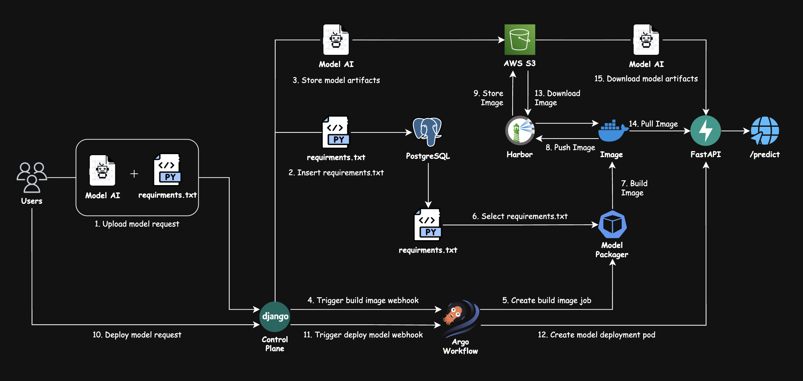
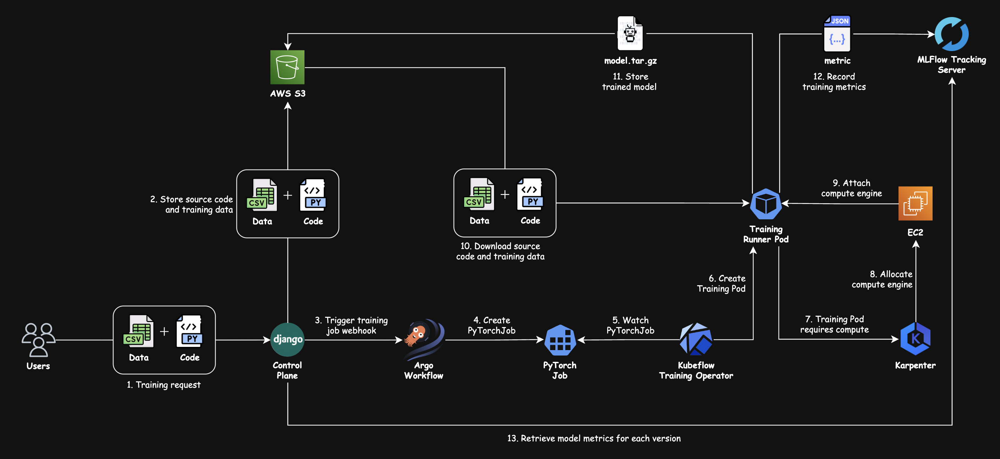
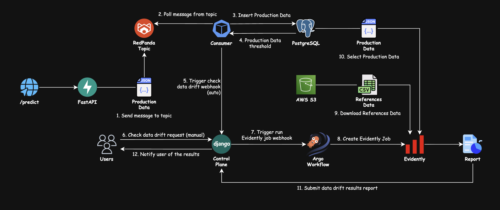

<div align="center">

# MLOps PaaS System

### Nền tảng AI PaaS End-to-End phục vụ đa mô hình ML/DL cho các tác vụ xây dựng, triển khai, giám sát, huấn luyện và quản lý phiên bản mô hình

[](https://python.org)
[](https://djangoproject.com)
[](https://fastapi.tiangolo.com)
[](https://mlflow.org)
[](https://evidentlyai.com)
[](https://redpanda.com)
[](https://kubeflow.org)
[](https://karpenter.sh)
[](https://argoproj.github.io/workflows)
[](https://k3s.io)
[](https://www.terraform.io)
[](https://ansible.com)

**Khoa Mạng máy tính và Truyền thông dữ liệu · Trường Đại học Công nghệ Thông tin (UIT) · ĐHQG-HCM**

| Thành viên             | Email                    |
| ---------------------- | ------------------------ |
| Trần Nguyễn Việt Hoàng | <23520541@gm.uit.edu.vn> |
| Bùi Ngọc Thái          | <23521412@gm.uit.edu.vn> |

</div>

---

## 1. Tổng quan ⭐

Hệ thống này là một **nền tảng AI Platform-as-a-Service MLOps phục vụ đa mô hình ML/DL**, tự động hóa từ đóng gói mô hình, triển khai dịch vụ suy luận động, quản lý phiên bản, giám sát drift đến huấn luyện mô hình.

---

## 2. Tính năng Cốt lõi ✨

| #   | Tính năng                                      | Mô tả chi tiết                                                                                     | Công nghệ                          |
| --- | ---------------------------------------------- | -------------------------------------------------------------------------------------------------- | ---------------------------------- |
| 1   | **Multi-Tenant AI PaaS**                       | Cách ly tài nguyên, quyền hạn và dữ liệu giữa các người dùng/tổ chức với Asymmetric RS256 JWT     | Django DRF + JWKS + Asymmetric JWT |
| 2   | **Async Build & Package**                      | Celery điều phối Docker backend ở local hoặc Argo/Kaniko ở production để đóng gói và đẩy image | Celery + Argo + Harbor + Kaniko |
| 3   | **Dynamic Model Serving**                      | Traefik chuyển request vào model-server gateway; gateway resolve version/alias tới worker khỏe mạnh | Traefik + FastAPI + BentoML     |
| 4   | **Drift Detection**                            | Tạo monitor/run theo model version, phân tích production/reference data và lưu report trên S3 | Evidently AI + Celery + Argo Workflows |
| 5   | **Training Orchestration**                     | Snapshot bất biến code/data/requirements; Celery chạy Docker local hoặc kích hoạt Argo/Kubeflow | Celery + Argo + Kubeflow PyTorchJob |
| 6   | **Optional Elastic Training Capacity**         | Có thể provision/thu hồi node CPU/GPU theo nhu cầu sau khi training platform được bật và xác minh | Karpenter NodePool                 |
| 7   | **Job Events, Logs & Metrics**                 | Lưu trạng thái trong PostgreSQL; stream log/metrics runtime qua Redis và cung cấp API polling cho UI | PostgreSQL + Redis + React Query |
| 8   | **Immutable Model Registry**                   | Quản lý version, artifact, metric, alias và lineage; MLflow theo dõi experiment/artifact theo job | Django Registry + MLflow + S3 |
| 9   | **GitOps Deployment**                          | Build/sign image, cập nhật Kustomize tag và đồng bộ rolling update qua ArgoCD                     | ArgoCD GitOps + GitHub Actions     |
| 10  | **HA PostgreSQL & Event Streaming**            | PostgreSQL production gồm primary/standby; Redpanda vận chuyển inference và domain events          | CloudNativePG + Redpanda Kafka     |
| 11  | **Full-Stack Observability**                   | Giám sát toàn diện API Latency, Throughput, Error Rate, tài nguyên K3s và Kafka Lag                | Prometheus + Grafana + AlertManager|
| 12  | **Automated Infrastructure & IaC**             | Chuẩn hóa hạ tầng AWS bằng Terraform và cài đặt hoàn toàn cụm K3s cùng Add-ons chỉ qua 1 lệnh      | Terraform + Ansible Playbook       |

---

## 3. Kiến trúc Hệ thống 🏛️

**1. Quy trình Đóng gói & Triển khai Mô hình (Build & Deploy Workflow)**



**2. Quy trình Huấn luyện & Điều phối Tài nguyên (Training Workflow)**



**3. Quy trình Giám sát & Phát hiện Độ lệch Dữ liệu (Data Drift Workflow)**



> 💡 **Tài liệu Kỹ thuật Chuyên sâu:** Xem giải thích chi tiết về luồng dữ liệu, sơ đồ tuần tự (Sequence Diagrams), cơ chế bảo mật Zero-Trust và lược đồ cơ sở dữ liệu tại [ARCHITECTURE.md](ARCHITECTURE.md).

---

## 4. Công nghệ sử dụng ⚙️

| Lớp (Layer)                | Công nghệ / Thư viện                                      | Vai trò trong Hệ thống                                                  |
| -------------------------- | --------------------------------------------------------- | ----------------------------------------------------------------------- |
| **Machine Learning**       | XGBoost, Scikit-learn, PyTorch, TensorFlow                | Framework xây dựng và huấn luyện mô hình ML/DL                           |
| **Model Serving**          | FastAPI, BentoML, Traefik                                 | Gateway trung tâm định tuyến tới runtime worker ML/DL                    |
| **Training Orchestration** | Kubeflow Training Operator (PyTorchJob), Argo Workflows   | Điều phối huấn luyện mô hình phân tán và luồng sự kiện                 |
| **Drift Detection**        | Evidently AI, Celery, Argo Workflows                       | Chạy Data Drift theo monitor/run và lưu report trên S3                  |
| **Control Plane**          | Django 5.0, Django REST Framework, Celery, JWT RS256      | Modular monolith quản lý tenant, domain state và async execution        |
| **Message Broker**         | Redpanda (Kafka-compatible broker)                        | Hàng đợi tin nhắn tốc độ cao xử lý lưu lượng suy luận bất đồng bộ       |
| **Database (HA)**          | PostgreSQL 15, CloudNativePG Operator, SQLAlchemy         | Lưu trữ dữ liệu metadata, người dùng và dữ liệu suy luận production     |
| **Task Broker / Log Stream** | Redis 7 Alpine                                          | Celery broker/result backend và stream log/metric runtime               |
| **Container Registry**     | Harbor Registry (Self-hosted), Cosign                     | Lưu trữ Docker image đa người thuê, ký xác thực bảo mật image           |
| **CI/CD & GitOps**         | GitHub Actions, ArgoCD                                    | Tự động hóa kiểm thử, đóng gói và triển khai liên tục theo mô hình GitOps|
| **Model Registry**         | Django Registry, MLflow, AWS S3                           | Version/alias/lineage trong Control Plane; tracking và artifact theo job |
| **Orchestration**          | K3s (Lightweight Kubernetes)                              | Nền tảng quản lý container hiệu năng cao trên Cloud / Edge              |
| **Infrastructure (IaC)**   | Terraform, AWS (VPC, EC2, ALB, S3, Route53, ACM)          | Khai báo và quản lý tự động hạ tầng đám mây Amazon Web Services         |
| **Automation**             | Ansible Playbook                                          | Tự động hóa cài đặt K3s Master/Worker và triển khai toàn bộ K8s Add-ons |
| **Security & Secrets**     | AWS Secrets Manager, External Secrets Operator (ESO)      | Quản lý bảo mật biến môi trường và đồng bộ secret vào Kubernetes         |
| **Observability**          | Prometheus, Grafana, AlertManager                         | Thu thập metrics, trực quan hóa dashboard và phát cảnh báo tự động      |
| **Autoscaling**            | KEDA (core), Karpenter NodePool (optional)                | Mở rộng pod theo event; mở rộng node chỉ khi training phase được bật     |

---

## 5. Cấu trúc Thư mục 📁

```
MLOps-paas-system/
│
├── .github/
│   └── workflows/
│       ├── ci.yml                            # Lint, type-check, test, manifest/image/secret scan
│       └── cd.yml                            # Build/sign image và tạo GitOps promotion PR
│
├── services/
│   ├── control-plane/                        # Django: AI PaaS Control Plane API
│   │   ├── manage.py
│   │   ├── requirements.txt                  # Runtime và quality tooling dependencies
│   │   ├── pyproject.toml                    # Pytest, Ruff và mypy configuration
│   │   ├── Dockerfile
│   │   └── src/
│   │       ├── config/                       # Settings, root URLs, ASGI/WSGI, Celery
│   │       ├── common/                       # API policy, middleware, logging, metrics
│   │       ├── infrastructure/               # S3, Docker, Argo, Harbor, HTTP, Redis, Redpanda
│   │       └── apps/                         # Domain apps; each owns api/, services/, migrations/, tests/
│   │           ├── auth/                     # User, tenant, JWT, OAuth, OTP, profile
│   │           ├── access/                   # Project-scoped API keys
│   │           ├── catalog/                  # ModelProject and workspace code/data assets
│   │           ├── registry/                 # Immutable versions, artifacts, metrics, aliases
│   │           ├── training/                 # Training jobs, events, outputs, snapshots
│   │           ├── deployment/               # Builds, deployments, runtime endpoints
│   │           ├── drift/                    # Drift monitors and runs
│   │           └── observability/            # Health, metrics, outbox, model telemetry
│   │
│   ├── model-server/                         # FastAPI gateway trung tâm: auth, routing, metrics, event logging
│   ├── machine-learning-serving/             # Machine Learning Serving container: Scikit-learn / XGBoost
│   ├── deep-learning-serving/                # Deep Learning Serving container: PyTorch / TensorFlow / Keras
│   ├── model-packager/                       # Đóng gói model artifact thành container service
│   ├── consumer/                             # Redpanda Consumer: Đọc Kafka topic & ghi batch vào DB
│   ├── evidently/                            # Evidently AI: Container chạy Drift Detection Job
│   ├── training-runner/                      # Container runtime cho Kubeflow / Argo Workflows training
│   └── test/                                 # Integration & End-to-End Test suites
│
├── k8s/
│   ├── kustomization.yaml                    # Root chỉ render GitOps control tree production
│   ├── gitops/production/
│   │   ├── projects/                         # AppProject theo trust boundary
│   │   ├── applications/                     # Explicit child Applications, gồm operator apps
│   │   └── repositories/                     # Public Helm/OCI repository descriptors
│   ├── cluster/                              # Namespace, StorageClass, SecretStore, policy và capacity
│   ├── addons/                               # Upstream controller/CRD/driver adapter
│   │   ├── platform/                             # Data, registry, MLflow, observability, Cloudflare và routing dùng chung
│   ├── argo/                                 # Argo Events/Workflows, templates và RBAC
│   ├── apps/
│   │   ├── base/                             # Manifest dùng chung cho bốn workload
│   │   └── overlays/production/              # Registry và Git SHA tag cho production
│   ├── security/                             # Policy dự kiến, chưa được reconcile
│   └── argocd/                               # Tài nguyên bootstrap Argo CD do Ansible sử dụng
│
├── ansible/                                  # Ansible: Tự động hóa cài đặt & triển khai K3s
│   ├── ansible.cfg                           # Cấu hình SSH pipelining, remote_user, key
│   ├── site.yml                              # Main Playbook: Điều phối toàn bộ tiến trình
│   ├── inventory/                            # Dynamic & Static inventory templates
│   ├── group_vars/                           # Cấu hình biến cho Master và Worker nodes
│   └── roles/
│       ├── common/                           # Cài đặt gói cơ bản (curl, git, jq, nfs-common)
│       ├── k3s_master/                       # Cài K3s Server + thiết lập kubeconfig
│       ├── k3s_worker/                       # Join Worker nodes vào cluster qua SSH ProxyJump
│       ├── helm/                             # Cài đặt Helm 3 package manager
│       ├── platform_core/                    # Bootstrap Argo CD và root GitOps Application
│       ├── platform_training/                # Kubeflow/Karpenter tùy chọn
│       └── verify/                           # Kiểm tra bootstrap và platform sau rollout
│
├── infra/                                    # Terraform IaC: Khai báo hạ tầng AWS
│   ├── main.tf                               # Root module: VPC, EC2, ALB, S3, IAM Roles
│   ├── variables.tf                          # Định nghĩa biến cấu hình (CIDR, instance type...)
│   ├── outputs.tf                            # Xuất IP, DNS, ARN phục vụ Ansible inventory
│   └── modules/
│       ├── network/                          # VPC, Public/Private Subnets, IGW, NAT Gateway
│       ├── compute/                          # EC2 Master (t3.medium) + Worker Nodes (t3.large)
│       ├── security/                         # Security Groups (Master, Worker, ALB, DB)
│       ├── storage/                          # S3 Bucket lưu model artifacts & datasets
│       ├── iam/                              # IAM Roles cho Worker profile & GitHub OIDC
│       ├── alb/                              # Application Load Balancer + Target Groups
│       ├── dns/                              # Route53 DNS records + ACM SSL Certificate
│       └── secrets/                          # AWS Secrets Manager placeholders
│
├── web/                                      # React Frontend: AI PaaS Dashboard
│   ├── src/
│   │   ├── app/                              # Router, providers, application shell, theme và i18n
│   │   ├── features/                         # Auth, catalog, deploy, training, registry, drift, settings
│   │   └── shared/                           # API client, hooks, types, utilities và UI primitives
│   └── nginx.conf                            # Nginx reverse proxy & định hướng traffic
│
├── models/                                   # Local model artifacts mẫu (phục vụ dev/demo)
│   ├── v1/                                   # Mô hình NIDS 2 phân lớp (BENIGN + DDoS)
│   ├── v2/                                   # Mô hình NIDS 3 phân lớp (+ PortScan)
│   ├──training/                              # Mã nguồn huấn luyện mẫu & requirements
│   ├── nids-xgboost/
│   └── deployable-sklearn/
│
├── data/                                     # Tập dữ liệu mẫu CIC-IDS2017 (CSV)
├── docker-compose.yml                        # Môi trường Local Development hoàn chỉnh
└── .env.example                              # Template biến môi trường chuẩn
```

---

## 6. Hướng dẫn Cài đặt & Vận hành 🛠️

Hệ thống hỗ trợ 2 chế độ vận hành chính: **Chạy Local với Docker Compose** (dành cho phát triển, cải tiến tính năng) và **Triển khai Production trên AWS EC2 với K3s** (dành cho vận hành thực tế).

### 6.1 Chạy Local (Docker Compose)

Khi chạy local, đặt **`EXECUTION_BACKEND=docker`**. Đây là giá trị mặc định chung cho build, deployment, training và drift. Có thể override từng thành phần bằng `BUILD_BACKEND`, `DEPLOYMENT_BACKEND`, `TRAINING_BACKEND` hoặc `DRIFT_BACKEND`; các giá trị hợp lệ hiện tại là `docker` và `argo`.

#### Yêu cầu Hệ thống

| Thành phần | Tối thiểu     | Khuyến nghị  |
| ---------- | ------------- | ------------ |
| Python     | 3.10+         | 3.12+        |
| Docker     | v24+          | Latest       |
| RAM        | 8 GB          | 16 GB+       |
| OS         | Ubuntu 20.04+ | Ubuntu 22.04 |

#### Các bước thực hiện

```bash
# Bước 1: Clone repository
git clone https://github.com/Viet-Hoang-2005/MLOps-paas-system.git
cd MLOps-paas-system

# Bước 2: Cấu hình biến môi trường
cp .env.example .env
# Chỉnh sửa các biến cơ bản trong .env
# Local: EXECUTION_BACKEND=docker

# Bước 3: Build và khởi chạy toàn bộ stack dịch vụ
docker compose up --build -d

# Bước 4: Kiểm tra trạng thái các container
docker compose ps

# Theo dõi log thời gian thực của Control Plane
docker compose logs -f control-plane

# Bước 5: chạy React Dashboard ở terminal khác
cd web
pnpm install --frozen-lockfile
pnpm dev
```

**Local Service URLs:**

| Dịch vụ              | URL Local                    | Mô tả                                      |
| -------------------- | ---------------------------- | ------------------------------------------ |
| **Control Plane API**| <http://localhost:8000/api/> | REST API của AI PaaS Backend               |
| **React Dashboard**  | <http://localhost:5173>      | Vite dev server, chạy riêng bằng `pnpm dev`|
| **Model Server**     | <http://localhost:5001>      | Gateway nội bộ/public trực tiếp            |
| **Traefik Gateway**  | <http://localhost:5002>      | Public inference routing                   |
| **Traefik Dashboard**| <http://localhost:8080>      | Dashboard định tuyến local                 |
| **MLflow Tracking**  | <http://localhost:5003>      | Tracking Server và artifact UI             |
| **Redpanda Console** | <http://localhost:8081>      | Quản lý Kafka Topics & Consumer Groups     |
| **pgAdmin 4 GUI**    | <http://localhost:5050>      | Giao diện quản trị cơ sở dữ liệu PostgreSQL|

---

### 6.2 Triển khai Production (K3s Cluster)

Production được triển khai theo ba lớp ownership rõ ràng:

- **Terraform** quản lý VPC, EC2, ALB, IAM, ACM, S3, Secrets Manager và private DNS cho K3s API.
- **Ansible** chuẩn bị Ubuntu, cài K3s, publish K3s agent token và bootstrap Argo CD.
- **Argo CD** cài core/training operators và quản lý toàn bộ Kubernetes resource của Karpenter, gồm `EC2NodeClass` và `NodePool`.

#### Bước 1: Khởi tạo hạ tầng AWS bằng Terraform

Sau khi destroy **toàn bộ** AWS, chuẩn bị trước khi apply:

- Khôi phục `.env` từ kho bí mật an toàn. Terraform destroy xóa bốn Secrets Manager container với recovery window bằng `0`, nên secret cũ không thể phục hồi từ AWS. Ba application secret được nạp lại từ `.env`; K3s agent token được Ansible publish lại sau bootstrap.
- Giữ private key ở ngoài repository và bảo đảm public key tương ứng đã tồn tại trong EC2 Key Pairs với đúng tên `key_name` (mặc định `mlops-keypair`). Terraform chỉ tham chiếu key pair, không tạo nó. Ví dụ từ WSL:

  ```bash
  aws ec2 import-key-pair \
    --region ap-southeast-1 \
    --key-name mlops-keypair \
    --public-key-material "fileb://$HOME/.ssh/aws_key.pub"
  ```

- Chuẩn bị quyền sửa DNS Cloudflare cho domain. ACM DNS validation không được Terraform tự tạo record vì DNS public do Cloudflare quản lý.

```bash
cd infra/

# Xác thực AWS CLI bằng profile/session cục bộ, sau đó kiểm tra cấu hình.
terraform init
terraform fmt -check -recursive
terraform validate

# Chỉ bootstrap certificate để lấy CNAME validation của ACM.
terraform apply -target='module.dns[0].aws_acm_certificate.mlops_cert'
terraform output -json acm_ssl_validation_records
```

Tạo các CNAME được output ở Cloudflare, chờ ACM hiển thị `ISSUED`, rồi mới chạy full apply. `-target` chỉ dùng cho bootstrap certificate; các lần sau luôn review full plan:

```bash
terraform plan -out=tfplan
terraform apply tfplan
terraform output -json
```

**Terraform sẽ tự động tạo ra:**

- VPC với Public Subnet (Master Node) và Private Subnet (Worker Nodes).
- EC2 Master Node (`t3.medium`) + Worker Nodes (`t3.large` × 2, tùy chỉnh trong `terraform.tfvars`).
- Application Load Balancer (ALB) + ACM SSL Certificate; DNS public hiện được quản lý tại Cloudflare.
- S3 Bucket lưu model artifacts và tập dữ liệu huấn luyện.
- IAM Roles cho Worker nodes (S3 access), GitHub Actions OIDC và Karpenter (instance profile, controller policy, interruption queue).

#### Bước 2: Tự động đồng bộ cấu hình lên AWS Secrets Manager

Hệ thống cung cấp script `scripts/push_secrets_to_aws.py` sử dụng thư viện `boto3` để tự động đọc file `.env` và đẩy lên AWS Secrets Manager (region: `ap-southeast-1`).

Quay lại root repository trước khi chạy script; ở bước Terraform, working directory đang là `infra/`.

**1. Chuẩn bị file `.env` từ file mẫu:**

```bash
cp .env.example .env
```

**2. Điền các thông tin quan trọng vào file `.env`:**

- **AWS client configuration**: chỉ dùng khi workload thực sự không thể nhận IAM role; ưu tiên EC2 instance profile cho cluster.
- **Cơ sở dữ liệu PostgreSQL**: `DB_USER`, `DB_PASSWORD`
- **Harbor Registry**: `HARBOR_USERNAME`, `HARBOR_PASSWORD`, `HARBOR_GITHUB_USERNAME`, `HARBOR_GITHUB_PASSWORD`
- **GitHub & CI/CD**: `GITHUB_REPO`, `GITHUB_TOKEN`
- **Ký image**: CD dùng GitHub Actions OIDC và Cosign keyless; không lưu Cosign private key hoặc password trong `.env` hay AWS Secrets Manager.
- **Django, JWT & internal execution**: `DJANGO_SECRET_KEY`, `JWT_PRIVATE_KEY`, `JWT_PUBLIC_KEY`, `CONTROL_PLANE_WEBHOOK_SECRET`, `ARGO_EVENTS_WEBHOOK_TOKEN`
- **OAuth & Cloudflare Tunnel**: `GOOGLE_OAUTH2_CLIENT_ID`, `GITHUB_OAUTH2_CLIENT_ID`, `GITHUB_OAUTH2_CLIENT_SECRET`, `TUNNEL_TOKEN`, `EMAIL_HOST_USER`, `EMAIL_HOST_PASSWORD`

**3. Chạy script đồng bộ lên AWS Secrets Manager:**

```bash
cd ..

# Dùng virtual environment riêng để không sửa Python hệ thống
python3 -m venv .venv-secrets
source .venv-secrets/bin/activate
python -m pip install boto3 python-dotenv

# Thực hiện đẩy tự động lên AWS Secrets Manager
python scripts/push_secrets_to_aws.py
deactivate
```

**Script sẽ tự động phân nhóm và tạo/cập nhật chính xác 3 kho Secret trên AWS:**

- **`mlops/aws-secrets`**: Lưu thông tin xác thực AWS S3.
- **`mlops/github-actions-secrets`**: Lưu Harbor robot credential cho CI/CD; Cosign dùng GitHub Actions OIDC keyless.
- **`mlops/production-secrets`**: Lưu toàn bộ cấu hình bảo mật cho cụm K3s (DB, Harbor, JWT, OAuth, Webhook...).

`ARGO_EVENTS_WEBHOOK_TOKEN` phải là token ngẫu nhiên tối thiểu 32 ký tự và
không được tái sử dụng `CONTROL_PLANE_WEBHOOK_SECRET`. Khi rotate, cập nhật
`mlops/production-secrets`, chờ `control-plane-api-secret-sync`,
`celery-worker-secret-sync` và `argo-events-webhook-server-sync` Ready,
rồi rolling restart Control Plane API/worker và EventSource; xác minh token mới
hoạt động trước khi kết thúc cửa sổ rotation.

#### Bước 3: Chuẩn bị Ansible control host trong WSL

```bash
cd /mnt/d/AI\ Models/mlops-paas-system

# Control host cần có Terraform >= 1.5, AWS CLI, OpenSSH và kubectl; Ansible
# preflight sẽ kiểm tra terraform/aws/ssh trước khi kết nối vào cluster.
python3 -m venv .venv-ansible
source .venv-ansible/bin/activate
pip install -r ansible/requirements.txt
ansible-galaxy collection install -r ansible/requirements.yml

# Private key không được commit vào repository.
install -m 0600 /path/to/aws_key ~/.ssh/aws_key
```

Dynamic inventory đọc Terraform outputs. Worker dùng SSH `ProxyJump` qua server; Kubernetes API chỉ được quản trị qua private network/SSH tunnel.

#### Bước 4: Triển khai K3s và core platform theo phase

Chạy static validation trước khi thay đổi host:

```bash
cd ansible
export ANSIBLE_CONFIG=./ansible.cfg

ansible-inventory --graph
ansible-playbook --syntax-check site.yml
ansible-lint .
kubectl kustomize --enable-helm ../k8s >/dev/null
```

Rollout đầy đủ theo từng phase và chạy bootstrap lần hai để xác minh idempotency:

```bash
ansible-playbook site.yml --tags bootstrap
ansible-playbook site.yml --tags bootstrap
ansible-playbook site.yml --tags platform-core
ansible-playbook site.yml --tags preflight,platform-training,verify
```

Trước một clean bootstrap, chạy CD thủ công với `component=all` trên nhánh
`main` và merge GitOps promotion PR do workflow tạo ra. Bước này phải hoàn tất
trước `platform-core`: Kyverno sẽ fail closed cho mọi image
`registry.mlops-nids-nt114.id.vn/mlops-paas/*` không có Cosign keyless
signature từ chính `cd.yml` trên `main`. Nó không áp dụng cho image bên thứ ba
hoặc `user-images/*`.

Nếu chủ đích chỉ xác minh core mà không chạy training smoke, tắt rõ ràng training verification trong lần chạy đó:

```bash
ansible-playbook site.yml --tags verify \
  -e deploy_training_platform=false \
  -e enable_karpenter=false
```

Các phase hiện có:

| Phase/tag | Trách nhiệm | Mặc định |
| --- | --- | --- |
| `preflight` | Kiểm tra WSL, Terraform inventory, SSH và rollout flags | Luôn chạy |
| `bootstrap` | Cài K3s `v1.34.9+k3s1`, một server và hai worker | Bật |
| `platform-core` | Cài Argo CD, bootstrap root và chờ core add-on/cluster Application | Bật |
| `platform-training` | Chờ training add-on/capacity Application do Argo CD quản lý và chạy smoke tests | Bật trong group vars hiện tại |
| `verify` | Xác minh node, operator và root Application | Chạy cuối |

Ansible chỉ cài Argo CD rồi tạo root Application `mlops-paas-system`. Repository GitHub hiện public nên không cần repository credential bootstrap. Root chỉ tạo GitOps control tree; child cluster Application tạo Namespace trước, tiếp đến add-ons, cluster configuration, platform service, execution và workload được Argo CD reconcile theo sync wave; không cần `kubectl apply` thủ công sau khi `platform-core` hoàn tất.

#### Bước 5: Xác minh GitOps, workload và AWS edge health

```bash
ssh -i ~/.ssh/aws_key ubuntu@$(cd ../infra && terraform output -raw master_public_ip)

sudo k3s kubectl get nodes -L workload-type
sudo k3s kubectl get applications -n argocd \
  -o custom-columns=NAME:.metadata.name,SYNC:.status.sync.status,HEALTH:.status.health.status
sudo k3s kubectl get pods -A --field-selector=status.phase!=Running,status.phase!=Succeeded
sudo k3s kubectl get clustersecretstore,externalsecret -A
sudo k3s kubectl get clusters.postgresql.cnpg.io -A
sudo k3s kubectl get clusterpolicy verify-platform-images
```

Mọi Application phải là `Synced/Healthy`; CNPG phải có hai instance Ready; lệnh pod bất thường không được trả về workload lỗi. `mlops-prod-addon-kyverno` và `mlops-prod-cluster-image-verification` cũng phải Healthy trước khi application platform được tạo. `verify` của Ansible cũng kiểm tra core add-on/cluster Application, CRD/controller, ESO, root GitOps, Traefik trên static worker, ALB target health, CNPG, Argo Workflow server-side dry-run và EBS smoke/cleanup.

Từ WSL control host, xác nhận cả hai ALB targets healthy:

```bash
aws elbv2 describe-target-health \
  --region ap-southeast-1 \
  --target-group-arn "$(cd ../infra && terraform output -raw alb_target_group_arn)" \
  --query 'TargetHealthDescriptions[*].[Target.Id,TargetHealth.State]' \
  --output table
```

Không ghi mật khẩu Argo CD, token K3s, kubeconfig hoặc secret value vào log/tài liệu. Đổi mật khẩu admin ban đầu sau lần đăng nhập đầu tiên.

#### Bước 6: Cấu hình training capacity và smoke test sau khi core đã ổn định

```bash
ansible-playbook site.yml --tags platform-training \
  -e deploy_training_platform=true \
  -e enable_karpenter=true
```

Ngoài bảy core operator Application, root trực tiếp quản lý 6 training/capacity Application: Kubeflow Training Operator, Karpenter CRD, Karpenter controller, Karpenter capacity, NFD và NVIDIA GPU Operator. Terraform tạo private DNS `k3s-api.internal.mlops-nids-nt114.id.vn` và secret container; Ansible chỉ publish token runtime; Argo CD sở hữu hai `EC2NodeClass` và hai `NodePool`. CPU smoke phải hoàn tất và tự cleanup. GPU smoke chỉ bật sau khi quota G/VT AWS đã effective; `training_gpu_smoke_enabled=false` là kết quả mong đợi khi quota chưa sẵn sàng.

---

**Production Service URLs:**

| Dịch vụ              | URL Production                                | Mô tả                              |
| -------------------- | --------------------------------------------- | ---------------------------------- |
| **Frontend**         | <https://mlops-nids-nt114.id.vn>              | React AI PaaS Dashboard            |
| **Control Plane**    | <https://api.mlops-nids-nt114.id.vn/api/>     | REST API của Control Plane         |
| **MLflow Server**    | <https://mlflow.mlops-nids-nt114.id.vn>       | Model Registry & Experiment UI     |
| **Grafana Dashboard**| <https://grafana.mlops-nids-nt114.id.vn>      | Monitoring & Observability Hub     |
| **ArgoCD Dashboard** | <https://argocd.mlops-nids-nt114.id.vn>       | GitOps CD Management Portal        |
| **Argo Workflow UI** | <https://workflow.mlops-nids-nt114.id.vn>     | Orchestration & Workflow UI        |
| **Harbor Registry**  | <https://registry.mlops-nids-nt114.id.vn>     | Private Container Registry         |

Frontend, Argo CD, Argo Workflows, Grafana và MLflow đi qua Cloudflare Tunnel. Control Plane và Harbor đi qua public ALB với TLS termination; Traefik chỉ tin `X-Forwarded-*` từ các Flannel gateway `/32` đã cấu hình, không bật `forwardedHeaders.insecure`.

---

### 6.3 Gỡ cài đặt hệ thống (Uninstallation & Cleanup)

> **Cảnh báo mất dữ liệu:** Chỉ tiếp tục sau khi đã backup dữ liệu cần giữ (S3 artifacts, PostgreSQL/PVC nếu áp dụng) và `.env`/secret material. Terraform destroy sẽ xóa Secrets Manager không có recovery window; EBS volumes có thể còn lại nếu PVC/PV không được prune trước khi cluster bị xóa.

```bash
# Trên master: xóa root Application và chờ Argo CD prune tài nguyên nó sở hữu.
sudo k3s kubectl delete -f k8s/argocd/application.yaml --ignore-not-found
sudo k3s kubectl get pvc,pv -A

# Review và xóa rõ ràng PVC/PV còn lại ở mọi namespace trước khi hủy cluster.
# Không chỉ xóa PVC trong namespace default.
```

Thoát phiên SSH, quay lại WSL control host rồi review destroy plan:

```bash
cd infra/
terraform plan -destroy -out=destroy.tfplan
terraform apply destroy.tfplan
```

---

## 7. Kiểm thử Toàn bộ Pipeline (End-to-End Verification) 🧪

### Giai đoạn 1: Xác nhận sức khỏe hệ thống K3s

```bash
# Trên master: kiểm tra trạng thái các node trong cụm.
sudo k3s kubectl get nodes -L workload-type
# Mong đợi: master (workload-type=control-plane) + workers (workload-type=worker) ở trạng thái Ready

# Kiểm tra trạng thái toàn bộ pod dịch vụ
sudo k3s kubectl get pods -A
```

### Giai đoạn 2: Kiểm thử Upload & Build Model

1. Đăng nhập vào giao diện React Dashboard.
2. Tải lên mã nguồn mô hình hoặc file trọng số (`.pkl`, `.pt`, `.tar.gz`).
3. Bấm Build; chỉ callback build thành công mới tự động cấp registry version kế tiếp.
4. Tạo build qua `/api/builds/` và theo dõi trạng thái/log trên giao diện.
5. Xác nhận Docker image đã được đóng gói và push lên Harbor Registry.

### Giai đoạn 3: Kiểm thử Triển khai Dynamic Serving Endpoint

1. Nhấn nút **Deploy** trên Dashboard ứng với mô hình vừa build.
2. Argo Workflows tạo Deployment và Service cho model worker; ingress dùng chung chuyển traffic vào model-server gateway.
3. Gửi request suy luận kiểm thử đến endpoint động:

```bash
curl -X POST https://api.mlops-nids-nt114.id.vn/{tenant_id}/models/{project_uuid}/{version_uuid}/predict \
  -H "Authorization: Bearer <your_jwt_token>" \
  -H "Content-Type: application/json" \
  -d '{"data": [[0.1, 1.2, 3.4, 0.0, 120.5, ...]]}'
```

### Giai đoạn 4: Kiểm thử Tự động Huấn luyện (Training & Retraining Job)

Tenant training cố ý chưa được mở trong production: không gọi submit endpoint và không dùng UI để kiểm thử training, vì `TRAINING_ENABLED=false` trả HTTP 503. Kiểm thử được hỗ trợ ở phase hiện tại là Ansible CPU PyTorchJob smoke trong namespace riêng `ansible-training-smoke`; job phải hoàn tất, namespace phải bị xóa và Karpenter phải consolidate node tạm thời. GPU smoke chỉ chạy sau khi quota AWS G/VT có hiệu lực.

### Giai đoạn 5: Kiểm thử Phát hiện Data Drift (Evidently AI)

1. Tạo `DriftMonitor` qua `/api/drift-monitors/` với model version và reference asset thuộc cùng tenant.
2. Gửi `POST /api/drift-monitors/{monitor_uuid}/runs/` để tạo lần chạy.
3. Quan sát Celery/Argo chạy Evidently và callback vào `/internal/webhooks/drift-runs/{run_uuid}/`.
4. Xác nhận report HTML/JSON/summary đã được lưu trên S3 và hiển thị trên Dashboard.

### Giai đoạn 6: Kiểm tra Hệ thống Giám sát (Observability)

1. Truy cập Grafana: `https://grafana.mlops-nids-nt114.id.vn`
2. Kiểm tra các Dashboard chuyên biệt:
   - **MLOps PaaS Model Serving**: Theo dõi Throughput (RPS), Latency (P95/P99), và HTTP Error Rate của từng model pod.
   - **Kafka / Redpanda**: Monitoring Consumer lag và tốc độ xử lý message.
   - **Kubernetes Compute Resources**: CPU, Memory, GPU utilization của các node và pod.
3. Kiểm tra AlertManager: Xác nhận các quy tắc cảnh báo tự động khi phát hiện lượng truy cập bất thường hoặc lỗi dịch vụ.

---

## 8. Tài liệu Tham khảo 📚

| Tài liệu                           | Mô tả chi tiết                                                  |
| ---------------------------------- | --------------------------------------------------------------- |
| [ARCHITECTURE.md](ARCHITECTURE.md) | Kiến trúc kỹ thuật chuyên sâu, sơ đồ luồng dữ liệu và DB schema |
| [CHANGELOG.md](CHANGELOG.md)       | Lịch sử phát triển và nâng cấp hệ thống qua từng giai đoạn      |
| [CONTRIBUTING.md](CONTRIBUTING.md) | Quy chuẩn đóng góp mã nguồn, branch naming và commit convention |
