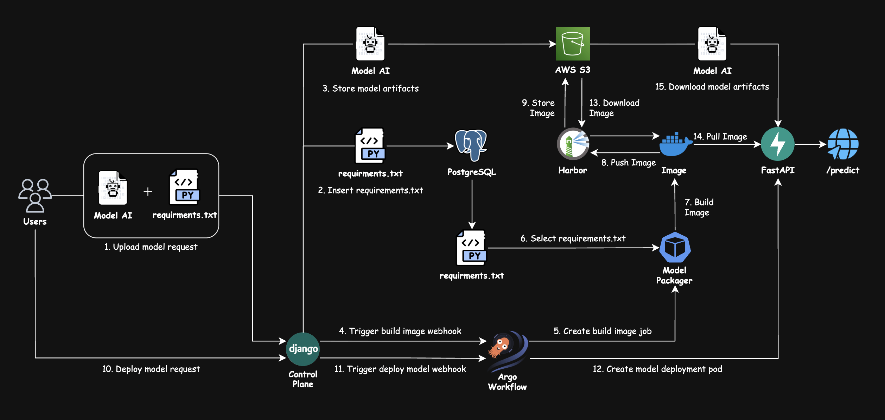
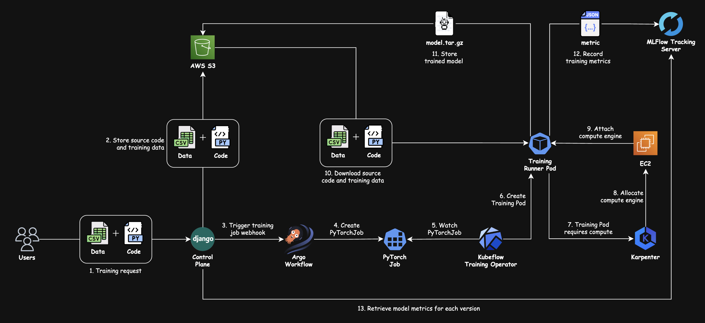
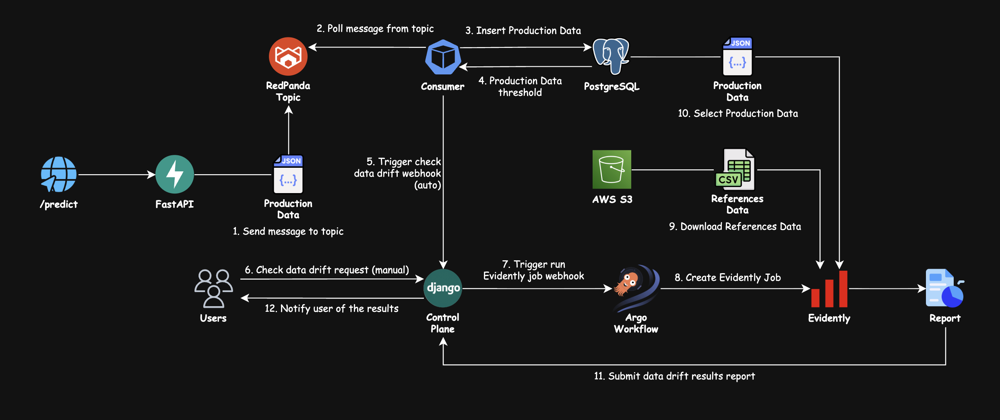

<div align="center">

# MLOps PaaS System

### Nền tảng AI Platform-as-a-Service End-to-End phục vụ đa mô hình ML/DL cho các tác vụ xây dựng, đóng gói, triển khai, suy luận, giám sát trôi dạt và tái huấn luyện mô hình tự động

[](https://python.org)
[](https://djangoproject.com)
[](https://fastapi.tiangolo.com)
[](https://mlflow.org)
[](https://bentoml.com)
[](https://evidentlyai.com)
[](https://redpanda.com)
[](https://kubeflow.org)
[](https://karpenter.sh)
[](https://argoproj.github.io/cd)
[](https://k3s.io)
[](https://www.terraform.io)
[](https://ansible.com)
[](LICENSE)

**Khoa Mạng Máy Tính và Truyền Thông Dữ Liệu · Trường Đại học Công nghệ Thông tin (UIT) · ĐHQG-HCM**

| Thành viên thực hiện | Mã số sinh viên | Email liên hệ |
|---|---|---|
| **Trần Nguyễn Việt Hoàng** | 23520541 | <23520541@gm.uit.edu.vn> |
| **Bùi Ngọc Thái** | 23521412 | <23521412@gm.uit.edu.vn> |

</div>

---

## 1. Giới thiệu & Tầm nhìn 🎯

**MLOps PaaS System** là nền tảng quản trị vòng đời học máy toàn diện (**End-to-End MLOps Platform-as-a-Service**) được thiết kế để giải quyết bài toán chuyển giao mô hình từ giai đoạn nghiên cứu (R&D) sang môi trường vận hành thực tế (Production).

Hệ thống cho phép các tổ chức và kỹ sư dữ liệu:
- **Tự động hóa hoàn toàn** từ khâu chuẩn bị dataset, đóng gói container image chuẩn OCI, triển khai serving phục vụ suy luận thời gian thực với độ trễ thấp.
- **Giám sát chất lượng mô hình liên tục** thông qua cơ chế thu thập viễn thám bất đồng bộ và kiểm định trôi dạt dữ liệu (Data Drift).
- **Khép kín vòng lặp MLOps** với khả năng tự động kích hoạt tái huấn luyện (**Continuous Training - CT**) khi phát hiện độ suy giảm phân phối dữ liệu sản xuất.
- **Hỗ trợ cơ chế đa hạ tầng linh hoạt**: chuyển đổi mượt mà giữa môi trường phát triển cục bộ (**Docker Compose**) và môi trường sản xuất quy mô lớn trên nền tảng đám mây AWS (**Kubernetes K3s + GitOps**).

---

## 2. Tính năng Cốt lõi ✨

| # | Tính năng | Mô tả kỹ thuật |
|---|---|---|
| 1 | **Multi-Tenant AI PaaS** | Cách ly tài nguyên, phân quyền theo dự án, xác thực bất đối xứng JWT RS256 kết hợp endpoint phân phối khóa công khai JWKS. |
| 2 | **Inference Gateway Tập trung** | Điểm tiếp nhận suy luận duy nhất, bảo vệ các worker nội bộ, phân giải định tuyến động (Docker / K8s CoreDNS FQDN) và xuất bản viễn thám async. |
| 3 | **Đa Runtime Phục vụ Mô hình** | Tách biệt tối ưu giữa runtime cho ML truyền thống (Scikit-Learn/XGBoost) và runtime cho Học sâu (PyTorch/TensorFlow) với cơ chế tensor normalization. |
| 4 | **Thu thập Viễn thám Hiệu năng cao** | Worker nền gom micro-batching bản ghi suy luận vào PostgreSQL và triển khai Transactional Outbox phát tín hiệu drift mà không chặn luồng Kafka. |
| 5 | **Phát hiện Trôi dạt Dữ liệu (Drift)** | So sánh phân phối thống kê giữa dữ liệu tham chiếu (S3) và dữ liệu sản xuất thực tế bằng các kiểm định Kolmogorov-Smirnov và Chi-square. |
| 6 | **Tự động Tái Huấn Luyện (CT)** | Vòng lặp tự động hóa khép kín: Tự động kích hoạt pipeline huấn luyện lại mô hình khi tỷ lệ trôi dạt dữ liệu vượt ngưỡng an toàn cho phép. |
| 7 | **Đóng gói Container Tự động** | Tự động phân tích artifact thô, nhận diện model flavor, sinh Dockerfile nhiều tầng và build ảnh OCI bằng Docker SDK hoặc Kaniko Rootless. |
| 8 | **Huấn luyện Sandbox Cô lập** | Thực thi mã nguồn người dùng trong sandbox an toàn, không cấp credentials AWS, quản lý bằng Capability Tokens, S3 Presigned URLs và process group cleanup. |
| 9 | **Kho Mô hình Bất biến (Registry)** | Quản lý phiên bản mô hình bất biến (`ModelVersion`), artifacts, metrics đánh giá, model insights, và các bí danh động (`champion`/`challenger`). |
| 10 | **Hạ tầng Tự động hóa & GitOps** | Khởi tạo IaaS AWS 100% bằng Terraform, chuẩn hóa OS và bootstrap K3s bằng Ansible, quản trị toàn bộ ứng dụng khai báo qua Argo CD (5 Sync Waves). |
| 11 | **Co giãn Node Đàn hồi (Autoscaling)** | Tự động cấp phát và thu hồi các node máy chủ EC2 CPU/GPU (Spot/On-Demand) theo nhu cầu thực tế của bài toán huấn luyện. |
| 12 | **Khả năng Quan sát Toàn diện** | Giám sát toàn diện API Latency, RPS Throughput, Error Rate, Kafka Lag, tài nguyên cụm K3s và thu thập log tập trung có chữ ký con trỏ bảo mật. |

---

## 3. Kiến trúc Hệ thống 🏛️

MLOps PaaS được xây dựng theo kiến trúc phân tách rõ ràng giữa **Mặt phẳng Điều phối (Control Plane)** và **Mặt phẳng Thực thi (Data & Execution Plane)**:

```
                      +---------------------------------------+
                      |       Web Dashboard / External Client |
                      +---------------------------------------+
                                          │
                                 HTTPS / Ingress ALB
                                          ▼
                      +---------------------------------------+
                      |      Traefik Ingress Router (K3s)     |
                      +---------------------------------------+
                             │                         │
            (Quản trị: /api/*)│                         │ (Dự đoán: /models/*/predict)
                             ▼                         ▼
            +─────────────────────────+       +─────────────────────────+
            │  Django Control Plane   │       │   Model Server Gateway  │
            │  (10 Domain Monolith)   │       │  (Trusted Auth & Route) │
            +─────────────────────────+       +─────────────────────────+
                   │           │                           │
  (Async Tasks)    │           │ (SSOT)                    │ (Forward Traffic)
                   ▼           ▼                           ▼
            +─────────────+ +─────────────+       +─────────────────────────+
            │   Celery    │ │ PostgreSQL  │       │  Serving Worker Pods    │
            │   Worker    │ │ (CloudNative│       │  - ML Serving (FastAPI) │
            │             │ │     PG HA)  │       │  - DL Serving (BentoML) │
            +─────────────+ +─────────────+       +─────────────────────────+
                   │                                       │
     +─────────────+─────────────+                         │ (Async Telemetry)
     │                           │                         ▼
     ▼ (Local Dev)               ▼ (Production K3s)       +─────────────────────────+
+───────────────+        +──────────────────────+         │     Redpanda Kafka      │
|  Docker SDK   |        |   Argo Workflows     |         +─────────────────────────+
| (Local Build/ |        |  - Kaniko (Build)    |                      │
|  Train/Drift) |        |  - Kubeflow (Train)  |                      │ (Poll Records)
+───────────────+        |  - Evidently (Drift) |                      ▼
                         +──────────────────────+         +─────────────────────────+
                                                          │     Consumer Worker     │
                                                          │  (Micro-batch & Outbox) │
                                                          +─────────────────────────+
```

**1. Quy trình Đóng gói & Triển khai Mô hình (Build & Deploy Workflow)**



**2. Quy trình Huấn luyện & Điều phối Tài nguyên (Training Workflow)**



**3. Quy trình Giám sát & Phát hiện Độ lệch Dữ liệu (Data Drift Workflow)**



> [!TIP]
> **Tài liệu Kỹ thuật Chi tiết:** Xem toàn bộ 7 sơ đồ luồng chi tiết (Cloud IaaS, Ansible Bootstrap, K3s GitOps 5 Sync Waves, Microservices Interaction, Training/Build/Inference Lifecycles) tại [**`ARCHITECTURE.md`**](ARCHITECTURE.md).

---

## 4. Công nghệ Sử dụng ⚙️

| Tầng chức năng | Công nghệ chủ đạo | Vai trò kỹ thuật |
|---|---|---|
| **Frontend UI** | React 18, TypeScript, Vite, Tailwind CSS, Radix UI | Giao diện Web Dashboard thời gian thực, hỗ trợ Dark Mode & song ngữ (EN/VI) |
| **Control Plane** | Python 3.12, Django 5.0, Django REST Framework, Celery | Modular monolith quản lý 10 domain nghiệp vụ và điều phối tác vụ async |
| **Inference Gateway** | FastAPI, HTTPX Async, PyJWT, Cryptography | Cổng tiếp nhận suy luận tập trung, xác thực RS256/JWKS, định tuyến worker |
| **Serving Engines** | FastAPI (ML), BentoML (DL), MLflow PyFunc | Runtime phục vụ suy luận phi trạng thái tối ưu cho Scikit-Learn và PyTorch/TF |
| **Message Streaming** | Redpanda (Kafka-compatible C++ engine) | Hàng đợi tin nhắn tốc độ cao xử lý luồng dữ liệu suy luận sản xuất bất đồng bộ |
| **Data Ingestion** | confluent-kafka, Pandas, SQLAlchemy | Worker tiêu thụ dữ liệu, micro-batching và Transactional Outbox pattern |
| **Drift & CT** | Evidently AI (v0.4.x), Scipy | Kiểm định thống kê Kolmogorov-Smirnov, Chi-square, xuất báo cáo và kích hoạt CT |
| **Experiment Tracking** | MLflow Server 2.14, AWS S3 | Theo dõi tham số huấn luyện, metrics và lưu trữ artifacts mô hình |
| **Relational Database** | PostgreSQL 15, CloudNativePG Operator | Nguồn chân lý quan hệ (SSOT) cho toàn bộ trạng thái domain hệ thống |
| **Cache & Task Broker** | Redis 7.4, Redis Sentinel HA | Broker/Result backend cho Celery, stream logs thời gian thực và cache gateway |
| **Container Registry** | Harbor OCI Registry, Cosign Keyless | Lưu trữ image nội bộ, bảo mật chuỗi cung ứng với chữ ký số xác thực ảnh |
| **Container Engine** | K3s (Lightweight Kubernetes v1.34), Docker | Nền tảng điều phối và thực thi container chuẩn hóa đám mây |
| **Infrastructure as Code**| Terraform (AWS Provider) | Quản lý toàn bộ tài nguyên đám mây AWS (VPC, EC2, S3, ALB, IAM, Secrets) |
| **Automation Bootstrap** | Ansible Automation Engine | Chuẩn hóa OS Ubuntu, cài đặt K3s embedded etcd, Helm và bootstrap Argo CD |
| **GitOps Delivery** | Argo CD, Kustomize | Tự động hóa đồng bộ và kiểm soát triển khai ứng dụng khai báo (5 Sync Waves) |
| **Workload Orchestration**| Argo Events, Argo Workflows, Kubeflow, Kaniko | Quản lý quy trình huấn luyện phân tán, build ảnh rootless và pipeline ML |
| **Autoscaling** | Karpenter, AWS SQS, KEDA | Co giãn tự động node máy chủ EC2 GPU/CPU theo nhu cầu huấn luyện |
| **Observability** | Prometheus, Grafana, Grafana Loki, Alloy | Thu thập metrics, nhật ký thực thi tập trung và phát cảnh báo tự động |

---

## 5. Cấu trúc Cây Thư mục 📁

```text
mlops-paas-system/
├── ARCHITECTURE.md                    # Kiến trúc kỹ thuật trực quan hóa (Diagram-First)
├── INSTALL.md                         # Hướng dẫn cài đặt chi tiết (Local & Production)
├── TESTING.md                         # Hướng dẫn kiểm thử toàn diện & Quality Gates
├── README.md                          # Tài liệu giới thiệu tổng quan dự án
├── docker-compose.yml                 # Môi trường Local Development hoàn chỉnh
├── .env.example                       # File mẫu khai báo các biến môi trường
├── Makefile                           # Các lệnh tắt thao tác nhanh
│
├── services/                          # Toàn bộ mã nguồn các dịch vụ Backend Python
│   ├── control-plane/                 # Django: AI PaaS Control Plane API (10 Domain Apps)
│   ├── model-server/                  # FastAPI: Cổng suy luận tập trung (Inference Gateway)
│   ├── consumer/                      # Redpanda Consumer: Micro-batching & Outbox Worker
│   ├── machine-learning-serving/      # Worker serving chuyên biệt cho Scikit-Learn / XGBoost
│   ├── deep-learning-serving/         # Worker serving BentoML cho PyTorch / TensorFlow / Keras
│   ├── model-packager/                # Worker đóng gói model artifact thành ảnh container
│   ├── training-runner/               # Worker thực thi huấn luyện trong sandbox cô lập
│   ├── evidently/                     # Worker phân tích độ lệch dữ liệu (Data & Model Drift)
│   └── mlflow/                        # Container cấu hình MLflow Tracking Server
│
├── infra/                             # Mã nguồn Terraform IaC (Quản lý hạ tầng AWS)
│   ├── main.tf                        # Root module điều phối các tài nguyên đám mây
│   ├── s3-only.tfvars                 # Tùy chọn chỉ tạo riêng S3 cho Docker Compose local
│   └── modules/                       # 9 Modules: network, compute, security, storage, iam, alb, dns, secrets...
│
├── ansible/                           # Ansible Playbooks: Tự động hóa chuẩn bị OS & K3s
│   ├── site.yml                       # Playbook chính điều phối toàn bộ quá trình cài đặt
│   ├── inventory/terraform.py         # Dynamic Inventory tự động đọc output từ Terraform
│   └── roles/                         # Roles: common, k3s_master, k3s_worker, helm, platform_core, verify...
│
├── k8s/                               # Khai báo Kubernetes GitOps (Argo CD SSOT)
│   ├── kustomization.yaml             # Root Kustomization quản lý production GitOps control tree
│   ├── gitops/production/             # Argo CD Application-of-Applications (5 Sync Waves)
│   ├── cluster/                       # Khai báo Namespace, StorageClass, SecretStore, Capacity
│   ├── addons/                        # Addons hạ tầng: CloudNativePG, Redis HA, Redpanda, ESO, Traefik, Loki...
│   ├── argo/                          # Argo Events EventSource/Sensors, Workflow Templates
│   └── apps/                          # Manifests cơ sở và overlays triển khai microservices
│
├── web/                               # Mã nguồn React Frontend Dashboard (Vite / TypeScript)
│   ├── src/app/                       # App providers, Shell, Router, Theme tokens
│   ├── src/features/                  # Các màn hình chức năng: Auth, Catalog, Deploy, Training, Drift...
│   └── src/shared/                    # API clients, React Query hooks, UI components dùng chung
│
├── scripts/                           # Các script tiện ích vận hành (Đẩy bí mật lên AWS Secrets Manager)
└── docs/                              # Tài liệu kỹ thuật chuyên sâu và đặc tả thiết kế
```

---

## 6. Hướng Dẫn Khởi Chạy Nhanh 🚀

Hệ thống hỗ trợ 2 chế độ triển khai chính:

### 6.1. Chạy Cục bộ (Local Development với Docker Compose)

Workflow Web mới: **Project/Preview → Build → Register → Deploy/Running**. Training completed là nguồn Build, không tự đăng ký version. Overview chỉ hiển thị snapshot Running; drift monitor có reference riêng bất biến. Prometheus/cAdvisor local cung cấp CPU/RAM/RPS qua Control Plane.

Đợt refactor này cần database ứng dụng sạch, không có backfill hoặc route compatibility. Xem [kế hoạch và trạng thái](docs/dev/web-workflow-refactor.md) và [runbook khởi chạy/kiểm thử local](docs/dev/web-workflow-local.md) trước khi chạy lại Compose. Không tự xóa volume hoặc dữ liệu cũ.
```bash
# 1. Chuẩn bị file môi trường
cp .env.example .env

# 2. Khởi chạy toàn bộ hệ sinh thái dịch vụ Backend
docker compose up --build -d

# 3. Khởi chạy giao diện Frontend Dashboard (Terminal riêng)
cd web && pnpm install && pnpm dev
```
Truy cập Dashboard tại `http://localhost:5173` và Control Plane API tại `http://localhost:8000/api/`.

### 6.2. Triển khai Sản xuất (Production K3s trên AWS)
Quy trình sản xuất được tự động hóa qua 3 bước:
1. **Terraform:** Tạo hạ tầng mạng VPC, EC2, ALB, S3, Secrets Manager:
   ```bash
   cd infra && terraform init && terraform apply
   ```
2. **Đồng bộ Bí mật:** Nạp secret lên AWS Secrets Manager qua script:
   ```bash
   python scripts/create_and_push_secrets_to_aws.py --groups 0 --yes
   ```
3. **Ansible & Argo CD:** Khởi tạo cụm K3s và bàn giao quyền kiểm soát cho GitOps:
   ```bash
   cd ansible && ansible-playbook -i inventory/terraform.py site.yml --tags bootstrap,platform-core
   ```

> 📖 **Xem hướng dẫn chi tiết từng bước:** Đọc tài liệu [**`INSTALL.md`**](INSTALL.md) để nắm rõ yêu cầu hệ thống, cấu hình biến môi trường, thiết lập SSL/TLS, chế độ S3-only, và quy trình dọn dẹp hạ tầng an toàn.

---

## 7. Kiểm Thử & Đảm Bảo Chất Lượng 🧪

Để duy trì độ tin cậy và ngăn ngừa lỗi hồi quy, hệ thống áp dụng các cổng kiểm soát chất lượng nghiêm ngặt:

```bash
# 1. Kiểm tra Linting Backend (Ruff)
python -m ruff check services/

# 2. Kiểm tra Linting & Type-check Frontend
cd web && pnpm lint && pnpm build

# 3. Kiểm thử tự động khai báo Kubernetes & GitOps (14 tiêu chí)
pytest k8s/validate/tests/ -v

# 4. Chạy kiểm thử đơn vị cho dịch vụ Backend (Ví dụ: Control Plane)
cd services/control-plane && python -m pytest
```

> 🧪 **Xem quy trình kiểm thử toàn diện:** Đọc tài liệu [**`TESTING.md`**](TESTING.md) để xem chi tiết các bài kiểm thử đơn vị độc lập (Mock 100%), kiểm định chính sách an toàn K8s, và quy trình nghiệm thu luồng nghiệp vụ 6 giai đoạn trên môi trường thật.

---

## 8. Danh Mục Tài Liệu Kỹ Thuật Liên Kết 📚

| Nhóm tài liệu | Đường dẫn liên kết | Mô tả nội dung |
|---|---|---|
| **Kiến trúc & Thiết kế** | [**`ARCHITECTURE.md`**](ARCHITECTURE.md) | Kiến trúc kỹ thuật trực quan hóa (Diagram-First), 7 sơ đồ luồng chi tiết |
| **Cài đặt & Vận hành** | [**`INSTALL.md`**](INSTALL.md) | Hướng dẫn cài đặt chi tiết từng bước (Local Docker Compose & AWS K3s) |
| **Kiểm thử & Nghiệm thu**| [**`TESTING.md`**](TESTING.md) | Bộ tiêu chuẩn Quality Gates, Unit tests, K8s validation và E2E verification |
| **Hạ tầng AWS (IaaS)** | [**`infra/README.md`**](infra/README.md) | Tài liệu 9 modules Terraform, chế độ S3-only và dọn dẹp EBS |
| **Cài đặt Máy chủ K3s** | [**`ansible/README.md`**](ansible/README.md) | Tự động hóa chuẩn bị OS, K3s embedded etcd, Helm và Argo CD bootstrap |
| **Quản trị Cụm K3s** | [**`k8s/README.md`**](k8s/README.md) | Khai báo 5 System Planes GitOps, Kustomize overlays và các fix chống drift |
| **Điều phối Trung tâm** | [**`services/control-plane/README.md`**](services/control-plane/README.md) | Chi tiết 10 domain apps Django Monolith, phân tầng và lifecycle |
| **Thu thập Dữ liệu** | [**`services/consumer/README.md`**](services/consumer/README.md) | Cơ chế micro-batching, Kafka ingestion và Transactional Outbox |
| **Cổng Suy luận** | [**`services/model-server/README.md`**](services/model-server/README.md) | Cổng Ingress suy luận tập trung, xác thực JWKS RS256 và định tuyến worker |
| **Serving ML Cổ điển** | [**`services/machine-learning-serving/README.md`**](services/machine-learning-serving/README.md) | Worker FastAPI phục vụ mô hình Scikit-Learn/XGBoost, Model Signature |
| **Serving Deep Learning** | [**`services/deep-learning-serving/README.md`**](services/deep-learning-serving/README.md) | Worker BentoML phục vụ mô hình PyTorch/TensorFlow, tensor normalization |
| **Đóng gói Mô hình** | [**`services/model-packager/README.md`**](services/model-packager/README.md) | Đóng gói MLflow format, Kaniko rootless build và Harbor OCI Registry |
| **Huấn luyện Mô hình** | [**`services/training-runner/README.md`**](services/training-runner/README.md) | Sandbox huấn luyện cô lập, Capability Token, Presigned S3 URLs |
| **Giám sát Trôi dạt** | [**`services/evidently/README.md`**](services/evidently/README.md) | Kiểm định thống kê Kolmogorov-Smirnov, báo cáo và kích hoạt CT |

---

## 9. Bản Quyền & Đóng Góp 📄

Dự án được phát triển phục vụ mục đích nghiên cứu, học thuật và ứng dụng công nghệ tại **Trường Đại học Công nghệ Thông tin (UIT) - ĐHQG-HCM**.

Mã nguồn được phân phối dưới giấy phép [**Apache License 2.0**](LICENSE). Mọi đóng góp, đề xuất cải tiến và báo cáo lỗi (Bug Reports) xin vui lòng mở Issue hoặc Pull Request trên repository GitHub.
