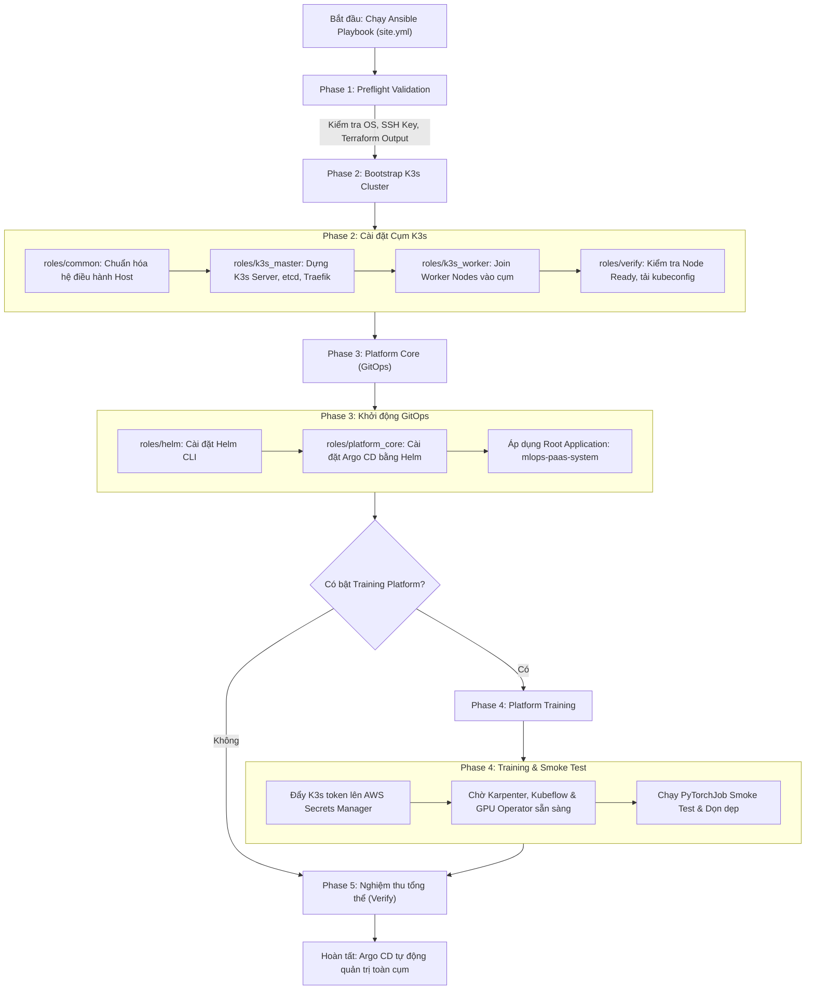

# Ansible - Cấu hình Máy chủ & Khởi tạo Cụm K3s (Host & Cluster Bootstrap)

Thư mục `ansible/` chứa toàn bộ mã nguồn Ansible tự động hóa quá trình chuẩn bị hệ điều hành, cài đặt cụm Kubernetes K3s trên AWS EC2, và khởi động hệ thống GitOps (Argo CD) cho nền tảng MLOps PaaS.

---

## 1. Giới thiệu

### 1.1. Vai trò trong hệ thống
Trong kiến trúc tổng thể của MLOps PaaS, Ansible đóng vai trò là **cầu nối chuyển giao hạ tầng (Infrastructure Handoff)** giữa tầng IaaS (AWS) và tầng PaaS/Workload (Kubernetes):
- **Terraform** chịu trách nhiệm tạo hạ tầng ảo hóa đám mây (VPC, Subnets, EC2 Instances, Security Groups, ALB, IAM, S3, Secrets Manager).
- **Ansible** nhận thông tin đầu ra từ Terraform, truy cập SSH vào các máy chủ Ubuntu để cấu hình môi trường, cài đặt cụm K3s gọn nhẹ nhưng chuẩn hóa sản xuất (với embedded etcd, Traefik, ServiceLB), cài đặt Helm và kích hoạt **Argo CD**.
- **Argo CD (GitOps)** sau khi được Ansible dựng lên sẽ tiếp quản toàn bộ vòng đời của các addons và microservices ứng dụng được khai báo trong thư mục `k8s/`.

```
+---------------+       +------------------+       +-------------------+
|   Terraform   | ----> |     Ansible      | ----> |      Argo CD      |
|  (AWS Infra)  |       | (Host & K3s Init)|       | (GitOps Workloads)|
+---------------+       +------------------+       +-------------------+
  - VPC / Subnets         - Chuẩn hóa OS Ubuntu      - Addons & CRDs
  - EC2 Master/Workers    - K3s Server & Workers     - Platform Services
  - ALB & IAM Roles       - Cài đặt Helm & Argo CD   - User Workloads
```

---

### 1.2. Các thành phần chính

1. **Dynamic Inventory (`inventory/terraform.py`):**
   - Tự động đọc `terraform output -json` từ thư mục `infra/`.
   - Phân loại các máy chủ thành các nhóm logic: `master` (Master node có Public IP) và `workers` (các Worker node có Private IP trong VPC).
   - Thiết lập cấu hình kết nối SSH ProxyJump tự động qua Master node để Ansible trên máy điều khiển có thể cấu hình các Worker node trong mạng nội bộ.

2. **Cấu hình chuẩn hóa máy chủ (`roles/common`):**
   - Tối ưu hóa kernel Linux (sysctl parameters cho Kubernetes networking như `net.bridge.bridge-nf-call-iptables`, `net.ipv4.ip_forward`).
   - Tắt swap, cài đặt các gói tiện ích phụ trợ (`curl`, `iptables`, `socat`).

3. **Cài đặt cụm K3s (`roles/k3s_master` & `roles/k3s_worker`):**
   - Cài đặt K3s server phiên bản cố định (`v1.34.9+k3s1`) với cơ chế lưu trữ **Embedded etcd** (hỗ trợ tự động sao lưu snapshot định kỳ lên ổ đĩa).
   - Kích hoạt mã hóa Secret ở tầng lưu trữ (Secrets Encryption at rest).
   - Đặt taint `CriticalAddonsOnly=true:NoSchedule` trên Master node để bảo vệ control-plane không bị quá tải bởi workload người dùng.
   - Cấu hình Traefik Ingress Controller nội bộ với request timeout 600s (khớp với AWS ALB idle timeout) và danh sách dải IP tin cậy (Trusted IPs) để xử lý đúng header `X-Forwarded-Proto`.
   - Kết nối (Join) các Worker node vào cụm bằng node token bảo mật, gán label và AWS Provider ID (lấy qua IMDSv2).
   - Tự động trích xuất file cấu hình truy cập cụm (`kubeconfig`) về máy điều khiển.

4. **Khởi động GitOps Core (`roles/helm` & `roles/platform_core`):**
   - Cài đặt Helm CLI (`v3.17.3`) trực tiếp trên Master node.
   - Dùng Helm cài đặt Argo CD chính thức (`argo/argo-cd`).
   - Tạo Application gốc (`mlops-paas-system`) trỏ về repository Git để Argo CD tự động đồng bộ toàn bộ hạ tầng K8s còn lại.

5. **Hạ tầng Huấn luyện Đàn hồi (`roles/platform_training` - Tùy chọn):**
   - Xuất K3s agent token an toàn lên AWS Secrets Manager để trình quản lý mở rộng node tự động (**Karpenter**) sử dụng khi cấp phát các worker node tạm thời (Spot/On-Demand CPU/GPU).
   - Chờ các CRD và Controller (Kubeflow Training Operator, GPU Operator, Karpenter) sẵn sàng.
   - Khởi chạy bài kiểm tra khói (**Smoke test**) với `PyTorchJob` dùng ảnh CUDA trên namespace cô lập `ansible-training-smoke` và dọn dẹp sạch sẽ sau kiểm tra.

6. **Kiểm tra & Nghiệm thu (`roles/verify`):**
   - Thực thi các kiểm tra xác thực tính sẵn sàng của Node, Pod hệ thống, CRD và trạng thái đồng bộ (`Synced` & `Healthy`) của các ứng dụng GitOps.

---

### 1.3. Luồng hoạt động (Workflow Lifecycle)



---

## 2. Cấu trúc cây thư mục

```text
ansible/
├── ansible.cfg                 # File cấu hình mặc định của Ansible (inventory path, SSH params, timeout)
├── requirements.yml            # Khai báo các Ansible Collections phụ thuộc (kubernetes.core, cloud.common)
├── site.yml                    # Playbook chính điều phối toàn bộ các giai đoạn triển khai
├── group_vars/                 # Biến cấu hình theo nhóm máy chủ
│   ├── all.yml                 # Biến toàn cục (phiên bản K3s/Helm, domain, danh sách add-ons, flags)
│   ├── master.yml              # Biến riêng cho Master node
│   └── workers.yml             # Biến riêng cho Worker nodes
├── inventory/                  # Quản lý danh sách máy chủ
│   ├── terraform.py            # Dynamic Inventory Script (đọc IP trực tiếp từ Terraform outputs)
│   └── hosts.ini.tpl           # File mẫu inventory tĩnh dự phòng
├── artifacts/                  # Thư mục chứa tệp xuất ra (được gitignore)
│   └── kubeconfig              # File kubeconfig được tải về từ Master sau khi khởi tạo thành công
└── roles/                      # Các vai trò (Roles) thực thi tác vụ
    ├── preflight/              # Kiểm tra điều kiện tiên quyết trước khi chạy
    ├── common/                 # Cấu hình nhân Linux, mạng, tắt swap trên mọi máy chủ
    ├── k3s_master/             # Cài đặt K3s server, etcd snapshot, Traefik Ingress
    ├── k3s_worker/             # Kết nối worker node vào cụm qua private IP
    ├── helm/                   # Cài đặt Helm binary trên Master node
    ├── platform_core/          # Cài đặt Argo CD và deploy root GitOps Application
    ├── platform_training/      # Cấu hình mở rộng phục vụ Training (Karpenter token, Kubeflow)
    └── verify/                 # Kiểm tra tính toàn vẹn của cụm, CRD và trạng thái các app Argo CD
```

---

## 3. Hướng dẫn khởi chạy và các lệnh cần thiết

### 3.1. Yêu cầu chuẩn bị môi trường điều khiển (Control Host)
> [!IMPORTANT]
> Ansible yêu cầu chạy trên môi trường **Linux/Unix native** hoặc **WSL2 Ubuntu** trên Windows. Không chạy Ansible trực tiếp từ PowerShell của Windows.

1. **Khởi tạo môi trường Python và cài đặt thư viện:**
   ```bash
   cd /mnt/d/AI\ Models/mlops-paas-system
   python3 -m venv .venv-ansible
   source .venv-ansible/bin/activate
   pip install -r ansible/requirements.txt
   ansible-galaxy collection install -r ansible/requirements.yml
   ```

2. **Cấu hình SSH Key:**
   Đặt quyền `0600` cho file private key truy cập AWS EC2 (được tạo bởi Terraform hoặc có sẵn):
   ```bash
   install -m 0600 /path/to/aws_key ~/.ssh/aws_key
   ```

3. **Cập nhật dữ liệu từ Terraform:**
   Đảm bảo hạ tầng AWS đã được khởi tạo và Terraform outputs đã sẵn sàng:
   ```bash
   terraform -chdir=infra apply -refresh-only
   terraform -chdir=infra output -json
   ```

---

### 3.2. Các lệnh kiểm tra tĩnh (Static Verification)
Chạy các lệnh kiểm tra trước khi thực sự áp dụng thay đổi lên cụm:

```bash
cd ansible
export ANSIBLE_CONFIG=./ansible.cfg

# 1. Kiểm tra danh sách máy chủ được parse từ Terraform
ansible-inventory --graph

# 2. Kiểm tra cú pháp của playbook
ansible-playbook --syntax-check site.yml

# 3. Kiểm tra tính hợp lệ của kustomize GitOps
kubectl kustomize --enable-helm ../k8s >/dev/null
```

---

### 3.3. Các lệnh triển khai theo từng giai đoạn (Phased Rollout)

Để đảm bảo việc triển khai an toàn và dễ cô lập lỗi, playbook được phân chia theo các `--tags`:

```bash
# Bước 1: Khởi tạo cụm K3s (Cấu hình OS, Master, Worker và kiểm tra tính lũy thừa - Idempotency)
ansible-playbook site.yml --tags bootstrap
ansible-playbook site.yml --tags bootstrap

# Bước 2: Dựng nền tảng GitOps cốt lõi (Helm + Argo CD + Root Application)
ansible-playbook site.yml --tags platform-core

# Bước 3: Nghiệm thu và kiểm tra sức khỏe của cụm K3s và các ứng dụng Core
ansible-playbook site.yml --tags verify
```

Khi muốn kích hoạt thêm các thành phần phục vụ **Huấn luyện mô hình (Training Platform: Karpenter, Kubeflow, GPU Operator)**:
```bash
ansible-playbook site.yml --tags preflight,platform-training,verify
```

---

### 3.4. Sử dụng kubeconfig để quản trị cụm từ xa
Sau khi chạy phase `bootstrap`, file kubeconfig sẽ được lưu tại `ansible/artifacts/kubeconfig`.
Do API Server cổng 6443 nằm trong mạng riêng (Private Subnet), bạn có thể thiết lập SSH tunnel qua Master node để thao tác `kubectl` từ máy local:

```bash
# Thiết lập đường hầm SSH từ máy local tới cổng 6443 của Master
ssh -i ~/.ssh/aws_key -N -L 6443:127.0.0.1:6443 ubuntu@<MASTER_PUBLIC_IP> &

# Trỏ KUBECONFIG và kiểm tra cụm
export KUBECONFIG=$(pwd)/ansible/artifacts/kubeconfig
kubectl get nodes -o wide
```

---

## 4. Các chú ý quan trọng

> [!WARNING]
> **Quyền truy cập và bảo mật SSH Key:**
> Tuyệt đối không commit private SSH key (`aws_key`) hoặc file `kubeconfig` lên Git repository. Thư mục `ansible/artifacts/` đã được cấu hình trong `.gitignore`. File key trên máy chủ điều khiển bắt buộc phải có phân quyền `chmod 600`.

> [!NOTE]
> **Hạn chế thư mục chia sẻ WSL `/mnt/d`:**
> Ansible từ chối đọc file cấu hình `ansible.cfg` nếu file đó nằm trên thư mục NTFS mount `/mnt/d` có quyền truy cập mở rộng (`777`). Nếu chạy trong WSL, hãy copy `ansible.cfg` vào `/tmp` hoặc cấp quyền thích hợp trước khi chạy:
> ```bash
> export ANSIBLE_CONFIG="$(mktemp /tmp/ansible.XXXXXX.cfg)"
> install -m 0600 ansible.cfg "$ANSIBLE_CONFIG"
> ```

> [!TIP]
> **Cấu hình Traefik Ingress Timeout:**
> Traefik trong cụm K3s đã được cấu hình template với timeout `600s`. Điều này giúp đồng bộ với **AWS ALB Idle Timeout** (600s), tránh tình trạng bị ngắt kết nối giữa chừng (HTTP 504) khi người dùng hoặc CI/CD đẩy các Docker Image tầng lớn lên Harbor Registry.

> [!IMPORTANT]
> **Tính duy nhất của vai trò quản trị (Single Source of Truth):**
> - **Ansible** không quản lý hay chỉnh sửa trực tiếp các deployment của microservices (control-plane, model-server, v.v.).
> - Sau khi Ansible dựng xong Argo CD, toàn bộ việc cập nhật, rollback, giám sát trạng thái ứng dụng phải được thực hiện thông qua **Argo CD** và các khai báo GitOps trong thư mục `k8s/`.
