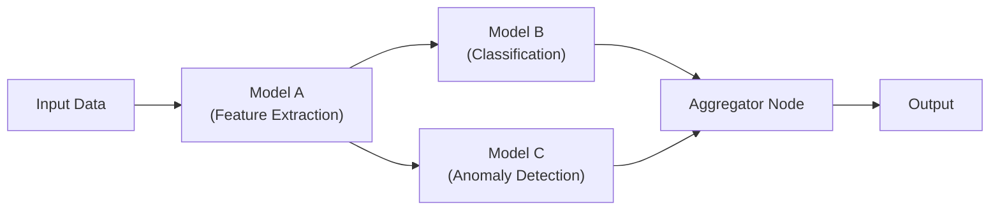

# Đánh giá 7 Đề xuất Cải thiện Hệ thống AI PaaS

Dựa trên kiến trúc hiện tại của hệ thống (Control Plane Django + Data Plane FastAPI/BentoML + Argo Workflows + Karpenter + Harbor), dưới đây là phân tích chi tiết từng đề xuất.

---

## 1. Sử dụng Base Image chung thay vì Build Image riêng

**Hiện trạng:** Mỗi lần user deploy model, hệ thống build một Docker image riêng cho từng model (qua [cli.py](file:///d:/AI%20Models/mlops-nids-system/services/model-packager/src/cli.py#L114-L154)). Image này dùng `FROM mlops-paas-model-server:latest` rồi `COPY` thêm requirements và model artifact vào.

| Tiêu chí | Đánh giá |
|---|---|
| **Tính khả thi** | ⭐⭐⭐⭐⭐ Rất cao — hệ thống đã gần như làm điều này rồi |
| **Tác động** | ⭐⭐⭐⭐ Giảm đáng kể dung lượng Harbor và thời gian build |
| **Độ phức tạp** | ⭐⭐ Thấp |
| **Ưu tiên đề xuất** | 🟢 Nên làm sớm |

### Phân tích kỹ thuật

**Ưu điểm:**
- Harbor sẽ chỉ lưu **1 base image** (~500MB–1GB), thay vì mỗi model lại tạo thêm ~500MB. Với 100 models, tiết kiệm được hàng chục GB dung lượng registry.
- Thời gian build giảm từ vài phút xuống vài giây (chỉ cần `pip install` thêm requirements nhỏ).
- Docker layer caching hoạt động hiệu quả hơn vì các layer base được chia sẻ (shared).

**Cách triển khai đề xuất:**
Thay vì build Docker image riêng, chuyển sang mô hình **"Init Container + Shared Volume"**:

```
┌─ Init Container (base image) ─────────────┐
│  1. Tải model artifact từ S3              │
│  2. pip install -r user_requirements.txt  │
│  3. Ghi model vào /shared-volume/         │
└────────────────────────────────────────────┘
                    ↓ emptyDir volume
┌─ Main Container (base image) ─────────────┐
│  FastAPI/BentoML server                    │
│  Load model từ /shared-volume/             │
└────────────────────────────────────────────┘
```

> [!WARNING]
> **Đánh đổi (Trade-off):** Mô hình Init Container sẽ làm **thời gian khởi động Pod lâu hơn** (cold start) vì phải tải model từ S3 mỗi lần Pod restart. Ngược lại, mô hình build image riêng thì model đã nằm sẵn trong image, khởi động nhanh hơn. Cần cân nhắc giữa "tiết kiệm storage" vs "tốc độ khởi động".

> [!TIP]
> **Giải pháp trung dung:** Giữ nguyên cơ chế build image riêng cho model, nhưng sử dụng **Docker multi-stage build** + **Harbor image GC (Garbage Collection)** để tự động xóa các image cũ. Đồng thời cấu hình `--cache-repo` cho Kaniko để tận dụng layer cache tối đa.

---

## 2. Hỗ trợ đa dạng mô hình AI (Deep Learning + BentoML)

**Hiện trạng:** Hệ thống đã có sẵn 2 runtime:
- [model-server](file:///d:/AI%20Models/mlops-nids-system/services/model-server/src/index.py) (FastAPI) — cho ML truyền thống (sklearn, xgboost)
- [bento-model-server](file:///d:/AI%20Models/mlops-nids-system/services/bento-model-server/src/index.py) — cho Deep Learning (mlflow.pyfunc)

| Tiêu chí | Đánh giá |
|---|---|
| **Tính khả thi** | ⭐⭐⭐⭐⭐ Rất cao — template BentoML đã sẵn sàng |
| **Tác động** | ⭐⭐⭐⭐⭐ Mở rộng thị trường người dùng rất lớn |
| **Độ phức tạp** | ⭐⭐⭐ Trung bình |
| **Ưu tiên đề xuất** | 🟢 Nên làm sớm |

### Phân tích kỹ thuật

**Những gì đã có:**
- Template BentoML đã tích hợp đầy đủ: Redpanda logging, FastAPI routing (`/models/{id}/predict`), health check — **tương thích hoàn toàn** với Traefik IngressRoute hiện tại.
- Hàm `build_bento_image()` trong [cli.py](file:///d:/AI%20Models/mlops-nids-system/services/model-packager/src/cli.py#L156-L195) đã xử lý logic build image BentoML.

**Những gì cần hoàn thiện:**

1. **Control Plane:** `ModelProject` và `ModelVersion` lưu `model_type`/`flavor` để phân biệt ML với DL. Khi user chọn "Deep Learning", Control Plane truyền flavor tương ứng xuống model-packager.
2. **Deploy Adapter:** Cần sửa [deploy_adapter.py](file:///d:/AI%20Models/mlops-nids-system/services/control-plane/src/deployment/deploy_adapter.py) để chọn đúng base image (FastAPI vs BentoML) dựa trên `runtime_type`.
3. **Kaniko Pipeline:** Cần tạo thêm 1 variant của [build-workflowtemplate.yaml](file:///d:/AI%20Models/mlops-nids-system/k8s/argo-workflows/build-workflowtemplate.yaml) hoặc thêm parameter `RUNTIME_TYPE` để chọn base image phù hợp.
4. **Frontend:** Thêm dropdown cho user chọn loại model khi upload.

> [!TIP]
> **Lợi thế lớn của BentoML:** Adaptive Batching tự động gom nhiều request nhỏ thành 1 batch lớn trước khi chạy inference → tối ưu GPU utilization cho Deep Learning models. Đây là điểm mạnh rất đáng quảng bá.

---

## 3. Kết nối Model thành Pipeline (giao diện giống n8n)

**Hiện trạng:** Mỗi model hiện tại là một endpoint độc lập. Chưa có cơ chế nối đầu ra (output) của model A thành đầu vào (input) của model B.

| Tiêu chí | Đánh giá |
|---|---|
| **Tính khả thi** | ⭐⭐⭐ Trung bình |
| **Tác động** | ⭐⭐⭐⭐⭐ Rất cao — đây là tính năng "killer feature" |
| **Độ phức tạp** | ⭐⭐⭐⭐⭐ Rất cao |
| **Ưu tiên đề xuất** | 🟡 Nên làm sau khi các tính năng cơ bản ổn định |

### Phân tích kỹ thuật

**Mô hình kiến trúc đề xuất:**



**Thành phần cần xây dựng:**

| Thành phần | Mô tả | Độ khó |
|---|---|---|
| **Pipeline Definition (Backend)** | Model mới trong Django: `Pipeline`, `PipelineNode`, `PipelineEdge` | ⭐⭐ |
| **Pipeline Executor (Backend)** | Service điều phối chạy tuần tự/song song các node, mapping output → input | ⭐⭐⭐⭐ |
| **Visual Editor (Frontend)** | Giao diện kéo-thả node giống n8n (dùng thư viện như React Flow) | ⭐⭐⭐⭐ |
| **Data Transform Nodes** | Các node chuyển đổi dữ liệu giữa các model (format mapping) | ⭐⭐⭐ |

> [!IMPORTANT]
> **Đây là một tính năng lớn**, tương đương với việc xây dựng một hệ thống **Inference Pipeline Orchestrator** riêng. Nên cân nhắc triển khai theo giai đoạn:
> - **Phase 1:** Cho phép nối 2 model theo kiểu chuỗi (sequential) đơn giản — output model A → input model B. Không cần giao diện kéo thả, chỉ cần form cấu hình.
> - **Phase 2:** Giao diện kéo thả (React Flow) và hỗ trợ DAG (song song + nối nhánh).

> [!TIP]
> Thư viện **React Flow** (https://reactflow.dev) là lựa chọn rất phổ biến cho giao diện kéo-thả node, miễn phí và tương thích tốt với React + TypeScript hiện có.

---

## 4. Đánh giá suy giảm mô hình toàn diện (không chỉ Data Drift)

**Hiện trạng:** Hệ thống chỉ dùng **Evidently AI DataDriftPreset** để so sánh phân phối features giữa dữ liệu tham chiếu và dữ liệu production. Chưa đánh giá được chất lượng prediction thực tế.

| Tiêu chí | Đánh giá |
|---|---|
| **Tính khả thi** | ⭐⭐⭐⭐ Cao |
| **Tác động** | ⭐⭐⭐⭐⭐ Rất cao — đây là điểm yếu lớn nhất hiện tại |
| **Độ phức tạp** | ⭐⭐⭐ Trung bình |
| **Ưu tiên đề xuất** | 🟢 Nên làm sớm |

### Phân tích kỹ thuật

Hệ thống hiện tại đã log đủ dữ liệu cần thiết qua Redpanda (features + prediction). Chỉ cần bổ sung thêm các khía cạnh đánh giá:

**Các loại giám sát cần bổ sung:**

| Loại giám sát | Dữ liệu cần | Hiện có? | Cách triển khai |
|---|---|---|---|
| **Data Drift** (Đã có) | Features tham chiếu vs production | ✅ | Evidently DataDriftPreset |
| **Prediction Drift** | Phân phối prediction thay đổi | ✅ (prediction đã log) | Thêm Evidently `TargetDriftPreset` |
| **Confidence Monitoring** | Xác suất dự đoán (probability/confidence) | ❌ Cần bổ sung | Log thêm `confidence` từ model server |
| **Performance Monitoring** (F1, Accuracy...) | Ground Truth labels | ❌ Cần bổ sung | Cần API cho user gửi labels thực tế |

**Cách triển khai cụ thể:**

1. **Prediction Drift:** Dễ nhất — Evidently đã hỗ trợ sẵn. Chỉ cần sửa [evidently worker](file:///d:/AI%20Models/mlops-nids-system/services/evidently) để chạy thêm `TargetDriftPreset` song song với `DataDriftPreset`.

2. **Confidence Monitoring:** Sửa model server để log thêm `confidence_score` vào Redpanda message. Sau đó dùng Evidently `NumericValueDrift` để phát hiện khi confidence trung bình giảm.

3. **Performance Monitoring (F1, Precision, Recall):**

> [!WARNING]
> Đây là phần **khó nhất** vì cần **Ground Truth** (nhãn thực tế). Trong thực tế, nhãn thực tế thường chỉ có sau một khoảng thời gian (ví dụ: sau khi chuyên gia kiểm tra). Cần xây dựng:
> - API endpoint `/api/drift/feedback` cho phép user gửi batch labels thực tế (ground truth)
> - Lưu vào PostgreSQL và join với prediction logs
> - Tính F1/Precision/Recall rồi vẽ biểu đồ trên Dashboard

---

## 5. Huấn luyện mô hình phân tán (Multi-framework + DAG Pipeline)

**Hiện trạng:** Hệ thống chỉ hỗ trợ **Kubeflow PyTorchJob** (CPU/GPU). Mỗi Training Job là 1 step đơn lẻ.

| Tiêu chí | Đánh giá |
|---|---|
| **Tính khả thi** | ⭐⭐⭐ Trung bình |
| **Tác động** | ⭐⭐⭐⭐ Cao — mở rộng khả năng huấn luyện |
| **Độ phức tạp** | ⭐⭐⭐⭐⭐ Rất cao |
| **Ưu tiên đề xuất** | 🟡 Nên làm sau — cần thiết kế kỹ |

### Phân tích kỹ thuật

**Hỗ trợ đa framework:**

| Framework | K8s Operator | Cần cài thêm? |
|---|---|---|
| PyTorch | Kubeflow Training Operator (PyTorchJob) | ✅ Đã có |
| XGBoost | Kubeflow Training Operator (XGBoostJob) | ❌ Cần enable thêm |
| TensorFlow | Kubeflow Training Operator (TFJob) | ❌ Cần enable thêm |
| MPI (Horovod) | Kubeflow Training Operator (MPIJob) | ❌ Cần enable thêm |

> [!NOTE]
> **Tin vui:** Kubeflow Training Operator mà hệ thống đang dùng thực ra đã hỗ trợ sẵn tất cả các loại Job trên (PyTorchJob, XGBoostJob, TFJob, MPIJob). Bạn chỉ cần tạo thêm các WorkflowTemplate tương ứng và sửa Control Plane để truyền đúng `framework_type`.

**DAG Pipeline (giống GitHub Actions):**

Ý tưởng này rất phù hợp với **Argo Workflows** vì Argo đã hỗ trợ sẵn DAG template:

```yaml
# Ví dụ: User định nghĩa pipeline 3 bước
steps:
  - name: preprocess
    template: xgboost-job  # Bước 1: Tiền xử lý
  - name: train-model-a
    template: pytorch-job   # Bước 2a: Huấn luyện song song
    depends: preprocess
  - name: train-model-b
    template: xgboost-job   # Bước 2b: Huấn luyện song song
    depends: preprocess
  - name: evaluate
    template: pytorch-job   # Bước 3: Đánh giá
    depends: train-model-a && train-model-b
```

**Cách triển khai:**
1. User định nghĩa pipeline trên giao diện web (YAML hoặc visual editor).
2. Control Plane chuyển đổi thành Argo Workflow DAG spec.
3. Submit Workflow lên Argo.

> [!CAUTION]
> **Rủi ro lớn nhất:** Hệ thống hiện tại dùng Karpenter Scale-to-Zero. Nếu user tạo pipeline có 5 bước song song, Karpenter sẽ phải provision 5 EC2 nodes cùng lúc → **chi phí AWS có thể bùng nổ**. Cần thiết lập **resource quota per tenant** và **max concurrent pods**.

---

## 6. Hiển thị Metrics trên giao diện Web (Prometheus + Grafana)

**Hiện trạng:** Hệ thống đã có Prometheus + Grafana + [ServiceMonitor](file:///d:/AI%20Models/mlops-nids-system/k8s/monitoring/model-server-servicemonitor.yaml), nhưng metrics chỉ xem được qua Grafana Dashboard riêng. Chưa tích hợp vào giao diện web chính.

| Tiêu chí | Đánh giá |
|---|---|
| **Tính khả thi** | ⭐⭐⭐⭐⭐ Rất cao |
| **Tác động** | ⭐⭐⭐⭐ Cao — cải thiện trải nghiệm người dùng |
| **Độ phức tạp** | ⭐⭐⭐ Trung bình |
| **Ưu tiên đề xuất** | 🟢 Nên làm sớm |

### Phân tích kỹ thuật

**Các metrics cần hiển thị:**

| Metric | Nguồn | Hiển thị |
|---|---|---|
| CPU/Memory Usage (Pod) | `container_cpu_usage_seconds_total` | Biểu đồ đường (line chart) |
| Network I/O | `container_network_receive_bytes_total` | Biểu đồ đường |
| Request Count/Latency | `http_requests_total` (FastAPI Instrumentator) | Biểu đồ thanh + p50/p95/p99 |
| Pod Status (Running/Crash) | `kube_pod_status_phase` | Badge trạng thái |
| GPU Utilization | `DCGM_FI_DEV_GPU_UTIL` (nếu có DCGM Exporter) | Gauge |

**Cách triển khai (2 lựa chọn):**

| Cách | Mô tả | Ưu điểm | Nhược điểm |
|---|---|---|---|
| **A. Embed Grafana Panel** | Dùng `<iframe>` nhúng Grafana panel vào React | Nhanh, không cần viết code backend | Cần cấu hình Grafana anonymous auth, giao diện khó custom |
| **B. Proxy API qua Control Plane** | Django query Prometheus HTTP API → trả JSON cho Frontend → React vẽ chart | Full control giao diện, bảo mật tốt hơn | Cần viết thêm API endpoint + Frontend chart component |

> [!TIP]
> **Đề xuất:** Dùng **Cách B** (Proxy API) với thư viện **Recharts** hoặc **Chart.js** trên React. Lý do: giao diện đồng nhất với hệ thống, không phụ thuộc vào Grafana auth, và bạn có thể filter metrics theo `tenant_id` để đảm bảo multi-tenant isolation.

**Endpoint Prometheus API mẫu:**
```
GET <Prometheus query_range endpoint>?query=container_cpu_usage_seconds_total{pod=~"endpoint-.*"}&start=...&end=...&step=60s
```

---

## 7. Tích hợp Billing (Tính tiền dựa trên tài nguyên sử dụng)

**Hiện trạng:** Hệ thống chưa có bất kỳ cơ chế nào theo dõi chi phí hay tính tiền.

| Tiêu chí | Đánh giá |
|---|---|
| **Tính khả thi** | ⭐⭐⭐ Trung bình |
| **Tác động** | ⭐⭐⭐⭐⭐ Rất cao — cần thiết để thương mại hóa |
| **Độ phức tạp** | ⭐⭐⭐⭐⭐ Rất cao |
| **Ưu tiên đề xuất** | 🟡 Nên làm sau khi Prometheus Metrics Dashboard ổn định |

### Phân tích kỹ thuật

**Các tài nguyên cần tính tiền:**

| Tài nguyên | Đơn vị tính | Nguồn dữ liệu |
|---|---|---|
| **Model Endpoint** (CPU/RAM) | vCPU-giờ, GB-RAM-giờ | Prometheus: `container_cpu_usage_seconds_total`, `container_memory_working_set_bytes` |
| **Training Job** (CPU/GPU) | vCPU-giờ, GPU-giờ | Prometheus + Karpenter EC2 node cost |
| **Storage** (S3 + Harbor) | GB-tháng | AWS S3 API: `GetBucketMetricsConfiguration` |
| **API Requests** | Số lượng request | Prometheus: `http_requests_total` |
| **Bandwidth** | GB transferred | Prometheus: `container_network_transmit_bytes_total` |

**Kiến trúc Billing đề xuất:**

```
Prometheus ──(query)──→ Django Billing Service ──(aggregate)──→ PostgreSQL
                              │                                    │
                              │ (cron job hàng giờ)                │
                              ↓                                    ↓
                        Tính Usage Hourly              Dashboard + Invoice
```

**Các bước triển khai:**

1. **Usage Collector (CronJob):** Tạo một Django management command (hoặc Argo CronWorkflow) chạy mỗi giờ, query Prometheus lấy metrics của từng tenant, tính toán usage rồi lưu vào bảng `UsageRecord`.

2. **Pricing Model:** Tạo bảng `PricingPlan` trong Django ORM:
   ```
   PricingPlan: cpu_per_hour, gpu_per_hour, storage_per_gb, request_per_1000
   UsageRecord: tenant_id, resource_type, quantity, timestamp
   Invoice: tenant_id, period, total_amount, status
   ```

3. **Dashboard:** Hiển thị biểu đồ usage + estimated cost trên giao diện web.

> [!IMPORTANT]
> **Lưu ý quan trọng:** Billing là tính năng **cực kỳ nhạy cảm**. Sai sót trong tính toán có thể gây mất niềm tin của khách hàng. Cần:
> - Audit trail cho mọi bản ghi usage
> - Idempotent collection (chạy lại không bị tính trùng)
> - Grace period cho tenant mới (free trial)

> [!TIP]
> **Gợi ý thực tế:** Nếu mục đích ban đầu chỉ là cho user thấy chi phí ước tính (không phải thu tiền thật), bạn có thể bắt đầu đơn giản bằng cách hiển thị **"Estimated Cost"** trên Dashboard dựa trên bảng giá EC2 on-demand. Việc tích hợp thanh toán thật (Stripe, PayPal...) có thể làm ở giai đoạn sau.

---

## Tổng hợp & Lộ trình đề xuất

### Ma trận ưu tiên

```
           Tác động cao
               │
    ┌──────────┼──────────┐
    │  ④ Drift │ ③ n8n    │
    │  ⑥ Metrics│ ⑤ Train │
    │  ② BentoML│ ⑦ Billing│
    │  ① Base   │          │
    │  Image    │          │
    ├──────────┼──────────┤
    │          │          │
    │          │          │
    └──────────┼──────────┘
               │
           Tác động thấp
   Dễ triển khai ← → Khó triển khai
```

### Lộ trình đề xuất theo 3 giai đoạn

| Giai đoạn | Tính năng | Thời gian ước tính | Lý do |
|---|---|---|---|
| **Phase 1 — Nền tảng** | ② BentoML Deep Learning + ④ Prediction Drift + ⑥ Prometheus Metrics Dashboard | 2–3 tuần | Tận dụng code đã có sẵn, tác động lớn, độ phức tạp vừa phải |
| **Phase 2 — Nâng cao** | ① Tối ưu Image Storage + ⑤ Đa framework Training (XGBoostJob, TFJob) | 2–3 tuần | Mở rộng khả năng huấn luyện, tối ưu chi phí |
| **Phase 3 — Thương mại** | ③ Pipeline Editor (n8n) + ⑦ Billing + ⑤ DAG Training Pipeline | 4–6 tuần | Tính năng phức tạp, cần thiết kế UX kỹ lưỡng |

> [!NOTE]
> Lộ trình trên là gợi ý. Bạn có thể điều chỉnh thứ tự dựa trên nhu cầu thực tế của người dùng và deadline dự án.
