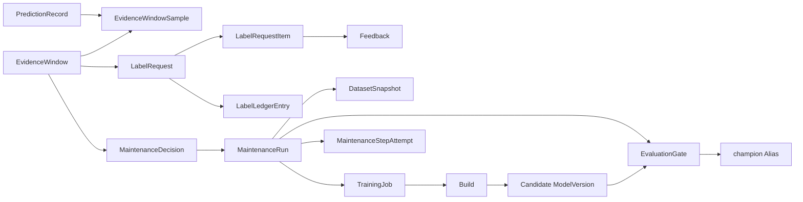

# Thiết kế cơ sở dữ liệu cho Continuous Training

Tài liệu này đối chiếu schema hiện tại với luồng Continuous Training (CT) trong đề cương. Phạm vi chỉ gồm dữ liệu do các backend của hệ thống sở hữu. Các bảng do MLflow và PostgreSQL tạo không thuộc phạm vi thiết kế lại.

## 1. Quy ước

- Các model Django hiện dùng `id BIGINT` làm khóa nội bộ và `public_id UUID UNIQUE` làm định danh qua API. Danh sách dưới đây lược bớt hai cột này khi chúng xuất hiện ở hầu hết bảng.
- Các bảng Django nằm trong schema `control_plane`; Consumer hiện tự tạo bảng trong schema `public`.
- `created_at`, `updated_at`, các khóa ngoại và index vẫn được nêu khi chúng mang ý nghĩa vòng đời hoặc truy vấn.
- PostgreSQL và object storage là nguồn dữ liệu bền vững. Redis chỉ giữ queue, cache và log tạm.

## 2. Inventory hiện tại

### 2.1. Bảng nghiệp vụ do Control Plane quản lý

| Nhóm | Table | Thuộc tính nghiệp vụ hiện có | Vai trò hiện tại |
|---|---|---|---|
| Identity | `identity_customuser` | `email`, `tenant_id`, `full_name`, `description`, `pronouns`, `company`, `avatar`, `field_of_work`, `country`, `auth_provider`, `password`, `last_login`, `is_active`, `is_staff`, `is_superuser`, `deleted_at`, `date_joined` | Tài khoản, tenant và hồ sơ người dùng. |
| Identity | `identity_useravatar` | `user_id`, `image`, `created_at` | Lịch sử avatar. |
| Identity | `identity_customuser_groups` | `customuser_id`, `group_id` | Quan hệ quyền do `PermissionsMixin` sinh ra. |
| Identity | `identity_customuser_user_permissions` | `customuser_id`, `permission_id` | Quyền trực tiếp do `PermissionsMixin` sinh ra. |
| Access | `access_control_userapikey` | `user_id`, `name`, `description`, `key_prefix`, `key_hash`, `last_used_at`, `revoked_at`, `created_at` | API key đã băm của người dùng. |
| Access | `access_control_userapikey_allowed_projects` | `userapikey_id`, `modelproject_id` | Scope project của API key. |
| Catalog | `catalog_modelproject` | `owner_id`, `name`, `description`, `access_mode`, `next_version_number`, `is_active`, `deletion_state`, `deletion_error`, `deletion_task_id`, `deleted_at`, timestamps | Aggregate gốc của một model project và trạng thái xóa bất đồng bộ. |
| Catalog | `catalog_workspaceasset` | `project_id`, `kind`, `relative_path`, `s3_uri`, `checksum`, `size_bytes`, `content_type`, timestamps | File code/data mới nhất trong workspace; không phải snapshot bất biến. |
| Registry | `registry_modelversion` | `project_id`, `source_job_id`, `source_job_reference`, `version`, `requirements_snapshot`, `flavor`, `stage`, `deployability`, `deployability_reason`, `metrics_summary`, `params_summary`, `insights_summary`, `registered_at` | Version đã đăng ký. Có một số dữ liệu trùng với job, build, metric và alias. |
| Registry | `registry_modelartifact` | `version_id`, `kind`, `name`, `uri`, `checksum`, `size_bytes`, `content_type`, `metadata`, `created_at` | Manifest artifact bất biến của version. |
| Registry | `registry_modelmetric` | `version_id`, `name`, `value`, `step`, `timestamp`, `metadata` | Metric dạng hàng để truy vấn/so sánh. |
| Registry | `registry_registryalias` | `project_id`, `version_id`, `name`, `updated_at` | Alias định tuyến như `production`, `latest`, `champion`. |
| Registry | `registry_registryevent` | `version_id`, `actor_id`, `event_type`, `from_state`, `to_state`, `metadata`, `created_at` | Audit riêng của registry. |
| Training | `training_trainingjob` | `project_id`, `retry_of_id`, `name`, `model_flavor`, `entry_point`, `requirements_text`, `code_snapshot_uri`, `data_snapshot_uri`, `output_uri`, `mlflow_artifact_uri`, `mlflow_run_id`, `backend`, `external_job_id`, `celery_task_id`, `status`, tài nguyên CPU/RAM/GPU, `tracking`, lỗi và timestamps vòng đời/xóa | Một lần chạy training; hiện chưa chỉ ra policy, champion nền hoặc dataset manifest của CT. |
| Training | `training_trainingjobevent` | `job_id`, `event_type`, `message`, `metadata`, `idempotency_key`, `created_at` | Audit trạng thái training. |
| Training | `training_trainingjobcapability` | `job_id`, `purpose`, `token_hash`, `expires_at`, `consumed_at`, `created_at` | Capability ngắn hạn cho runner/callback; cần giữ vì lý do bảo mật. |
| Training | `training_trainingoutput` | `job_id`, `kind`, `relative_path`, `s3_uri`, `checksum`, `size_bytes`, `content_type`, `metadata`, `created_at` | Output do training runner tạo. |
| Deployment | `deployment_build` | `project_id`, `source_job_id`, `source_job_reference`, `version_id`, `flavor`, `artifact_format`, `requirements_snapshot`, `backend`, `status`, `celery_task_id`, `external_build_id`, `image_uri`, `image_digest`, `package_uri`, `logs`, `error_message`, timestamps | Build image và liên kết version. |
| Deployment | `deployment_buildinputasset` | `build_id`, `kind`, `name`, `s3_uri`, `checksum`, `size_bytes`, `content_type`, `purged_at`, `created_at` | Snapshot input của build. |
| Deployment | `deployment_deployment` | `version_id`, `build_id`, `backend`, `status`, `celery_task_id`, `external_deployment_id`, `error_message`, lifecycle timestamps | Một lần triển khai version. |
| Deployment | `deployment_endpoint` | `deployment_id`, `public_url`, `internal_url`, `runtime_name`, `runtime_namespace`, `health_status`, `last_checked_at`, `metadata`, timestamps | Endpoint và trạng thái probe của deployment. |
| Drift | `drift_driftmonitor` | `version_id`, `reference_asset_id`, `name`, `trigger_threshold`, `last_automatic_trigger_count`, `backend`, `is_active`, timestamps | Cấu hình drift gắn trực tiếp với workspace asset và watermark đếm mẫu. |
| Drift | `drift_driftrun` | `monitor_id`, `status`, `celery_task_id`, `external_run_id`, `current_data_uri`, các URI report/summary, `drift_score`, `has_drift`, `summary`, `error_message`, `idempotency_key`, timestamps | Một lần chạy Evidently. |
| Observability | `observability_eventoutbox` | `topic`, `aggregate_type`, `aggregate_id`, `event_type`, `payload`, `headers`, `attempts`, `published_at`, `last_error`, `created_at` | Transactional outbox của Control Plane. |

### 2.2. Bảng do Consumer sở hữu

Code hiện tại dự kiến tự tạo ba bảng sau khi Consumer khởi động:

| Table | Thuộc tính | Nhận xét |
|---|---|---|
| `public.mlops_inference_events` | `id`, `prediction_id`, `tenant_id`, `project_id`, `model_version_id`, `model_version`, `endpoint_url`, `request_id`, `timestamp`, `prediction`, `confidence`, `latency_ms`, `status_code`, `created_at` | Telemetry. Producer hiện chỉ phát sự kiện khi inference thành công, nên phần lớn dữ liệu trùng bảng production. `model_version` và `endpoint_url` không được producer hiện tại gửi. |
| `public.mlops_production_data` | `id`, `inference_event_id`, `tenant_id`, `project_id`, `model_version_id`, `observed_at`, `features`, `prediction`, `ground_truth`, `label_status`, `labeled_at`, `data_quality_status`, `training_eligibility`, `exclusion_reason`, `drift_run_id`, `created_at` | Candidate data cho drift/CT. `id` và `inference_event_id` hiện luôn cùng giá trị; phần label/eligibility chưa có workflow sở hữu rõ ràng. |
| `public.paas_automatic_drift_outbox` | `id`, `idempotency_key`, `model_version_id`, `attempts`, `available_at`, `locked_until`, `published_at`, `last_error`, `created_at` | Outbox thứ hai, riêng cho Consumer. |

Database local được kiểm tra còn `public.paas_production_logs`. Bảng này chứa cả `raw_payload` và toàn bộ telemetry/features của thiết kế cũ, không còn code đọc/ghi. README của Consumer nói bảng sẽ bị xóa khi khởi tạo, nhưng `init_db()` hiện chưa thực hiện lệnh xóa. Đây là bảng legacy cần loại bỏ khi reset.

### 2.3. Bảng framework cần phân biệt với bảng nghiệp vụ

`django_migrations`, `django_content_type`, `auth_permission`, `auth_group`, `auth_group_permissions`, `django_admin_log`, `django_session`, `token_blacklist_outstandingtoken` và `token_blacklist_blacklistedtoken` do Django/SimpleJWT tạo. Chúng không mô tả vòng đời MLOps. Hiện tại admin, session middleware, `PermissionsMixin` và refresh-token rotation vẫn được bật, vì vậy không nên xóa riêng các bảng này khi code vẫn phụ thuộc chúng.

## 3. Các vấn đề của schema hiện tại đối với đề tài

1. Không có identity của episode/window và danh sách prediction đã được chốt. Query “N bản ghi mới nhất” không tái lập được khi dữ liệu tiếp tục đến.
2. Không có phân vai `verify/train/gate` được chọn trước khi đọc nhãn, nên chưa chứng minh được các pool không trùng và không có leakage.
3. `ground_truth` và vài cờ trên `mlops_production_data` không đủ thay cho `LabelRequest`, feedback identity và sổ ngân sách có reserve/commit/release.
4. Không lưu đầy đủ policy version, estimator result, khoảng kiểm chứng và cả quyết định `KEEP/HOLD`; lineage hiện chỉ bắt đầu rõ từ `TrainingJob`.
5. Không có dataset manifest bất biến nối prediction IDs với code/recipe/calibration/reference/gate.
6. Không có gate so sánh candidate–champion và không lưu điều kiện promotion.
7. `celery_task_id`/external ID ở từng job chưa mô tả từng attempt khi callback lặp, đến muộn hoặc runtime cần đối soát.
8. Hai bảng production trùng dữ liệu; hai outbox có hai cơ chế retry; schema được tạo từ cả Django migration lẫn DDL khi Consumer startup.
9. `ModelVersion.stage` trùng ý nghĩa với `RegistryAlias`, trong khi code promotion chỉ cập nhật alias.
10. `source_job_reference` trùng với `source_job_id`; `metrics_summary` trùng với `registry_modelmetric`; `Build.logs` làm phình PostgreSQL dù log runtime đã có kênh riêng.

## 4. Schema đích tối thiểu

### 4.1. Nguyên tắc sở hữu

- Mọi bảng first-party nằm trong `control_plane` và chỉ được tạo bởi Django migrations. Consumer không chạy `CREATE TABLE`/`ALTER TABLE` lúc startup.
- Consumer chỉ ghi `production_predictionrecord` và tạo event trong outbox chung. Control Plane sở hữu mọi trạng thái policy, label, budget, decision, maintenance và gate.
- Các blob lớn như dataset manifest, report, model, log đầy đủ nằm ở object storage; PostgreSQL chỉ giữ URI, checksum, summary và quan hệ.
- Các bảng có dữ liệu tenant phải đi qua `project_id` hoặc FK khác dẫn tới project. Không nhận `tenant_id` độc lập nếu có thể suy ra từ project, tránh cặp tenant/project mâu thuẫn.
- Event time (`observed_at`) và ingestion time (`created_at`) được giữ riêng.

### 4.2. Bảng hiện có được giữ và chỉnh

| Table đích | Thuộc tính cần giữ/chỉnh | Thay đổi chính |
|---|---|---|
| `identity_customuser` | email, tenant identity, password/auth provider, tên/avatar hiện tại, trạng thái tài khoản, timestamps | Bỏ bảng lịch sử avatar nếu không còn yêu cầu UX; các trường hồ sơ đang được UI dùng nên chưa coi là dead field. |
| `access_control_userapikey` + bảng scope project | owner, name/description, prefix/hash, last-used/revoked, project scope | Giữ; đây là contract auth của Model Server. |
| `catalog_modelproject` | owner, name/description, access mode, version counter, deletion state, timestamps | Giữ. Version counter và deletion fields đang bảo vệ concurrency/lifecycle. |
| `catalog_workspaceasset` | project, kind, path, object URI/checksum/size/type | Chỉ là workspace mutable. CT không được dùng trực tiếp table này làm snapshot. |
| `registry_modelversion` | project, version, deployability/reason, params/insights, registered time | Bỏ `stage`; alias là nguồn sự thật promotion. Bỏ `source_job_reference`; dùng FK có bảo vệ. Bỏ `metrics_summary`; lấy metric từ bảng metric. |
| `registry_modelartifact` | version, kind/name, URI/checksum/size/type/metadata | Giữ làm manifest artifact bất biến. |
| `registry_modelmetric` | version, dataset role/split, metric name/value, step/time/metadata | Giữ và thêm `dataset_role` để phân biệt train/calibration/holdout/gate. |
| `registry_registryalias` | project, alias, version, updated time | Giữ; `champion` là con trỏ mô hình được policy kỳ vọng. |
| `training_trainingjob` | project, retry relation, trigger kind, baseline version, dataset snapshot, recipe version, runtime config/resources, backend IDs/status/error/timestamps | Bỏ URI dataset/output lặp; dataset đi qua snapshot, output đi qua `training_trainingoutput`. Bỏ `source_job_reference` ở các bảng liên quan. |
| `training_trainingjobcapability` | job, purpose, token hash, expiry/consumption | Giữ. |
| `training_trainingoutput` | job, kind/path, URI/checksum/size/type/metadata | Giữ. |
| `deployment_build` | project, source job, version, flavor/format/requirements, backend IDs/status, image/package identity, error/timestamps | Thay `logs TEXT` bằng `log_uri` và `log_tail`; bỏ `source_job_reference`. |
| `deployment_buildinputasset` | build, kind/name, URI/checksum/size/type/purge time | Giữ. |
| `deployment_deployment` | version, exact build, backend IDs/status/error/timestamps | Giữ; thêm ràng buộc service đảm bảo build thuộc đúng version. |
| `deployment_endpoint` | deployment, URLs, runtime identity, health and metadata | Giữ. |
| `drift_driftmonitor` | version, immutable reference snapshot, detector config/version, backend, active flag | Bỏ count threshold/watermark; policy và evidence window sở hữu lịch/trigger. Không trỏ vào workspace asset mutable. |
| `drift_driftrun` | monitor, evidence window, status/backend IDs, report URI, score/decision/summary/error/timestamps | Gộp nhiều URI report thành một artifact prefix/manifest; window xác định chính xác current data. |
| `observability_eventoutbox` | topic, aggregate, event, payload/headers, attempt, available/lease/published/error/timestamps | Mở rộng lease/retry và dùng chung cho Control Plane lẫn Consumer. |
| `observability_lifecycleevent` | tenant/project, aggregate type/id, event type, actor, state before/after, message, metadata, correlation/maintenance ID, timestamp | Bảng audit append-only chung, thay `registry_registryevent` và `training_trainingjobevent`. Outbox và audit là hai mục đích khác nhau nên vẫn tách bảng. |

### 4.3. Bảng prediction và dữ liệu bất biến

#### `production_predictionrecord`

Một hàng cho một inference thành công; thay cả `mlops_inference_events` và `mlops_production_data`.

| Cột | Ý nghĩa |
|---|---|
| `prediction_id UUID PRIMARY KEY` | Identity xuyên Kafka, DB, feedback và manifest. |
| `project_id`, `model_version_id` | FK theo UUID public; version phải thuộc project. Tenant suy ra từ project. |
| `observed_at`, `created_at` | Event time và ingestion time. |
| `features JSONB` | Input cần cho drift/retraining; áp dụng retention và quyền truy cập. |
| `predicted_class` | Nhãn dự đoán. |
| `positive_class_probability` | Xác suất lớp dương 0–1 cho CBPE/ATC; không dùng max-confidence 0–100. |
| `class_mapping JSONB` | Ánh xạ class của version tại thời điểm dự đoán. |
| `decision_threshold`, `calibration_version` | Contract xác suất/calibration của champion. |
| `latency_ms`, `request_id` | Telemetry và correlation cần thiết. |

Không lưu `endpoint_url`, version string, `status_code=200`, `raw_payload` hoặc `inference_event_id`; các giá trị này là dẫn xuất, hằng số hoặc trùng identity. Nhãn thật và eligibility không nằm trên prediction record.

#### `ct_datasetsnapshot`

`project_id`, `role` (`initial_train`, `calibration`, `reference`, `retrain`, `gate`, `historical_holdout`), `source_window_id` nullable, `manifest_uri`, `manifest_checksum`, `schema_checksum`, `row_count`, `code_snapshot_uri/checksum`, `recipe_version`, `metadata`, `sealed_at`, `created_at`. Manifest chứa danh sách prediction ID và được chốt trước dispatch.

### 4.4. Bảng feedback và ngân sách nhãn

| Table | Thuộc tính tối thiểu | Ràng buộc quan trọng |
|---|---|---|
| `ct_evidencewindow` | project, champion version, policy, reference snapshot, ordinal/time range, prediction manifest URI/hash, sample count, drift run, estimator results, verification interval/result, status, sealed time | Unique theo project/policy/ordinal; champion và manifest không đổi sau khi seal. |
| `ct_evidencewindowsample` | window, prediction, `label_pool` (`verify`, `train`, `gate`, `hidden`), randomized rank, data-quality status/reason | Unique `(window, prediction)`; pool được gán trước khi feedback lộ ra. |
| `ct_labelbudget` | project, episode key, total quota, quota/held/used cho verify/train/gate, status, timestamps | Check `used + held <= quota` cho tổng và từng mục đích; khóa row khi cấp quota. |
| `ct_labelrequest` | window, budget, purpose, seed, request round, requested count, status, idempotency key, timestamps | Idempotency key unique; tối đa số lượt đọc đã chốt trong policy. |
| `ct_labelrequestitem` | request, window sample, status, unit cost, timestamps | Unique trên window sample được yêu cầu; không chọn ID sau khi biết nhãn. |
| `ct_feedback` | prediction, request item, true label, source/evaluator, revealed time, checksum | Một feedback đã tiết lộ cho mỗi prediction trong protocol chính; identity phải khớp project/version/window. |
| `ct_labelledgerentry` | budget, request/item, purpose, entry type (`reserve`, `commit`, `release`), units, idempotency key, timestamp | Append-only; idempotency key unique. Retry không tính nhãn lần hai. |

Các cột tổng hợp trên `ct_labelbudget` dùng để khóa và kiểm tra nhanh; `ct_labelledgerentry` là bằng chứng kế toán để đối soát.

### 4.5. Bảng policy, quyết định, thực thi và gate

| Table | Thuộc tính tối thiểu | Vai trò |
|---|---|---|
| `ct_maintenancepolicy` | project, version, policy kind (B0–B5), config JSON, config checksum, active flag, created time | Đóng băng audit interval, ngưỡng, cooldown, cỡ mẫu, quota và recipe. Unique `(project, version)`, chỉ một policy active/project. |
| `ct_maintenancedecision` | window, policy, expected champion, action (`KEEP`, `REQUEST_LABELS`, `HOLD`, `RETRAIN`), reason code/detail, evidence snapshot, label counts, training job nullable, decided time | Lưu mọi quyết định, kể cả KEEP/HOLD; unique theo window và policy evaluation attempt. |
| `ct_maintenancerun` | decision one-to-one, expected champion, state, dataset snapshot, training job, candidate version, evaluation gate, applied deployment, deadline, error, timestamps | Trạng thái bền vững của vòng CT; chỉ một run active/project. |
| `ct_maintenancestepattempt` | run, step (`snapshot`, `training`, `build`, `gate`, `update`, `verify_runtime`), attempt number, backend, workflow UID, workload UID, status, idempotency key, dispatched/started/completed times, error | Unique `(run, step, attempt_no)` và idempotency key. Cho phép đối soát callback lặp, muộn và runtime không rõ trạng thái. |
| `ct_evaluationgate` | run, candidate version, champion version, gate snapshot, status (`pending`, `pass`, `fail`, `hold`), metric, candidate/champion values, delta, pass margin, historical-holdout result, evidence URI/checksum, reason, timestamps | Candidate chỉ được promotion khi gate pass và champion hiện tại vẫn bằng expected champion. |

Chuỗi lineage cần truy vấn được là:

## 5. Thành phần cần xóa hoặc thay thế

### Xóa table

- `public.paas_production_logs`: legacy, không còn consumer.
- `public.mlops_inference_events` và `public.mlops_production_data`: thay bằng `production_predictionrecord` cùng các bảng feedback/window chuẩn hóa.
- `public.paas_automatic_drift_outbox`: thay bằng outbox chung có lease/retry.
- `identity_useravatar`: chỉ xóa nếu chấp nhận bỏ tính năng lịch sử/chọn lại avatar; avatar hiện tại vẫn nằm trên user.
- `registry_registryevent`, `training_trainingjobevent`: thay bằng lifecycle event append-only chung.

### Xóa cột trùng hoặc không có nguồn sự thật rõ

- `registry_modelversion.stage`; dùng `registry_registryalias`.
- `registry_modelversion.source_job_reference` và `deployment_build.source_job_reference`; giữ FK và không hard-delete row lineage.
- `registry_modelversion.metrics_summary`; dùng `registry_modelmetric` có dataset role.
- `training_trainingjob.data_snapshot_uri`; dùng FK tới `ct_datasetsnapshot`.
- `training_trainingjob.output_uri`; dùng `training_trainingoutput`.
- `deployment_build.logs`; lưu artifact URI và tail ngắn.
- `drift_driftmonitor.trigger_threshold`, `last_automatic_trigger_count`; dùng policy/window watermark.
- `drift_driftrun.current_data_uri`; dùng evidence window/dataset snapshot.
- `mlops_production_data.inference_event_id`, `ground_truth`, `label_status`, `training_eligibility`, `exclusion_reason`, `drift_run_id`; chuyển sang các quan hệ window/feedback/budget/decision.
- DDL `ALTER TABLE ... ADD COLUMN IF NOT EXISTS` trong Consumer; schema mới không hỗ trợ fallback legacy.

Không nên xóa các trạng thái lỗi/xóa bất đồng bộ, capability token, checksum, external runtime ID hoặc outbox. Đây là dữ liệu cần cho tenant isolation, idempotency, phục hồi và RQ2 dù chúng làm schema dài hơn.

## 6. Cách chuyển đổi sạch trên môi trường local

Vì dữ liệu local không cần giữ, không viết data migration hoặc compatibility view. Thứ tự thực hiện:

1. Chốt models, constraints và API/event contract v2; cập nhật producer, Consumer, Evidently, Control Plane và tests cùng một nhánh.
2. Tạo hai Django app sở hữu schema mới: `production` và `continuous_training` (tên app có thể rút gọn thành `ct`, nhưng table nên rõ nghĩa).
3. Chuyển DDL của Consumer thành Django initial migration. Consumer chỉ kiểm tra schema version/readiness rồi ghi dữ liệu.
4. Squash/rebuild các migration first-party thành initial migrations sạch; không tạo chuỗi rename/backfill cho dữ liệu bỏ đi.
5. Dừng toàn bộ service ghi DB. Drop/recreate riêng schema `control_plane`; drop bốn bảng first-party/legacy trong `public`. Không cần chạm schema `mlflow`.
6. Chạy `python manage.py migrate`, kiểm tra constraints/indexes, sau đó khởi động Control Plane, Consumer, Model Server và Evidently.
7. Chạy contract/integration tests cho: Kafka replay, ghi prediction idempotent, seal window, phân pool trước label, quota đồng thời, callback lặp/muộn, gate và champion compare-and-set.

Chỉ reset database sau khi code v2 và test đã sẵn sàng; nếu xóa trước, các service hiện tại sẽ không khởi động hoặc query sai table.

## 7. Thứ tự triển khai đề xuất

1. **Nền dữ liệu:** `production_predictionrecord`, probability contract, dataset snapshot và evidence window.
2. **Nhãn và ngân sách:** label request/item, feedback, budget, ledger; kiểm thử concurrency/idempotency.
3. **Quyết định:** policy version, estimator/verification evidence và KEEP/REQUEST_LABELS/HOLD/RETRAIN.
4. **Vòng thực thi:** maintenance run/attempt nối TrainingJob, Build và ModelVersion candidate.
5. **Gate và cập nhật:** paired candidate–champion gate, historical holdout, compare-and-set alias `champion`, runtime verification.
6. **Dọn schema:** hợp nhất event/outbox, bỏ table/cột cũ, tạo lại schema local và cập nhật tài liệu contract.

Thiết kế này giữ phần lifecycle đang hoạt động, loại dữ liệu trùng và bổ sung đúng các đối tượng tối thiểu đã nêu trong đề cương: PredictionRecord, LabelRequest/Feedback, BudgetLedger, EvidenceWindow, MaintenanceDecision, MaintenanceRun, DatasetSnapshot và EvaluationGate.
