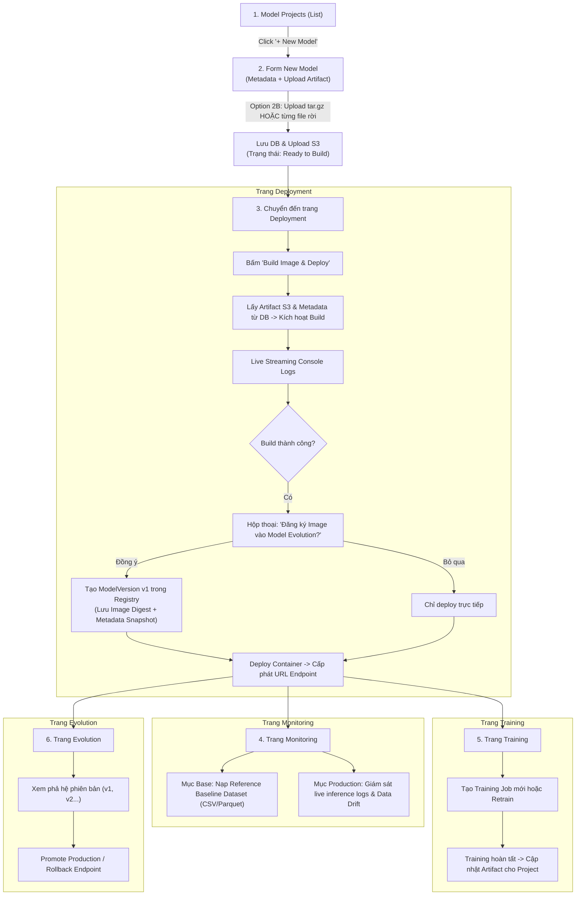

# Kế hoạch Tái cấu trúc Giao diện & Workflow Web MLOps PaaS

> **Tài liệu đặc tả kiến trúc điều hướng, luồng nghiệp vụ và lộ trình triển khai giao diện Web mới.**  

---

## 1. Mục tiêu và Nguyên tắc Tái cấu trúc

1. **Phân định rõ ranh giới Khởi tạo (Creation) và Vận hành (Deployment/Ops)**:
   - Thay vì ép buộc người dùng đi qua wizard 3 bước (Metadata -> Build -> Deploy) ngay khi tạo model, thao tác **New Model** chỉ tập trung vào: **Cung cấp Metadata + Upload Artifact**.
   - Việc build container image, stream runtime log và deploy endpoint URL được chuyển giao toàn quyền cho trang **Deployment** quản lý.
2. **Quy hoạch Information Architecture theo ngữ cảnh Model Project**:
   - Tất cả module cốt lõi phục vụ vòng đời một mô hình (*Overview, Deployment, Monitoring, Training, Evolution*) đều trực thuộc ngữ cảnh của chính **Model Project** đó.
3. **Đồng bộ hóa Router Coordinator và Header Model Selector**:
   - Khi đang làm việc trong các trang con của một project, việc đổi model ở Header Dropdown sẽ giữ nguyên tab chức năng và tự động chuyển sang `:projectId` mới.
   - Khi ở các trang độc lập (Setting, API Token, Notification), chọn model sẽ tự động điều hướng về trang Overview của model được chọn.
4. **Tách biệt Trang Quản trị Hệ thống**:
   - **Setting** chỉ còn lại cấu hình thông tin cá nhân (Profile).
   - **API Token** được tách thành một trang riêng biệt cấp 1 trên Sidebar.

---

## 2. Kiến trúc Điều hướng & Sơ đồ Sidebar (Option 1A - Tree Accordion)

### 2.1. Cấu trúc Menu Sidebar
```text
┌────────────────────────────────────────────────────────┐
│  AdaptML                                               │
├────────────────────────────────────────────────────────┤
│  🗂️  Model Projects                                    │  <- Click trực tiếp mở danh sách tất cả projects
│     ├── 📄 Overview                                    │  <- Chi tiết metadata, artifact, specs
│     ├── 🚀 Deployment                                  │  <- Build image, register version, deploy URL
│     ├── 📊 Monitoring                                  │  <- Giám sát Base vs Production drift
│     ├── 🧠 Training                                    │  <- Quản lý & kích hoạt job huấn luyện
│     └── 🧬 Evolution                                   │  <- Quản lý các phiên bản mô hình (Registry)
│                                                        │
│  🔔  Notification                                      │  <- Thông báo tác vụ, cảnh báo hệ thống
│  🔑  API Token                                         │  <- Quản lý API Key độc lập (cấp 1)
│  ⚙️  Setting                                           │  <- Quản lý Profile cá nhân
│  🚪  Logout                                            │
└────────────────────────────────────────────────────────┘
```

- **Cơ chế Tree Accordion**:
  - Khi click vào tiêu đề **Model Projects**: Luôn dẫn đến trang tổng quan danh sách (`/dashboard/projects`).
  - Khi có một project đang được chọn (`selectedModel` active): Mục **Model Projects** tự động bung (expand) 5 mục con (*Overview, Deployment, Monitoring, Training, Evolution*).
  - Người dùng có thể click nút danh sách hoặc thu gọn accordion bất kỳ lúc nào để quay lại danh sách toàn thể.

### 2.2. Bảng Đối chiếu Route URLs
| Trang / Mục | Route URL | Mô tả chức năng |
| :--- | :--- | :--- |
| **Model Projects (List)** | `/dashboard/projects` | Bảng danh sách Model Projects (thay thế trang Management). Tìm kiếm, lọc, xem trạng thái, nút **"+ New Model"**. |
| **New Model** | `/dashboard/projects/new` (hoặc Modal) | Nhập metadata, upload artifact (chọn nén `tar.gz` hoặc từng file rời), lưu S3 và tạo record DB. |
| **Overview** | `/dashboard/projects/:projectId/overview` | Hiển thị thông tin tổng quan của model: metadata, specs, file artifacts đã nạp, trạng thái endpoint hiện tại. |
| **Deployment** | `/dashboard/projects/:projectId/deployment` | Build container image từ artifact, stream log console, prompt đăng ký Evolution, cấp phát URL Endpoint. |
| **Monitoring** | `/dashboard/projects/:projectId/monitoring` | Giám sát mô hình: mục **Base** (baseline dataset) và mục **Production** (live inference data & drift scores). |
| **Training** | `/dashboard/projects/:projectId/training` | Danh sách training jobs của project, tạo job mới, nạp lại artifact từ job thành công. |
| **Evolution** | `/dashboard/projects/:projectId/evolution` | Quản lý lineage các version (v1, v2...), so sánh metrics, promote Staging/Production, rollback endpoint. |
| **Notification** | `/dashboard/notifications` | Danh sách thông báo trạng thái nền (build image xong, training xong, drift alert). |
| **API Token** | `/dashboard/api-tokens` | Quản lý Personal Access Tokens / API Keys (tạo mới, đặt hạn hết hạn, thu hồi quyền). |
| **Setting (Profile)** | `/dashboard/settings/profile` | Thông tin tài khoản người dùng, đổi mật khẩu, avatar, theme hiển thị. |

---

## 3. Quy trình Vận hành Chi tiết (End-to-End Workflow)



### Bước 1: Tạo Model Project (`New Model` - Hỗ trợ Option 2B)
- **Thông tin Metadata**:
  - Tên model project (ví dụ: `diabetes-readmission`, `bank-account-fraud`).
  - Mô tả & Phạm vi truy cập (`private` / `public`).
  - Flavor & Task Domain (Scikit-learn, PyTorch, XGBoost, TensorFlow...).
- **Nạp Artifact (Linh hoạt theo Option 2B)**:
  - **Cách 1 (Gói nén chuẩn)**: Upload duy nhất 1 file `model.tar.gz` (đã đóng gói model, `requirements.txt`, `data_contract.json`...).
  - **Cách 2 (File rời rạc)**: Upload riêng lẻ từng thành phần:
    - File mô hình cốt lõi (`.joblib`, `.pt`, `.pkl`, `.onnx`).
    - File phụ thuộc (`requirements.txt`).
    - File nhãn (`label_mapping.json`).
    - File hợp đồng dữ liệu / schema (`data_contract.json`).
    - File dữ liệu tham chiếu tùy chọn (`reference_data.csv`).
- **Xử lý lưu trữ**:
  - File được đẩy lên MinIO/S3 theo tiền tố chuẩn: `s3://mlops-artifacts/projects/{project_id}/artifacts/`.
  - Record `ModelProject` được lưu vào database với `artifact_s3_uri`, `artifact_format` và metadata.
  - Tự động chuyển hướng người dùng đến trang **Deployment** của project vừa tạo.

### Bước 2: Trang Deployment (Build Container & Prompt Đăng ký Evolution)
- **Giao diện**:
  - Thẻ thông tin Artifact: Tên file, dung lượng, SHA-256, flavor, ngày upload.
  - Nút hành động: **[ 🚀 Build Image & Deploy Endpoint ]**.
- **Quá trình Build**:
  - Backend lấy trực tiếp artifact từ S3 và metadata từ DB để gọi `model-packager`.
  - Màn hình console `TerminalViewer` stream log thời gian thực.
- **Hộp thoại xác nhận đăng ký Evolution**:
  - Khi build container image thành công, giao diện hiển thị prompt:
    > **🎉 Build Container Image thành công!**  
    > Image URI: `harbor.mlops.local/library/diabetes-logreg:build-102`  
    > **Bạn có muốn đăng ký Image này thành một phiên bản trong Model Evolution không?**  
    > - Tên phiên bản: `v1.0.0` (tự động gợi ý)  
    > - Ghi chú: *"Baseline model ban đầu"*  
    > - Giai đoạn: `[ Staging ]` hoặc `[ Production ]`  
    > 
    > [ Bỏ qua & Chỉ Deploy ]   [ ✓ Đăng ký vào Evolution & Deploy ]
- **Cấp phát URL Endpoint**:
  - Khởi chạy container phục vụ dự đoán.
  - Hiển thị card **URL Endpoint**:
    - URL công khai: `http://localhost:5001/v1/models/{project_name}/predict`
    - Trạng thái sức khỏe: 🟢 `Healthy`.
    - Snippet mẫu gọi cURL / Python client.
    - Nút truy cập nhanh: "Test Endpoint in Playground".

### Bước 3: Trang Monitoring (Base vs Production)
- **Mục Base (Reference Baseline)**:
  - Quản lý tập dữ liệu đối chứng chuẩn (Reference Dataset) dùng làm mốc so sánh phân phối.
  - Xem trước dữ liệu, phân bố giá trị từng feature.
- **Mục Production (Live Inference Data & Drift)**:
  - Tự động liên kết với Endpoint URL đã deploy để thu thập live inference logs.
  - Cấu hình Trigger Threshold (ví dụ: tự động kiểm tra sau mỗi 500 requests).
  - Hiển thị Drift Score tổng thể, danh sách các feature bị lệch phân phối và biểu đồ phân tích.
  - Nút kích hoạt: **"Run Drift Analysis Now"** và xem lịch sử Drift Reports.

### Bước 4: Trang Training (Huấn luyện & Tái huấn luyện)
- Quản lý danh sách các tác vụ huấn luyện (Training Jobs) của project này.
- Nút **Create Training Job**: Cấu hình môi trường (Docker/Kaggle), tài nguyên, hyperparameters.
- Khi training hoàn tất, artifact mới sinh ra có thể được chọn làm artifact hiện tại của project để sẵn sàng cho chu kỳ Build & Deploy tiếp theo.

### Bước 5: Trang Evolution (Model Registry)
- Hiển thị cây phả hệ phiên bản (*Model Version Lineage*): `v1` $\rightarrow$ `v2` $\rightarrow$ `v3`.
- Bảng chi tiết phiên bản: Metrics (ROC-AUC, F1...), Image Digest, Ngày tạo.
- Quản lý nhãn Stage: `Staging`, `Production`, `Archived`.
- Nút **Rollback / Deploy Version này**: Cho phép chuyển đổi endpoint hiện tại sang bất kỳ phiên bản nào trong quá khứ chỉ với 1 cú click.

---

## 4. Hành vi Điều hướng của Header Model Selector Dropdown

Dropdown chọn model trên Header đóng vai trò là **Context Coordinator**:
1. **Khi đang ở trang con của Model Project** (`/dashboard/projects/:projectId/:subpage`):
   - Khi chọn một project khác (ví dụ từ `diabetes-logreg` sang `baf-mlp`):
   - Route URL cập nhật thành: `/dashboard/projects/{baf-mlp-id}/{subpage}`.
   - Giữ nguyên tab chức năng hiện tại (*Overview, Deployment, Monitoring, Training, Evolution*) và tự động nạp dữ liệu của model mới.
2. **Khi đang ở trang độc lập** (`/dashboard/projects`, `/dashboard/settings`, `/dashboard/api-tokens`, `/dashboard/notifications`):
   - Khi chọn một model trong Dropdown:
   - Tự động điều hướng về: `/dashboard/projects/{selected-id}/overview`.
3. **Lưu vết**:
   - Lưu `selected_model_project_id` vào `localStorage` để duy trì ngữ cảnh khi F5 hoặc mở lại trình duyệt.

---

## 5. Lộ trình Triển khai Kỹ thuật (Phased Roadmap)

### Giai đoạn 1: Backend Data Model & API Contracts (Control Plane)
- [ ] Bổ sung trường lưu trữ artifact vào `ModelProject`: `artifact_s3_uri`, `artifact_format`, `flavor`, `metadata_payload`.
- [ ] Cập nhật endpoint tạo project (`/api/models/`) để hỗ trợ nhận file nén `tar.gz` hoặc bộ file rời rạc và upload S3 presigned.
- [ ] Xây dựng API endpoint hỗ trợ đăng ký phiên bản Evolution trực tiếp từ kết quả Build (`/api/registry/versions/register-from-build/`).

### Giai đoạn 2: Routing, Layout & Navigation Restructuring (Frontend)
- [ ] Cập nhật `paths.ts` và `AppRouter.tsx`:
  - Thiết lập cụm route mới `/dashboard/projects` và `/dashboard/projects/:projectId/...`.
  - Tạo route độc lập `/dashboard/api-tokens`.
  - Tinh gọn `/dashboard/settings` chỉ giữ lại Profile.
- [ ] Nâng cấp [Sidebar.tsx](file:///d:/AI%20Models/mlops-paas-system/web/src/app/layouts/Sidebar.tsx):
  - Hiện thực Tree Accordion mở rộng 5 mục con (*Overview, Deployment, Monitoring, Training, Evolution*) khi có project được chọn.
  - Bổ sung mục cấp 1: `API Token` và cấu trúc lại nhóm tiện ích.
- [ ] Cập nhật [Header.tsx](file:///d:/AI%20Models/mlops-paas-system/web/src/app/layouts/Header.tsx) và [ModelSelectionProvider.tsx](file:///d:/AI%20Models/mlops-paas-system/web/src/features/catalog/components/ModelSelectionProvider.tsx):
  - Hoàn thiện logic Router Coordinator khi chọn model từ Dropdown.

### Giai đoạn 3: New Model Creation & Deployment Experience
- [ ] Xây dựng lại trang/modal **New Model**: Hỗ trợ 2 tab nạp artifact (File nén `tar.gz` HOẶC bộ file rời), upload thẳng lên S3.
- [ ] Thiết kế lại trang **Deployment**:
  - Giao diện thẻ Artifact, nút kích hoạt Build & Deploy.
  - Tích hợp `TerminalViewer` live stream logs.
  - Hiện thực Modal Popup hỏi đăng ký Evolution sau khi build image thành công.
  - Hiển thị card thông tin Endpoint URL và status check.

### Giai đoạn 4: Monitoring (Base vs Production), Training & Evolution
- [ ] Tái cấu trúc trang **Monitoring**: Phân chia rõ ràng mục **Base** (Baseline Dataset) và mục **Production** (Live Inference & Drift).
- [ ] Đồng bộ hóa trang **Training** và **Evolution** theo phạm vi ngữ cảnh `:projectId`.
- [ ] Hoàn thiện trang **API Token** độc lập.

### Giai đoạn 5: Testing & Quality Gates
- [ ] Chạy kiểm thử Frontend: `pnpm lint` và `pnpm build`.
- [ ] Kiểm thử Backend API unit tests và Celery build task.
- [ ] Smoke-test toàn bộ luồng tạo model -> build/deploy -> giám sát drift -> đăng ký evolution.
