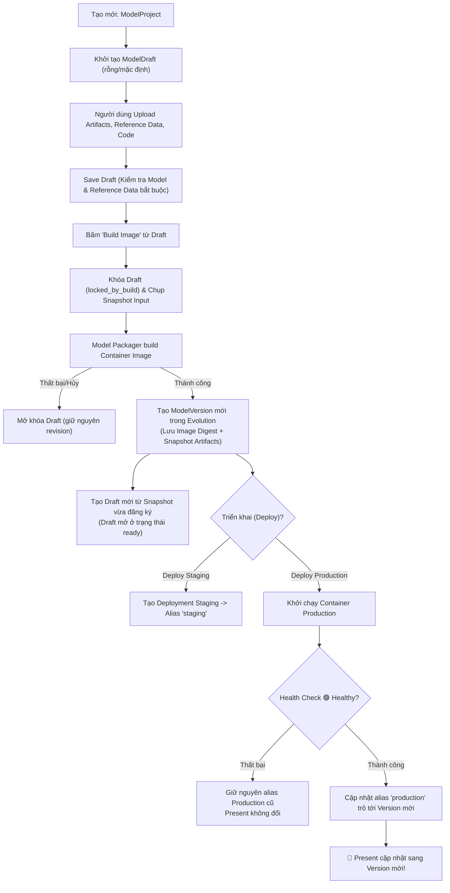

# Kế hoạch Tái cấu trúc Giao diện & Vòng đời Phiên bản: Present, Draft và Evolution

> **Tài liệu đặc tả kiến trúc điều hướng, mô hình dữ liệu, hợp đồng API và lộ trình triển khai luồng vận hành Web MLOps PaaS theo mô hình ba trạng thái: Present, Draft và Evolution.**

---

## 1. Mục tiêu và Triết lý Thiết kế

Hệ thống quản lý mô hình MLOps PaaS được tái cấu trúc nhằm giải quyết triệt để sự nhập nhằng giữa **Danh tính dự án (Project Identity)**, **Bàn làm việc đang chỉnh sửa (Mutable Draft)**, và **Phiên bản snapshot bất biến (Immutable Version)**.

### 1.1. Ba Trụ cột Trạng thái Cốt lõi

```text
┌────────────────────────────────────────────────────────────────────────┐
│                              ModelProject                              │
│         (Danh tính lâu dài: name, description, access_mode)            │
└───────────────────┬────────────────────────────────┬───────────────────┘
                    │ 1-to-1                         │ 1-to-N
                    ▼                                ▼
       ┌─────────────────────────┐      ┌─────────────────────────┐
       │       ModelDraft        │      │      ModelVersion       │
       │  (Bàn làm việc mutable) │      │  (Evolution - Snapshot) │
       │  Artifacts, Code, Data  │      │  Image Digest, Metrics  │
       └────────────┬────────────┘      └────────────▲────────────┘
                    │                                │
                    │ Build thành công               │ Đăng ký snapshot
                    └────────────────────────────────┘
                                                     │
                                                     │ Gán alias 'production'
                                                     │ (sau khi Deploy Healthy)
                                                     ▼
                                        ┌─────────────────────────┐
                                        │         Present         │
                                        │  (Model đang phục vụ)   │
                                        │  Live Endpoint & Drift  │
                                        └─────────────────────────┘
```

1. **`ModelProject` (Danh tính dự án)**:
   - Đại diện cho danh tính xuyên suốt của bài toán máy học (`name`, `description`, `access_mode`, `task_domain`).
   - Việc cập nhật tên hoặc mô tả dự án **không** sinh ra `ModelVersion` mới và không làm biến đổi bất kỳ artifact snapshot nào.
2. **`ModelDraft` (Bàn làm việc đang chỉnh sửa)**:
   - Quan hệ 1-to-1 với `ModelProject`. Mỗi dự án chỉ có duy nhất một Draft tại một thời điểm.
   - Chứa các file tài nguyên đang chuẩn bị: Model artifact, source code tùy chọn, reference dataset bắt buộc, requirements và metadata build.
   - Cho phép chỉnh sửa tự do (`editing`), lưu tạm (`saved_revision`), khóa khi build (`locked`).
3. **`ModelVersion` (Evolution - Snapshot bất biến)**:
   - Được tạo ra khi và chỉ khi một tiến trình Build container image thành công.
   - Đóng băng toàn bộ tài nguyên: model file, source code snapshot, reference data snapshot (`DatasetSnapshot`), requirements, image URI/digest và lineage (nguồn gốc).
   - Tuyệt đối **bất biến (immutable)**: không thể chỉnh sửa, ghi đè nội dung file sau khi đã tạo.
4. **`Present` (Phiên bản phục vụ hiện hành)**:
   - Đại diện cho `ModelVersion` đang mang alias `production` và có Endpoint đang hoạt động (`Healthy`).
   - Build thành công một version mới chỉ đưa version đó vào kho lưu trữ **Evolution**. `Present` **chỉ thay đổi** khi phiên bản mới được deploy thành công tới Production và vượt qua bài kiểm tra sức khỏe (Health Check).

### 1.2. Luồng Vận hành Tổng quan (End-to-End State Machine)



---

## 2. Kiến trúc Điều hướng & Sơ đồ Routing

### 2.1. Menu Sidebar (Cấu trúc Tree Accordion)

Sidebar tuân thủ mô hình **Tree Accordion** mở rộng khi có project đang được chọn (`selectedModel` active):

```text
┌────────────────────────────────────────────────────────┐
│  AdaptML PaaS                                          │
├────────────────────────────────────────────────────────┤
│  🗂️  Model Projects                                    │  <- Click mở danh sách tất cả projects
│     ├── 📄 Overview                                    │  <- URL Tabs: /present và /draft
│     ├── 🚀 Deployment                                  │  <- Build image, deploy Staging/Production
│     ├── 📊 Monitoring                                  │  <- Tabs: /base (read-only) và /production
│     ├── 🧠 Training                                    │  <- Quản lý jobs & output lineage
│     └── 🧬 Evolution                                   │  <- Lineage, registry versions & aliases
│                                                        │
│  🔔  Notification                                      │  <- Thông báo tác vụ nền, build, drift
│  🔑  API Token                                         │  <- Quản lý API Key độc lập (cấp 1)
│  ⚙️  Setting                                           │  <- Quản lý Profile cá nhân
│  🚪  Logout                                            │
└────────────────────────────────────────────────────────┘
```

### 2.2. Bảng Đối chiếu Route URLs Đầy đủ

Hệ thống loại bỏ toàn bộ các URL cũ (không dùng redirect ngầm định để tránh gánh nặng bảo trì kỹ thuật):

| Route URL | Tên Trang | Mô tả Chức năng |
| :--- | :--- | :--- |
| `/dashboard/projects` | **Model Projects** | Bảng danh sách tất cả projects. Lọc, tìm kiếm, nút **"+ New Model"**. |
| `/dashboard/projects/new` | **New Model** | Khởi tạo Project & nạp Draft ban đầu (hỗ trợ file rời hoặc archive). |
| `/dashboard/projects/:projectId/overview/present` | **Overview: Present** | Xem thông tin phiên bản Production đang phục vụ, live endpoint URL, health check, baseline metrics. |
| `/dashboard/projects/:projectId/overview/draft` | **Overview: Draft** | Bàn làm việc: Quản lý và chỉnh sửa files, upload presigned S3, kiểm tra revision, nút Save/Build. |
| `/dashboard/projects/:projectId/overview` | *Redirect thông minh* | Tự động chuyển hướng: tới `/present` nếu đã có production alias; tới `/draft` nếu project mới chưa có production. |
| `/dashboard/projects/:projectId/deployment` | **Deployment** | Build container image từ Draft hoặc Deploy image sẵn có từ Evolution tới Staging/Production. |
| `/dashboard/projects/:projectId/deployment/playground`| **Playground** | Giao diện test inference trực tiếp gửi sample payload tới Active Endpoint. |
| `/dashboard/projects/:projectId/monitoring/base` | **Monitoring: Base** | Hiển thị reference dataset snapshot bất biến, schema, checksum, phân phối feature (Chỉ đọc). |
| `/dashboard/projects/:projectId/monitoring/production`| **Monitoring: Live** | Giám sát luồng inference thực tế, cấu hình drift metric, xem drift scores và lịch sử kiểm tra. |
| `/dashboard/projects/:projectId/training` | **Training** | Danh sách training jobs của project, kích hoạt job mới, build & register version từ training output. |
| `/dashboard/projects/:projectId/training/jobs/:jobId/:tab`| **Training Job Detail**| Chi tiết log, metrics, hyperparameters, data contract và outputs của một job. |
| `/dashboard/projects/:projectId/evolution` | **Evolution** | Phả hệ phiên bản (v1, v2...), so sánh metrics, quản lý alias (`staging`, `production`), trigger Rebuild. |
| `/dashboard/projects/:projectId/evolution/versions/:versionId`| **Version Detail** | Xem chi tiết snapshot một phiên bản: Model artifact, code, reference data, container image digest. |
| `/dashboard/notifications` | **Notifications** | Thông báo tác vụ nền (build hoàn tất, training kết thúc, cảnh báo drift). |
| `/dashboard/api-tokens` | **API Token** | Quản lý Personal Access Tokens / API Keys (tạo mới, đặt hạn hết hạn, thu hồi quyền). |
| `/dashboard/settings/profile` | **Setting** | Thông tin tài khoản người dùng, đổi mật khẩu, theme hiển thị (Light/Dark/System). |

### 2.3. Cơ chế Điều phối Ngữ cảnh của Header Model Selector

Dropdown chọn model trên Top Header hoạt động như một **Router Coordinator**:
1. **Khi đang ở trang con cấp cao** (`/dashboard/projects/:projectId/:module/...`):
   - Đổi project từ `diabetes-logreg` sang `baf-mlp`: Giữ nguyên module hiện tại (ví dụ: đang ở `/deployment` thì chuyển sang `/dashboard/projects/{baf-mlp-id}/deployment`).
   - Riêng đối với `/overview`: Nếu project mới có production alias thì vào `/overview/present`, nếu chưa có thì vào `/overview/draft`.
2. **Khi đang ở trang chi tiết chuyên biệt** (`/training/jobs/:jobId`, `/evolution/versions/:versionId`):
   - Khi chuyển project, hệ thống tự động quay về đầu module tương ứng (`/training` hoặc `/evolution`) của project mới, tránh lỗi 404 do ID con không thuộc project mới.
3. **Khi đang ở các trang độc lập** (`/dashboard/projects`, `/dashboard/settings/profile`, `/dashboard/api-tokens`, `/dashboard/notifications`):
   - Khi chọn một project từ Header Dropdown, hệ thống tự động điều hướng về `/dashboard/projects/{projectId}/overview`.
4. **Lưu vết**:
   - `selected_project_id` được đồng bộ vào `localStorage` để phục hồi đúng ngữ cảnh khi người dùng F5 hoặc mở lại trình duyệt.

---

## 3. Đặc tả 7 Giai đoạn Triển khai Kỹ thuật

```
┌─────────────────────────────────────────────────────────────────────────────┐
│                            7 GIAI ĐOẠN TRIỂN KHAI                           │
├─────────────┬───────────────────────────────────────────────────────────────┤
│ Giai đoạn 1 │ Backend Data Models: ModelProject, ModelDraft, ModelVersion   │
│ Giai đoạn 2 │ REST API Contracts & Cơ chế Lưu trữ Two-Phase Presigned S3    │
│ Giai đoạn 3 │ Tích hợp Training, Evolution & Reference Dataset Snapshot     │
│ Giai đoạn 4 │ Cấu trúc Router Coordinator, Navigation Layout & URL Tabs     │
│ Giai đoạn 5 │ UI New Model Creation & Trang Overview 2 Tabs (Present/Draft) │
│ Giai đoạn 6 │ Trang Deployment (Staging/Production Gate) & Monitoring Base  │
│ Giai đoạn 7 │ Kiểm thử Toàn diện (Unit, Concurrency, Security, E2E Flow)   │
└─────────────┴───────────────────────────────────────────────────────────────┘
```

---

### Giai đoạn 1: Thiết kế Schema Present, Draft và Version

#### 1. Model `ModelProject` (catalog app)
Đại diện cho danh tính dự án, tách biệt khỏi vòng đời artifact:
- `id` (UUIDv4, PK)
- `tenant_id` (UUIDv4, multitenancy partition)
- `name` (Slug/String, unique per tenant)
- `description` (Text, optional)
- `access_mode` (`private` / `public`)
- `task_domain` (`binary_classification`, `multiclass_classification`, `regression`, `ranking`...)
- `lifecycle_status` (`active`, `archived`, `deleted`)
- `created_at`, `updated_at`

> [!NOTE]
> Chỉnh sửa `name`, `description`, `task_domain` trên `ModelProject` chỉ cập nhật bản ghi này, tuyệt đối **không sinh ra `ModelVersion` mới**.

#### 2. Model `ModelDraft` & `DraftAsset` (catalog/drafts app)
Bàn làm việc mutable, quan hệ 1-to-1 với `ModelProject`:
- `id` (UUIDv4, PK)
- `project` (OneToOneField -> `ModelProject`, `on_delete=models.CASCADE`)
- `flavor` (String: `sklearn`, `xgboost`, `pytorch`, `tensorflow`, `onnx`)
- `artifact_format` (`raw` [file rời], `archive` [`model.tar.gz`])
- `requirements_snapshot` (TextField, optional)
- `revision` (PositiveIntegerField, default=1, tăng mỗi khi có thay đổi file/metadata)
- `saved_revision` (PositiveIntegerField, default=0, cập nhật khi người dùng bấm Save Draft)
- `status` (`editing`, `ready`, `locked`)
- `locked_by_build` (ForeignKey -> `Build`, null=True, blank=True, `on_delete=models.SET_NULL`)
- `saved_at`, `created_at`, `updated_at`

Bảng con `DraftAsset` lưu trữ từng thành phần tài nguyên trong Draft:
- `id` (UUIDv4, PK)
- `draft` (ForeignKey -> `ModelDraft`, related_name='assets', `on_delete=models.CASCADE`)
- `kind` (Enum, unique_together với `draft`):
  - `model` (**Bắt buộc**): File trọng số mô hình (`.joblib`, `.pt`, `.pkl`, `.onnx` hoặc `model.tar.gz`)
  - `reference_data` (**Bắt buộc**): Dữ liệu tham chiếu baseline (`.csv` hoặc `.parquet`)
  - `source_code` (*Tùy chọn*): Source code đóng gói file `.zip`
  - `label_mapping` (*Tùy chọn*): File map nhãn `.json`
  - `data_contract` (*Tùy chọn*): Schema đầu vào `.json`
  - `metrics` (*Tùy chọn*): File metrics đánh giá ban đầu `.json`
  - `params` (*Tùy chọn*): Hyperparameters `.json`
  - `model_insights` (*Tùy chọn*): Báo cáo giải thích mô hình
  - `feature_importance` (*Tùy chọn*): Tầm quan trọng thuộc tính `.json`
- `name` (String, tên file gốc)
- `s3_uri` (String, đường dẫn S3/MinIO)
- `checksum` (SHA-256 hex string)
- `size_bytes` (BigIntegerField)
- `content_type` (String)
- `metadata` (JSONField, default=dict)
- `created_at`, `updated_at`

> [!IMPORTANT]
> **Ràng buộc Tính Toàn Vẹn Của Draft**:
> - Draft chỉ có thể chuyển sang trạng thái `ready` (và cho phép bấm `Build Image`) khi:
>   1. Đã có đủ 2 asset bắt buộc: `model` và `reference_data`.
>   2. `revision == saved_revision` (mọi thay đổi đã được Save).
>   3. `status != 'locked'`.

#### 3. Model `Build` (deployment app)
Chuyển đổi thành một execution snapshot bất biến:
- `id` (UUIDv4, PK)
- `project` (ForeignKey -> `ModelProject`)
- `source_kind` (`draft`, `model_version`, `training_job`)
- `source_draft_revision` (IntegerField, null=True)
- `source_version` (ForeignKey -> `ModelVersion`, null=True)
- `source_job` (ForeignKey -> `TrainingJob`, null=True)
- `registered_version` (ForeignKey -> `ModelVersion`, null=True, related_name='originating_build')
- `status` (`pending`, `running`, `ready`, `failed`, `cancelled`)
- `image_uri` (String, Harbor image tag)
- `image_digest` (String, sha256 container digest)
- `logs_s3_uri` (String)
- `created_at`, `finished_at`

Bảng `BuildInputAsset` sao chép đóng băng toàn bộ file đầu vào tại thời điểm bắt đầu build để đảm bảo tính tái lập (reproducibility).

#### 4. Model `ModelVersion` & Liên kết Reference Snapshot (registry app)
- `id` (UUIDv4, PK)
- `project` (ForeignKey -> `ModelProject`)
- `version` (String, semantic version: `v1.0.0`, `v1.0.1`...)
- `image_uri`, `image_digest`
- `reference_snapshot` (ForeignKey -> `DatasetSnapshot` với `role='reference'`, **bắt buộc đối với mọi version mới**)
- `source_kind`, `source_id` (Lineage truy nguyên nguồn gốc)
- `metrics_payload`, `data_contract_payload` (JSONField)
- `created_at`
- **Xóa bỏ trường `stage` trên `ModelVersion`**: Trạng thái `staging` và `production` được quản lý duy nhất qua bảng `RegistryAlias`.

#### 5. Phân vùng Lưu trữ Object Storage (S3 / MinIO Prefixes)
Phân vùng rõ ràng giúp áp dụng IAM policy và cơ chế dọn dẹp (lifecycle cleanup):
```text
s3://mlops-artifacts/
  └── users/{tenant_id}/models/{project_id}/
      ├── draft/{draft_id}/assets/{kind}/...      <- Vùng mutable của Draft
      ├── builds/{build_id}/inputs/...            <- Vùng snapshot đầu vào build
      ├── versions/{version_id}/artifacts/...     <- Vùng bất biến của ModelVersion
      └── datasets/{snapshot_id}/...              <- Vùng bất biến của Reference Datasets
```

---

### Giai đoạn 2: Đặc tả REST API & Quản lý Lưu trữ Draft

#### 2.1. Danh mục Endpoints cho ModelDraft & Overview

```text
GET    /api/models/{projectId}/overview/
GET    /api/models/{projectId}/draft/
PUT    /api/models/{projectId}/draft/
POST   /api/models/{projectId}/draft/save/
POST   /api/models/{projectId}/draft/assets/upload-url/
POST   /api/models/{projectId}/draft/assets/complete/
DELETE /api/models/{projectId}/draft/assets/{kind}/
POST   /api/models/{projectId}/draft/build/
POST   /api/models/{projectId}/draft/load-version/
```

#### 2.2. Chi tiết Nghiệp vụ API

1. **`GET /api/models/{projectId}/overview/`**:
   Trả về toàn bộ dữ liệu cần thiết cho trang Overview trong **1 round-trip duy nhất**:
   ```json
   {
     "project": {
       "id": "prj_uuid",
       "name": "diabetes-readmission",
       "description": "Dự đoán tái nhập viện trong 30 ngày",
       "task_domain": "binary_classification",
       "access_mode": "private"
     },
     "present": {
       "has_production": true,
       "version": "v1.0.0",
       "version_id": "ver_uuid",
       "image_uri": "harbor.mlops.local/library/diabetes:v1.0.0",
       "endpoint_url": "http://model-server.mlops.local/v1/models/diabetes/predict",
       "health_status": "healthy",
       "reference_snapshot": {
         "id": "snap_uuid",
         "name": "diabetes_reference.parquet",
         "checksum": "sha256:abc...",
         "row_count": 10000
       },
       "metrics": { "roc_auc": 0.842, "f1_score": 0.781 }
     },
     "draft": {
       "id": "draft_uuid",
       "status": "ready",
       "revision": 3,
       "saved_revision": 3,
       "flavor": "sklearn",
       "artifact_format": "raw",
       "assets": [
         { "kind": "model", "name": "model.joblib", "size_bytes": 1048576, "checksum": "..." },
         { "kind": "reference_data", "name": "ref.csv", "size_bytes": 5242880, "checksum": "..." },
         { "kind": "source_code", "name": "train_code.zip", "size_bytes": 20480, "checksum": "..." }
       ],
       "can_build": true
     }
   }
   ```

2. **Cơ chế Two-Phase Upload với Presigned URL**:
   - **Bước 1 (`POST /draft/assets/upload-url/`)**: Client gửi `{ "kind": "model", "filename": "model.joblib", "size_bytes": 1048576, "checksum": "sha256:..." }`. Backend kiểm tra quyền tenant, sinh S3 Presigned PUT URL có chữ ký bảo mật với TTL 15 phút.
   - **Bước 2**: Frontend upload trực tiếp file từ trình duyệt lên MinIO/S3 qua URL vừa nhận.
   - **Bước 3 (`POST /draft/assets/complete/`)**: Frontend thông báo đã upload xong. Backend thực hiện gọi `S3 HEAD` kiểm tra kích thước, đối chiếu checksum SHA-256, kiểm tra an toàn archive (chống Zip Slip, path traversal, symlink độc hại). Sau khi hợp lệ, tạo/cập nhật bản ghi `DraftAsset` và tăng `revision` của Draft.

3. **Optimistic Concurrency Control (Chống ghi đè giữa nhiều tab)**:
   - Khi gọi `POST /draft/save/`, Client bắt buộc gửi kèm `{ "expected_revision": 3 }`.
   - Nếu `draft.revision != expected_revision`, backend từ chối với mã lỗi `409 Conflict`, trả về revision mới nhất để frontend hiển thị dialog đối chiếu và merge.

4. **`POST /draft/load-version/`**:
   - Khi người dùng muốn kéo toàn bộ artifact và metadata của một version cũ trong Evolution về Draft để chỉnh sửa tiếp:
   - Backend yêu cầu xác nhận ghi đè Draft hiện tại.
   - Sao chép toàn bộ asset từ snapshot của version đó sang `DraftAsset`, đặt `saved_revision = revision`, mở Draft ở trạng thái `ready`.

---

### Giai đoạn 3: Tích hợp Training, Evolution và Reference Snapshot

#### 3.1. Ràng buộc Reference Data Đối với Training Job
Để đảm bảo mọi phiên bản sinh ra từ huấn luyện tự động (Continuous Training) đều sẵn sàng cho việc giám sát Data Drift:
- Bổ sung `reference_data` vào trường `kind` của `TrainingOutput`.
- Script huấn luyện (`train.py`) của bài toán (như Diabetes hoặc BAF) phải export:
  1. Model artifact (`model.joblib` hoặc `model.pt`).
  2. File dữ liệu đối chứng chuẩn (`reference_data.parquet` hoặc `reference_data.csv`).
  3. `split_manifest.json` ghi nhận phân chia tập train/test/reference.
- Thao tác **Build & Register Version** từ Training Job sẽ **từ chối** nếu job không có output `reference_data`.

#### 3.2. Độc lập Giữa Build Từ Training/Evolution và ModelDraft
- **Nguyên tắc vàng**: Bàn làm việc (`ModelDraft`) thuộc quyền kiểm soát độc quyền của người dùng thao tác thủ công.
- Khi người dùng bấm **Build & Register** từ trang Training Job hoặc bấm **Rebuild as New Version** từ trang Evolution:
  - Tiến trình Build lấy toàn bộ input từ chính Job/Version nguồn đó.
  - Build thành công sinh ra `ModelVersion` mới trong Evolution.
  - **Tuyệt đối không chạm vào `ModelDraft` hiện tại**. Draft của người dùng vẫn được bảo toàn nguyên vẹn.

#### 3.3. Tái xây dựng Phiên bản (Rebuild as New Version)
- Trong Evolution, người dùng có thể kích hoạt `Rebuild as New Version` cho một phiên bản cũ (ví dụ: rebuild lại container image với base image mới đã vá lỗi bảo mật).
- Quy trình: Sao chép toàn bộ model, source code, data contract và reference snapshot của version nguồn sang một `Build` mới với `source_kind='model_version'`. Không cho phép ghép lẫn lộn model từ Evolution với code/reference từ Draft trong cùng một build.

---

### Giai đoạn 4: Cấu trúc Router & Điều hướng Frontend

#### 4.1. Cấu hình Router Tuyến tính & Phân tách URL Tabs

Cập nhật `web/src/app/routes/AppRouter.tsx` và `paths.ts`:

```tsx
// Tuyến đường Model Projects
<Route path="/dashboard/projects" element={<ModelProjectsListPage />} />
<Route path="/dashboard/projects/new" element={<NewModelProjectPage />} />

// Cụm tuyến đường Model Project Context
<Route path="/dashboard/projects/:projectId" element={<ProjectLayout />}>
  {/* Overview URL Tabs */}
  <Route index element={<OverviewRedirector />} />
  <Route path="overview" element={<OverviewRedirector />} />
  <Route path="overview/present" element={<OverviewPresentTab />} />
  <Route path="overview/draft" element={<OverviewDraftTab />} />

  {/* Deployment */}
  <Route path="deployment" element={<DeploymentPage />} />
  <Route path="deployment/playground" element={<PlaygroundPage />} />

  {/* Monitoring Tabs */}
  <Route path="monitoring" element={<Navigate to="production" replace />} />
  <Route path="monitoring/base" element={<MonitoringBaseTab />} />
  <Route path="monitoring/production" element={<MonitoringProductionTab />} />

  {/* Training */}
  <Route path="training" element={<TrainingJobsPage />} />
  <Route path="training/jobs/:jobId/:tab" element={<TrainingJobDetailPage />} />

  {/* Evolution */}
  <Route path="evolution" element={<EvolutionPage />} />
  <Route path="evolution/versions/:versionId" element={<VersionDetailPage />} />
</Route>

// Các trang độc lập cấp 1
<Route path="/dashboard/notifications" element={<NotificationsPage />} />
<Route path="/dashboard/api-tokens" element={<ApiTokensPage />} />
<Route path="/dashboard/settings/profile" element={<ProfileSettingsPage />} />
```

#### 4.2. Logic Điều hướng Overview (`OverviewRedirector`)
Khi người dùng truy cập `/dashboard/projects/:projectId/overview`:
- Hook kiểm tra `present.has_production`:
  - Nếu `true`: Chuyển hướng sang `/overview/present`.
  - Nếu `false`: Chuyển hướng sang `/overview/draft`.

---

### Giai đoạn 5: Trải nghiệm Người dùng: New Model & Trang Overview (2 Tabs)

#### 5.1. Trang Tạo Mới Dự Án (`New Model`)
- **Phần 1: Metadata Cơ bản**: Tên dự án, mô tả, access mode (`private`/`public`), task domain (`binary_classification`...).
- **Phần 2: Nạp Tài nguyên Ban đầu (Draft Setup)**:
  - Chọn định dạng: **Raw Files** (từng file rời) HOẶC **Archive Package** (`model.tar.gz`).
  - Dropzone tải lên Model Artifact (**Bắt buộc**).
  - Dropzone tải lên Reference Baseline Dataset (**Bắt buộc**, CSV hoặc Parquet).
  - Dropzone tải lên Source Code ZIP (*Tùy chọn*).
  - Dropzone tải lên các file bổ trợ: `requirements.txt`, `data_contract.json`, `label_mapping.json`.
- **Cơ chế Chống Đứt Đoạn (Setup Resilient)**:
  - Khi bắt đầu upload, bản ghi `ModelProject` và `ModelDraft` được khởi tạo ngay trên DB.
  - Nếu quá trình upload gặp sự cố mạng, project được đánh dấu `setup_incomplete`. Khi người dùng truy cập lại sẽ tiếp tục từ bước dở dang mà không phải nhập lại metadata từ đầu.
- **Hoàn tất**: Tự động chuyển hướng thẳng tới `/dashboard/projects/:projectId/overview/draft`.

#### 5.2. Trang Overview - Thanh Tiêu Đề Dự Án (Project Header)
Thanh tiêu đề dùng chung cho cả 2 tab:
- Tên dự án, badge trạng thái (`Active`, `Private`), task domain.
- Cho phép bấm **Edit inline** để đổi tên hoặc mô tả dự án (Lưu trực tiếp vào `ModelProject`, không tạo version).
- Hai nút chuyển Tab rõ ràng:
  - **[ 🌟 Present (Production) ]** (có kèm badge 🟢 Live hoặc ⚪ Chưa có).
  - **[ 🛠️ Draft (Workspace) ]** (có kèm badge trạng thái: `Editing`, `Ready`, hoặc 🔒 `Building`).

#### 5.3. Tab Present (Production Endpoint & Snapshot)
- **Khi đã có Production Version**:
  - **Endpoint Status Card**: URL endpoint công khai, trạng thái sức khỏe (🟢 `Healthy`), cURL mẫu để test nhanh, độ trễ p95.
  - **Model Version Details**: Version tag (`v1.0.0`), commit message, ngày deploy, Harbor image digest.
  - **Dataset Baseline Snapshot**: Tên file reference dataset, số dòng, checksum SHA-256.
  - **Metrics Summary**: ROC-AUC, F1-score, Confusion Matrix.
  - **Quick Action Links**: `[ Test in Playground ]`, `[ View Drift in Monitoring ]`, `[ View Lineage in Evolution ]`.
- **Khi chưa có Production Version (Empty State)**:
  - Banner hướng dẫn trực quan: *"Dự án chưa có phiên bản nào được triển khai lên Production."*
  - Nút hành động dẫn sang Draft: **[ 🚀 Chuyển sang Draft để Build & Deploy ]**.

#### 5.4. Tab Draft (Bàn Làm Việc Đang Chỉnh Sửa)
- **Bảng Quản lý Files (Draft Assets)**:
  - Danh sách từng `kind`: Model file, Reference dataset, Source code, Label mapping, Data contract...
  - Trạng thái từng file: Tên file, dung lượng, checksum, thời gian cập nhật.
  - Nút tải lên / thay thế từng file đơn lẻ bằng Presigned URL.
  - Nút xem trước nội dung (đối với CSV, JSON, requirements).
- **Thanh Công Cụ Điều Khiển (Draft Controls)**:
  - Hiển thị tình trạng: `revision` hiện tại, trạng thái đã lưu hay chưa (`Unsaved changes`).
  - Nút **[ 💾 Save Draft ]**: Lưu tạm trạng thái, đặt `saved_revision = revision`.
  - Nút **[ ↩️ Discard Changes ]**: Khôi phục lại trạng thái của lần lưu gần nhất.
  - Nút **[ 📥 Load from Version... ]**: Mở modal chọn một version trong Evolution để nạp vào Draft.
  - Nút **[ 🚀 Build Container Image ]**: Chỉ active khi Draft ở trạng thái `ready` (đầy đủ model + reference data, không có thay đổi chưa lưu).
- **Cơ chế Khóa Khi Đang Build**:
  - Khi một tiến trình Build từ Draft đang diễn ra, toàn bộ form Draft chuyển sang chế độ `read-only` (disabled), hiển thị progress bar và nút **[ Xem Live Build Logs ]**.
- **Guard Chống Rời Trang**:
  - Nếu `revision > saved_revision`, kích hoạt `beforeunload` của trình duyệt và hiển thị React Router confirmation dialog nếu người dùng chuyển route.

---

### Giai đoạn 6: Trang Deployment & Monitoring (Base vs Production)

#### 6.1. Trang Deployment (Staging & Production Gate)
Trang Deployment hỗ trợ 2 luồng công việc rõ ràng:
1. **Luồng 1: Build từ Draft**:
   - Hiển thị snapshot của Draft hiện tại (revision, danh sách file).
   - Nút kích hoạt: **[ 🔨 Kích hoạt Build Container Image ]**.
   - `TerminalViewer` kết nối websocket/polling stream log thời gian thực từ Model Packager.
   - Khi Build thành công:
     - Tự động tạo `ModelVersion` mới trong Evolution.
     - Reset `ModelDraft` sang phiên bản snapshot vừa tạo.
     - Hiển thị hộp thoại hỏi triển khai: *"Bạn có muốn deploy phiên bản mới này lên Staging hoặc Production ngay không?"*
2. **Luồng 2: Deploy Image Sẵn Có từ Evolution**:
   - Chọn version mục tiêu từ dropdown (ví dụ: `v1.0.0`, `v1.0.1`).
   - Chọn môi trường đích: **Staging** HOẶC **Production**.
   - Nút **[ 🚀 Deploy to Target ]**.
3. **Cơ chế Bảo vệ Alias Độc quyền (Health-Check Gated Alias Promotion)**:
   - Khi deploy tới Production, backend khởi chạy container mới.
   - Endpoint đi qua bài kiểm tra sức khỏe (`/healthz` và test dummy prediction payload).
   - **Chỉ khi container trả về 🟢 Healthy**, backend mới thực hiện cập nhật `RegistryAlias` (gán alias `production` cho version mới).
   - Nếu container fail hoặc crash: Giữ nguyên container và alias Production cũ, đánh dấu deployment `failed`. **Tab Present hoàn toàn không bị ảnh hưởng tiêu cực**.
4. **Quy trình Rollback**:
   - Rollback thực chất là chọn một version cũ trong danh sách $\rightarrow$ Bấm Deploy to Production $\rightarrow$ Vượt qua Health Check $\rightarrow$ Alias Production được trỏ về version cũ. Thao tác hoàn toàn nhất quán và an toàn.

#### 6.2. Trang Monitoring (Phân Tách Base vs Production)
1. **Tab Base (Reference Baseline - Chỉ Đọc)**:
   - Dropdown chọn Model Version cần xem baseline (mặc định chọn Production Version).
   - Hiển thị chi tiết tập dữ liệu đối chứng chuẩn (`reference_snapshot`): Tên file, kích thước, SHA-256 checksum, ngày tạo.
   - Bảng thống kê phân phối thuộc tính: mean, std, min, max, missing values, phân bố quantile của từng feature.
   - **Tuyệt đối Chỉ Đọc**: Không có nút upload, thay thế hay sửa đổi file tại đây. Mọi sự thay đổi về baseline bắt buộc phải thông qua việc tạo ModelVersion mới từ Draft hoặc Training Job.
2. **Tab Production (Live Inference & Data Drift)**:
   - Tự động liên kết với active endpoint của Production Version.
   - Cấu hình cửa sổ giám sát (Monitoring Window): số lượng requests hoặc khoảng thời gian.
   - Biểu đồ Data Drift Score tổng thể theo thời gian (Evidently service).
   - Danh sách các feature bị lệch phân phối (Drifted Features) so với Baseline ở Tab Base.
   - Nút kích hoạt: **"Run Drift Analysis Now"** và xem danh sách các báo cáo drift chi tiết trước đó.

---

### Giai đoạn 7: Tiêu chí Nghiệm thu & Bộ Kiểm thử (Test Specification)

#### 7.1. Danh mục Kiểm thử Backend (Django / Celery / S3)

| Mã | Tên Test Case | Mục Tiêu & Kỳ Vọng |
| :--- | :--- | :--- |
| **BE-01** | `test_project_draft_one_to_one` | Một `ModelProject` chỉ có duy nhất một `ModelDraft`. Không thể tạo Draft thứ hai cho cùng project. |
| **BE-02** | `test_project_metadata_edit_no_version` | Cập nhật `name`, `description` trên `ModelProject` thành công nhưng không tạo bản ghi `ModelVersion` nào. |
| **BE-03** | `test_save_draft_missing_mandatory_assets` | Gọi `/draft/save/` khi thiếu `model` hoặc thiếu `reference_data` phải trả về lỗi `400 Bad Request`. |
| **BE-04** | `test_save_draft_optional_code_allowed` | Gọi `/draft/save/` khi có đủ model và reference data nhưng không có source code vẫn hợp lệ (`ready`). |
| **BE-05** | `test_draft_optimistic_concurrency_conflict`| Tab A gửi `expected_revision=1` khi DB đã lên `revision=2` -> Nhận lỗi `409 Conflict`. |
| **BE-06** | `test_draft_build_locking_idempotency` | Hai yêu cầu build đồng thời từ cùng một Draft chỉ tạo duy nhất 1 bản ghi `Build`, yêu cầu thứ 2 bị từ chối do Draft đang `locked`. |
| **BE-07** | `test_build_failure_unlocks_draft` | Khi Celery task build thất bại hoặc bị hủy, Draft tự động chuyển từ `locked` về `editing`, giữ nguyên revision. |
| **BE-08** | `test_build_success_creates_version_and_resets_draft`| Build thành công tạo 1 `ModelVersion` mới, đồng thời Draft được reset mang đúng nội dung của snapshot vừa đăng ký. |
| **BE-09** | `test_training_build_does_not_mutate_draft` | Kích hoạt build từ Training Job thành công tạo version mới trong Evolution nhưng `ModelDraft` hiện tại không bị biến đổi. |
| **BE-10** | `test_training_output_mandatory_reference` | Training Job không sinh artifact `reference_data` sẽ bị từ chối khi gọi API `build-and-register`. |
| **BE-11** | `test_evolution_rebuild_clones_all_artifacts`| Rebuild một version từ Evolution sẽ sao chép toàn bộ model, code, reference data của version đó vào build mới. |
| **BE-12** | `test_webhook_callback_replay_safety` | Webhook báo build thành công gửi lặp lại 2 lần (replay) không tạo ra 2 version trùng nhau (Idempotency). |
| **BE-13** | `test_production_alias_only_on_healthy` | Container deploy fail health check thì `RegistryAlias` của `production` không thay đổi, Present giữ nguyên. |
| **BE-14** | `test_monitoring_always_queries_version_reference`| Service Evidently luôn đọc `reference_snapshot` gắn liền với version đang được phân tích. |
| **BE-15** | `test_tenant_storage_isolation` | Tenant A không thể tạo presigned URL hoặc đọc Draft, Version của Tenant B (Bảo mật 403 Forbidden). |

#### 7.2. Danh mục Kiểm thử Frontend (React / Vite)

| Mã | Tên Test Case | Mục Tiêu & Kỳ Vọng |
| :--- | :--- | :--- |
| **FE-01** | `test_overview_url_tabs_routing` | URL `/overview/present` và `/overview/draft` hiển thị đúng tab tương ứng. URL `/overview` tự redirect đúng ngữ cảnh. |
| **FE-02** | `test_empty_production_redirects_to_draft`| Project mới tạo chưa có production khi vào `/overview` sẽ tự động redirect sang `/overview/draft`. |
| **FE-03** | `test_unsaved_changes_navigation_guard` | Khi Draft có thay đổi chưa save, bấm chuyển trang hiển thị confirmation dialog ngăn mất dữ liệu. |
| **FE-04** | `test_two_phase_upload_progress_and_retry`| Thử nghiệm upload file dung lượng lớn: Hiển thị progress bar %, hỗ trợ Cancel và Retry khi lỗi mạng. |
| **FE-05** | `test_draft_locked_ui_state` | Khi tiến trình Build đang chạy, mọi nút bấm và input trong Tab Draft đều ở trạng thái disabled. |
| **FE-06** | `test_monitoring_base_tab_is_readonly` | Tab Monitoring Base hiển thị đầy đủ thông số feature distribution nhưng không có bất kỳ nút upload/edit nào. |
| **FE-07** | `test_header_model_selector_preserves_subpage`| Đổi model trên Header Dropdown khi đang ở `/deployment` sẽ chuyển sang đúng `/deployment` của project mới. |
| **FE-08** | `test_header_model_selector_fallback_from_detail`| Đổi model trên Header khi đang ở `/training/jobs/123` sẽ an toàn quay về `/training` của model mới. |
| **FE-09** | `test_theme_and_responsive_design` | Giao diện hiển thị sắc nét trên cả Light/Dark theme; responsive mượt mà trên Desktop và Tablet. |
| **FE-10** | `test_quality_gates_pass` | Chạy `pnpm lint` và `pnpm build` không có bất kỳ lỗi cú pháp hoặc Type error nào. |

#### 7.3. Kịch bản Nghiệm thu Luồng Nghiệp vụ Đầu-Cuối (E2E Acceptance Scenario)

```text
[1] Tạo Model Project mới: "diabetes-readmission"
    │
[2] Nạp file model.joblib + reference_data.parquet + requirements.txt -> Bấm "Save Draft"
    │ (Hệ thống xác minh checksum, lưu Draft ở trạng thái ready)
    │
[3] Bấm "Build Container Image" từ Draft
    │ (Draft chuyển sang locked, TerminalViewer stream live build log từ Harbor/Kaniko)
    │
[4] Build thành công:
    ├── Xuất hiện ModelVersion v1.0.0 trong trang Evolution
    └── Bàn làm việc Draft được reset sẵn sàng từ snapshot v1.0.0
    │
[5] Bấm Deploy v1.0.0 tới Production:
    ├── Container khởi chạy -> Vượt qua bài Health Check 🟢 Healthy
    ├── RegistryAlias "production" được trỏ tới v1.0.0
    └── Trang Overview/Present cập nhật hiển thị Endpoint URL và Live status
    │
[6] Mở trang Monitoring:
    ├── Tab Base hiển thị chuẩn xác dữ liệu reference_data.parquet bất biến của v1.0.0
    └── Tab Production sẵn sàng nhận dữ liệu live inference và phân tích drift
    │
[7] Chạy một Training Job mới trong tab Training -> Job hoàn tất tạo model.joblib và reference mới
    │
[8] Bấm "Build & Register" từ Training Job:
    ├── Tạo ModelVersion v1.0.1 trong Evolution (Draft hiện tại không bị ảnh hưởng)
    └── Triển khai v1.0.1 tới Production -> Health Check thành công -> Present cập nhật v1.0.1!
```

---

## 4. Bảng Tra cứu Các Bất biến Hệ thống (System Invariants)

Nhằm đảm bảo hệ thống luôn hoạt động ổn định và tin cậy, mọi nhà phát triển tham gia đóng góp mã nguồn bắt buộc phải tuân thủ các bất biến kiến trúc sau:

1. **Một Project - Một Draft**: Mỗi `ModelProject` chỉ có đúng một `ModelDraft`. Không bao giờ tạo Draft song song cho cùng một project.
2. **Project Identity Tách Biệt Version**: Thay đổi `name` và `description` của `ModelProject` không làm phát sinh `ModelVersion` mới.
3. **Reference Data Bắt Buộc**: Mọi `ModelVersion` mới (dù tạo từ Draft hay Training Job) bắt buộc phải có `reference_snapshot` hợp lệ.
4. **Source Code Tùy Chọn**: Draft thủ công cho phép để trống source code (khi người dùng chỉ upload file pre-trained model nhị phân). Tuy nhiên, Training Job luôn lưu code snapshot của job.
5. **Định Dạng Chuẩn**: Source code đóng gói file `.zip`; Reference data chuẩn hóa dưới dạng `.csv` hoặc `.parquet`.
6. **Bất Biến Snapshot**: Một khi `ModelVersion` đã được tạo trong Evolution, toàn bộ metadata và file artifact của version đó là vĩnh viễn không thể sửa đổi (immutable).
7. **Present Thuộc Quyền Sở Hữu Của Production Alias**: Phiên bản hiển thị trên trang Present được định nghĩa duy nhất bởi `RegistryAlias` có tên là `production`.
8. **Build Thành Công Không Tự Ý Đổi Present**: Build container image thành công chỉ lưu version vào kho Evolution; chỉ khi deploy tới Production và vượt qua Health Check thì Present mới thay đổi.
9. **Draft Tự Reset Sau Build Của Chính Nó**: Draft chỉ tự động nạp lại snapshot khi tiến trình Build bắt nguồn từ chính Draft đó thành công.
10. **Build Từ Nguồn Khác Không Can Thiệp Draft**: Build bắt nguồn từ Training Job hoặc Evolution Rebuild không được phép ghi đè hay thay đổi bàn làm việc Draft hiện tại của người dùng.
11. **Monitoring Base Tuyệt Đối Chỉ Đọc**: Không cung cấp bất kỳ API hoặc nút bấm nào cho phép upload hay sửa đổi reference data trực tiếp trong module Monitoring.
12. **Sẵn Sàng Cho Continuous Training**: Mọi thành phần dữ liệu, code và model đều gắn với snapshot định danh UUID bất biến, tạo nền tảng vững chắc để kích hoạt các pipeline retraining tự động không điều kiện trong tương lai.
