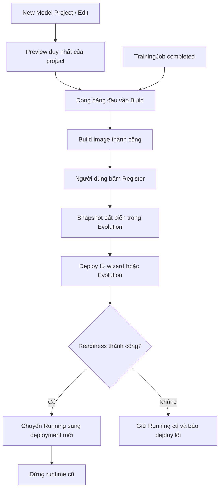

# Kế hoạch refactor Website và vòng đời Model Project

> Cập nhật: 03/10/2026. Trạng thái: code của 5 giai đoạn đã triển khai; kiểm thử runtime Docker Compose và UI trên trình duyệt còn chờ clean bootstrap.
> Môi trường mục tiêu: local Docker Compose, clean bootstrap dữ liệu ứng dụng.
> Tài liệu này là đặc tả triển khai mới. Tài liệu ý tưởng cũ đã được loại bỏ; xem [runbook local](web-workflow-local.md) để khởi chạy và kiểm thử.

## 1. Mục tiêu và quyết định đã chốt

Refactor đồng bộ Website và Control Plane, tách rõ dữ liệu đang chỉnh sửa, đầu vào đã build, phiên bản đã đăng ký và runtime đang phục vụ. Không giữ route cũ, API compatibility hoặc backfill dữ liệu ứng dụng cũ.

| Nội dung | Quyết định |
| --- | --- |
| Preview | Mỗi project có đúng một Preview có thể chỉnh sửa; version đã đăng ký là bất biến |
| New Model Project | Bắt buộc Raw model hoặc MLflow Model Package ZIP |
| Project tạo trong Training | Cho phép chưa có model artifact; vẫn tạo Preview 1–1 |
| Đăng ký Evolution | Người dùng chủ động Register sau build thành công; không tự đăng ký trong callback build |
| Deploy | Chỉ nhận version đã đăng ký; không có bước bỏ qua Evolution |
| Nút triển khai trong Evolution | Xác nhận là khởi động deploy ngay, dùng cùng service với wizard Deployment |
| Running | Một deployment phục vụ chính cho mỗi project; chỉ chuyển khi bản mới Healthy |
| Overview | Chỉ đọc snapshot Running; không lấy Preview hoặc version mới nhất để thay thế |
| Header | Cho chọn tất cả project, gồm Preview, Registered và Running |
| Advanced artifacts | Giữ label mapping, metrics, params, insights, feature importance và input schema |
| Access Mode | Chỉnh tại tab Information, áp dụng ngay cho toàn project |
| Drift sau đổi Running | Tạo monitor mới thủ công; giữ lịch sử version cũ |
| Thiếu reference CSV | Cho upload CSV riêng khi tạo monitor; không sửa Preview/version |
| Metric local | Docker SDK realtime CPU/RAM, counter gateway cho RPS; tối đa 5 phút trong bộ nhớ Web, không lưu lịch sử (quyết định cập nhật của người dùng) |
| Dữ liệu local cũ | Không backfill; chỉ reset khi người dùng chủ động thực hiện |

Phạm vi công việc là refactor code và kiểm thử local. Không tự destroy hạ tầng, reset volume, commit, push, chạy CD hoặc apply K3s. Các adapter Argo được cập nhật nhất quán nếu contract dùng chung thay đổi, nhưng không rollout production trong đợt này.

## 2. Control Plane: dữ liệu, snapshot và vòng đời

### 2.1. Project và Preview

- Giữ `ModelProject` quản lý owner, UUID, name, description và access mode.
- Thêm `ModelPreview` One-to-One với project, chứa flavor, artifact format, requirements, revision và các asset liên quan.
- Asset Preview gồm model artifact, source `.py`, reference `.csv` và Advanced artifacts.
- Name/description sửa trực tiếp trên banner. Access mode sửa riêng trong Information; cập nhật cache gateway khi thay đổi.
- Form Edit chỉ sửa Preview, không thay đổi version, runtime hoặc monitor hiện hữu.
- Project đang Running vẫn giữ trạng thái Running sau khi sửa Preview, kèm chỉ báo “Preview có thay đổi”.
- Preview của project tạo từ Training được phép chưa có artifact; Build Preview chỉ khả dụng khi đầu vào hợp lệ.

Upload sử dụng key do backend cấp, kiểm tra owner, loại file và phạm vi project. Ghi asset vào key mới thay vì ghi đè object đang được snapshot tham chiếu. Chỉ cập nhật Preview sau khi upload thành công; dùng revision để phát hiện hai tab ghi đè nhau. Upload dở hoặc lỗi không được trở thành đầu vào hợp lệ của Build.

### 2.2. Build và snapshot đầu vào

Build nhận nguồn tường minh:

- `preview`: project và revision đang xem.
- `training`: TrainingJob completed của đúng project, còn output hợp lệ.

Đóng băng đầu vào tại thời điểm yêu cầu Build: flavor, requirements, artifact, label mapping, source, reference data và metadata bổ sung. Preview thay đổi sau đó không ảnh hưởng build đang chạy hoặc đã hoàn tất.

Training build lấy source/reference từ snapshot của job, không đọc workspace hiện tại. Source code và reference data cần được lưu để truy xuất nguồn gốc dù không cần nhúng vào image inference.

Callback build chỉ ghi kết quả build, image identity, package và metadata. Bỏ tự động đăng ký `ModelVersion` trong cả callback và đường hoàn tất build local.

### 2.3. Đăng ký Evolution

- Thêm trạng thái đăng ký riêng trên Build: chưa đăng ký, đang đăng ký, đã đăng ký hoặc đăng ký lỗi.
- Nút Register gọi tác vụ đăng ký idempotent. Mỗi Build tạo tối đa một ModelVersion; retry không tăng version trùng.
- Chỉ công bố version khi snapshot và image identity đã được lưu đầy đủ. Đăng ký lỗi có thể retry mà không build lại.
- Giữ đầu vào của build thành công chưa đăng ký để người dùng quay lại tiếp tục.
- Cho phép chủ động build lại cùng Preview hoặc TrainingJob thành Build mới; không giới hạn một version vĩnh viễn cho mỗi TrainingJob.
- Version chứa snapshot bất biến: artifact/package, requirements thực tế, flavor, source code, reference data, Advanced artifacts, nguồn Preview/TrainingJob và image identity.
- Docker dùng image ID; backend registry giữ digest tương ứng. Không làm mất label mapping đã upload hoặc thu được từ training/package.

### 2.4. Deployment và Running

Thêm `active_deployment` trên Project làm nguồn sự thật cho phiên bản Running. Không suy luận Running bằng deployment mới nhất hoặc chỉ dựa vào `stage=production`.

1. Bước Deploy và nút Deploy trong Evolution gọi cùng service triển khai.
2. Chỉ nhận version đã đăng ký thành công; mỗi project chỉ có một yêu cầu triển khai đang tiến hành.
3. Runtime đặt tên theo deployment UUID để redeploy cùng image không va chạm container cũ.
4. Khi readiness thành công: chuyển `active_deployment` trong transaction, cập nhật gateway/cache rồi dừng runtime cũ.
5. Khi deploy lỗi: giữ nguyên Running cũ và ghi lỗi ở deployment mới.
6. Retry cleanup nếu dừng runtime cũ thất bại; runtime cũ không tiếp tục được coi là endpoint phục vụ chính.

Web poll trạng thái Control Plane và hiển thị log qua `TerminalViewer`; không tự suy luận thành công từ log. Readiness và việc được chọn là Running là hai thông tin riêng: runtime mất health vẫn hiện đúng version cùng cảnh báo Unhealthy.

### 2.5. API và quyền truy cập

| Interface | Hành vi |
| --- | --- |
| Project create/update | Tạo Project + Preview; sửa metadata độc lập |
| Project Preview GET/PATCH | Đọc/lưu bản chỉnh sửa với revision |
| Build create | Chọn Preview hoặc TrainingJob, tạo snapshot đầu vào |
| Build register | Đăng ký version bất đồng bộ, idempotent |
| Deployment create | Triển khai version đã đăng ký, trả deployment để theo dõi |
| Project overview | Trả metadata, Running, snapshot và endpoint nhất quán |
| Model observability | Trả time-series giới hạn theo project/deployment |

API công khai tiếp tục dùng UUID, kiểm tra tenant/owner trước khi trả resource. API điều phối qua domain services/selectors; Celery dispatch sau transaction commit. Presigned URL chỉ cấp cho asset đúng tenant/project. Giữ kiểm tra archive traversal, sandbox cho model/training code và callback idempotent; callback muộn không được khôi phục project/job đang xóa hoặc đã kết thúc.

### 2.6. Xóa cứng project

Delete trở thành cleanup bất đồng bộ có thể retry:

1. Đánh dấu deleting, khóa build/train/deploy/drift mới và vô hiệu hóa truy cập inference.
2. Dừng job/runtime, xử lý task đang chạy và callback đến muộn.
3. Xóa image, asset/report/snapshot, cache/log theo project và dữ liệu ứng dụng liên quan.
4. Xóa bản ghi con theo dependency rồi xóa cứng Project/Preview.

Chỉ báo hoàn tất sau khi cleanup thành công. Nếu lỗi, giữ `delete_failed` để retry; không báo đã xóa khi tài nguyên vẫn còn. Không xóa image nền, bucket hoặc tài nguyên dùng chung.

## 3. Website: feature, route và trải nghiệm

### 3.1. Tổ chức feature

Chuẩn hóa dưới `web/src/features/`:

| Feature | Trách nhiệm |
| --- | --- |
| `projects` | Danh sách, New/Edit Preview và Overview |
| `deployments` | Build history, wizard Build/Register/Deploy |
| `monitoring` | Drift configuration, run history, report và model metrics |
| `training` | Workspace, training jobs và reference selection |
| `evolution` | Version snapshots, lineage, so sánh và triển khai |
| `api-tokens` | API key hiện tại, tách khỏi Settings |
| `auth`, `settings`, `notifications` | Giữ trách nhiệm riêng |

Giữ hướng phụ thuộc `app → features → shared`. Router/layout điều phối các feature; page là coordinator, React Query hook quản lý server state, API module quản lý contract HTTP. Tránh dependency vòng khi chuyển file và DTO sang owner mới.

`TerminalViewer`, `DataTable`, `CSVEditor` và editor dùng chung chỉ nhận dữ liệu/callback, không tự gọi API domain. Giữ design tokens, light/dark theme, accessibility, lazy loading và cơ chế i18n hiện tại.

### 3.2. Sidebar và route

Sidebar hiển thị theo thứ tự:

1. Model Project
2. Overview Model
3. Deployment Model
4. Monitoring Model
5. Training Model
6. Evolution Model
7. Notification
8. Setting
9. API Token
10. Logout

| Trang | Route chính |
| --- | --- |
| Danh sách project, điểm đến sau đăng nhập | `/dashboard/projects` |
| New Model Project | `/dashboard/projects/new` |
| Edit Preview | `/dashboard/projects/:projectId/edit` |
| Overview | `/dashboard/projects/:projectId/overview` |
| Deployment | `/dashboard/projects/:projectId/deployment` |
| Monitoring | `/dashboard/projects/:projectId/monitoring` |
| Training | `/dashboard/projects/:projectId/training` |
| Evolution | `/dashboard/projects/:projectId/evolution` |
| Notification | `/dashboard/notifications` |
| Setting | `/dashboard/settings/profile` |
| API Token | `/dashboard/api-tokens` |

Form tạo và trang chi tiết dùng route riêng chứa build/job/run/version UUID khi resource đã tồn tại. Form tạo Deployment, Training và Drift có selector project riêng; không phụ thuộc lựa chọn ngầm từ Header. API Token giữ semantics API key hiện tại, không tự mở rộng thành một hệ thống personal access token mới.

### 3.3. Header và trạng thái điều hướng

- Header cho chọn mọi project, gồm Preview, Registered và Running.
- Ở năm trang chính: đổi project và giữ section đang xem.
- Ở trang tạo, chỉnh sửa, chi tiết hoặc trang tài khoản: chuyển đến Overview project được chọn.
- Không mang build/job/run/version UUID của project cũ sang project mới.
- Form có dữ liệu chưa lưu phải xác nhận rời trang; tác vụ đã chạy vẫn tiếp tục.
- URL là nguồn lựa chọn chính; localStorage chỉ nhớ lựa chọn khi URL chưa chỉ định project.
- URL không hợp lệ hiển thị lỗi phù hợp, không tự thay bằng project khác.
- Khi không có project, hiển thị empty state và hành động tạo project; không tạo route chứa ID rỗng.

### 3.4. Model Project và form New/Edit

Model Project hiển thị danh sách toàn bộ project của người dùng, tương đương Model Management hiện tại.

Form New gộp thành một trang:

- Metadata: name, description, access mode, framework flavor.
- Source `.py` và reference `.csv`, đều optional.
- Artifact: Raw model theo flavor hoặc MLflow Model Package `.zip`, bắt buộc.
- Requirements qua file `.txt` hoặc editor.
- Advanced artifacts thu gọn; giữ kiểm tra format và khả năng của packager hiện có.

Tạo thành công chuyển đến Overview với trạng thái Preview và nút dẫn sang Deployment. Form Edit tái sử dụng phần nhập Preview, bỏ name, description và access mode; lưu thay đổi vào Preview mà không áp dụng lên Running.

### 3.5. Overview

Banner hiển thị name/description có thể sửa trực tiếp, nút Edit Preview và Delete bên phải.

| Tab | Nội dung |
| --- | --- |
| Deployment | Endpoint, readiness, CPU/RAM, request và Model Testing hiện tại |
| Code | Editor read-only của source snapshot Running |
| Data | CSVEditor read-only của reference snapshot Running |
| Information | Metadata project, flavor Running nếu có, ngày tạo/cập nhật và chỉnh Access Mode |

Khi chưa có Running, vẫn xem được banner và metadata project; các nội dung runtime/snapshot hiển thị trạng thái chưa triển khai và hành động dẫn sang Deployment. Không dùng Preview hoặc version đăng ký mới nhất để thay thế Code/Data của Running.

### 3.6. Deployment và Evolution

Deployment hiển thị build ID, thời gian, tên project, nguồn build, version và kết quả. Giữ các nhãn `Build failed`, `Build successful only`, `Build and deploy successful`, đồng thời thể hiện rõ trạng thái Building, Deploying, Deploy failed và Cancelled.

Wizard CreateDeploymentModel có hai bước:

1. **Build image:** selector project độc lập, chọn Preview hoặc TrainingJob completed, xem đầu vào và log. Build thành công mới bật Register.
2. **Deploy:** chỉ mở sau khi đăng ký thành công; hiển thị version/image, nút Deploy, log và kết quả.

Refresh hoặc rời trang không mất tiến trình; có thể tiếp tục từ build ID. Register chỉ đăng ký và mở bước Deploy, không tự triển khai trước khi người dùng bấm Deploy.

Evolution chỉ hiển thị snapshot đã đăng ký, gồm lineage, metadata, metrics và nút xác nhận Deploy. Version Running có badge riêng. Xác nhận triển khai từ Evolution trực tiếp khởi động cùng service deployment, không chỉ đổi nhãn version trong DB.

### 3.7. Training

- Giữ quy trình Training hiện tại, gồm chọn project có sẵn hoặc tạo project mới ngay trong wizard.
- Project tạo từ Training có Preview 1–1 nhưng không bắt buộc artifact ban đầu.
- Thêm **Set as Reference** ở editor dữ liệu: chọn tối đa một CSV, lưu lựa chọn trên job và snapshot file khi bắt đầu training.
- Reference selection không tự thay đổi tập dữ liệu huấn luyện. Source, data và reference của job đã submit là bất biến.
- Training completed xuất hiện trong lựa chọn Trained Model tại bước Build; không tự đăng ký Evolution hoặc ghi đè Preview.

### 3.8. Monitoring

- Trên cùng hiển thị trạng thái Data drift của version Running; không diễn giải thành suy giảm chất lượng dự đoán.
- Metrics, params, insights và feature importance đọc từ snapshot Running; chỉ hiển thị phần có dữ liệu.
- Bên dưới giữ lịch sử drift, log và report; ghi rõ version của từng run.
- Create Drift Monitoring có selector riêng chỉ nhận project có Running hợp lệ.
- Dùng reference snapshot của version; nếu thiếu, cho upload CSV riêng và snapshot cho monitor, không sửa Preview/version.
- Khi đổi Running, monitor cũ ngừng tạo run tự động; lịch sử vẫn xem được. Người dùng tạo monitor mới thủ công.
- Kiểm tra lại Running lúc submit để tránh tạo monitor nhầm version nếu deployment vừa thay đổi.

## 4. Observability trên Docker Compose

Theo quyết định cập nhật, local chỉ cần quan sát realtime ngắn, không chạy Prometheus/cAdvisor hoặc lưu time-series.

- Giữ label tenant/project/version/deployment trên runtime; Docker SDK chỉ đọc đúng Running container, timeout 2 giây.
- CPU theo cores, RAM working set theo MiB. RPS dùng counter atomic gateway trong Redis hiện có (TTL 300 giây), phối hợp giữa các worker; không lưu chuỗi mẫu server-side.
- Control Plane trả snapshot cho tenant/project đã xác thực; không nhận container ID hoặc truy vấn tùy ý từ Web.
- Web poll mỗi 5 giây khi mở tab, giữ tối đa 60 điểm/5 phút trong bộ nhớ. Rời trang/F5/đổi deployment bắt đầu lại; không có history 1h/24h ở local.
- Mẫu đầu, nguồn metric lỗi hoặc counter reset hiện “Chưa có dữ liệu/Không khả dụng”, không giả số 0 hoặc spike.
- Production dùng Prometheus: CPU/RAM join cAdvisor với `kube_pod_labels` theo namespace và nhãn tenant/project/version/deployment, chỉ lấy container runtime `model-server`. Monitoring allowlist bốn nhãn Pod này. Runtime triển khai trước thay đổi cần redeploy để nhận đủ nhãn; không tự sửa runtime đang chạy.
- Gateway export counter/histogram multiprocess giữa các Uvicorn worker trong mỗi Pod. Parent tạo directory mới trước khi import app/spawn; worker restart giữ counter, parent restart reset counter. Production dùng `emptyDir` riêng từng Pod; Prometheus áp dụng `rate()` trước khi cộng các Pod. Local vẫn dùng Redis counter realtime, không cần Prometheus.
- Giữ Redis runtime logs. Trạng thái tác vụ lấy từ PostgreSQL; nghiệm thu Docker stats thực tế được tách khỏi test mock.

## 5. Lộ trình thực hiện

Checkbox trong phần này theo dõi code đã triển khai. Không đánh đồng code/test mock đã pass với acceptance runtime: các bước chạy Docker/S3/Evidently/training thực tế và kiểm tra UI được giữ riêng trong mục 6.

### Giai đoạn 1 — Schema, Preview và snapshot contracts

- [x] Thêm ModelPreview 1–1, asset metadata, revision và migration cho database mới.
- [x] Tách metadata Project khỏi Preview; hỗ trợ ngoại lệ project tạo từ Training.
- [x] Triển khai API upload/save/read Preview có kiểm tra tenant, file và revision.
- [x] Bổ sung snapshot đầu vào Build và dữ liệu source/reference cần lưu theo version.
- [x] Cập nhật serializer, selector, DTO và contract storage liên quan.
- [x] Kiểm thử snapshot isolation, upload thất bại và ghi đồng thời.

**Đầu ra:** tạo/sửa Preview được qua API; một project có đúng một Preview; build đọc đầu vào cố định dù Preview tiếp tục thay đổi.

### Giai đoạn 2 — Build, Register, Running và cleanup

Phụ thuộc giai đoạn 1.

- [x] Tách build completion khỏi automatic registration ở Docker và callback dùng chung.
- [x] Bổ sung thao tác Register, trạng thái đăng ký và idempotency theo Build.
- [x] Lưu đầy đủ snapshot/image identity; giữ đầu vào build chưa đăng ký.
- [x] Thêm active_deployment và đồng bộ selector Overview/gateway/Monitoring.
- [x] Chuyển Running sau readiness, giữ runtime cũ khi deploy lỗi và dọn runtime cũ sau thành công.
- [x] Đổi định danh runtime theo deployment UUID và cập nhật contract liên quan.
- [x] Hoàn thiện xóa cứng project, retry cleanup và xử lý callback đến muộn.
- [x] Kiểm thử registration/deployment concurrency, tenant isolation và cleanup failure.

**Đầu ra:** API chạy được Preview → Build → Register → Deploy; không đăng ký version tự động; mỗi project có một Running và cleanup xử lý đúng tài nguyên thuộc project.

### Giai đoạn 3 — Route/layout và các trang vòng đời chính

Phụ thuộc contract giai đoạn 1–2.

- [x] Tổ chức lại feature theo projects/deployments/monitoring/training/evolution/api-tokens.
- [x] Thay route, Sidebar, Header coordinator và link trong notification/action liên quan.
- [x] Xây form New/Edit Preview dùng chung các phần nhập liệu phù hợp.
- [x] Xây Overview với bốn tab và nguồn snapshot Running.
- [x] Chuyển Model Testing vào tab Deployment của Overview.
- [x] Xây Build history và wizard Build/Register/Deploy có thể tiếp tục từ UUID.
- [x] Cập nhật Evolution với snapshot, badge Running và nút Deploy trực tiếp.
- [x] Tách API Token khỏi Settings; giữ semantics API key hiện tại.
- [x] Bổ sung loading/error/empty state, dirty form guard, accessibility và i18n.

**Đầu ra:** người dùng thực hiện trọn luồng upload → build → register → deploy trên Web; refresh/deep link và đổi project không làm lẫn resource.

### Giai đoạn 4 — Training reference, Monitoring và metric local

Phụ thuộc snapshot/Running từ giai đoạn 1–2 và điều hướng từ giai đoạn 3.

- [x] Giữ luồng tạo project trực tiếp trong Training, không yêu cầu artifact đầu vào.
- [x] Bổ sung Set as Reference và snapshot CSV theo job.
- [x] Cho chọn TrainingJob completed làm nguồn Build và lưu lineage/source/reference.
- [x] Cập nhật Monitoring theo Running, reference snapshot và lịch sử từng version.
- [x] Cho upload reference CSV riêng của monitor khi version thiếu reference.
- [x] Ngừng auto-trigger monitor cũ khi chuyển Running; tạo monitor mới thủ công.
- [x] Thêm Docker SDK snapshot API và counter gateway ngắn hạn; bỏ Prometheus/cAdvisor local.
- [x] Kết nối biểu đồ CPU/RAM/request realtime, giới hạn cửa sổ Web 5 phút; chưa kiểm chứng Docker daemon thật.

**Đầu ra:** Training → Build → Register → Deploy hoạt động; drift dùng đúng reference bất biến; report mở được; metric realtime không trộn giữa các deployment.

### Giai đoạn 5 — Dọn code cũ, kiểm thử tích hợp và tài liệu

Phụ thuộc các giai đoạn trước.

- [x] Xóa page/route/context/DTO cũ không còn dùng; không giữ compatibility wrapper hoặc deploy bỏ qua Register.
- [x] Cập nhật adapter Argo và kiểm tra contract/render nếu interface dùng chung thay đổi; không apply cluster.
- [x] Cập nhật README, hướng dẫn local và skill references về lifecycle, ownership, route và API.
- [x] Chạy focused backend tests, Django checks và migration checks.
- [x] Chạy frontend lint/build và test điều hướng tự động.
- [ ] Kiểm tra form, theme, responsive và bàn phím trên trình duyệt.
- [x] Validate Compose; API integration dùng ORM thật và mock hạ tầng.
- [ ] Chạy các kịch bản end-to-end Docker Compose bên dưới.
- [x] Kiểm tra diff, không đưa secret hoặc thay đổi không liên quan vào refactor.

**Đầu ra:** code chỉ còn luồng mới và tài liệu khớp implementation. Acceptance runtime còn chờ các mục chưa đánh dấu; không tự reset dữ liệu đang có.

## 6. Kiểm thử và acceptance

### 6.1. Backend và bảo mật

- [ ] Sửa Preview lúc build không đổi đầu vào; sửa/xóa workspace không đổi snapshot.
- [ ] Stale revision bị từ chối, không ghi đè thay đổi mới hơn.
- [ ] Build thành công chưa tạo version; Register mới tạo; double-click/callback/retry không tạo trùng.
- [ ] Registration lỗi không mất build và có thể retry.
- [ ] Version chưa đăng ký bị chặn deploy; mỗi project chỉ có một Running.
- [ ] Deploy mới lỗi giữ bản cũ; thành công chuyển endpoint và dọn runtime cũ.
- [ ] Project tạo từ Training không cần artifact; reference CSV được đóng băng đúng job.
- [ ] Monitor không đọc Preview; monitor version cũ ngừng auto-trigger sau khi đổi Running.
- [ ] CSV upload riêng cho monitor không sửa snapshot version.
- [ ] Không đọc asset/log/metric khác tenant; archive traversal bị chặn.
- [ ] Hard delete xử lý job đang chạy, callback muộn, quan hệ DB và lỗi cleanup có thể retry.

### 6.2. Frontend

- [ ] Header hoạt động đúng ở trang chính, form tạo/edit, trang chi tiết và trang tài khoản.
- [ ] Đổi project không giữ resource ID của project cũ; deep link/F5 phục hồi đúng resource.
- [ ] Dirty form có xác nhận rời trang; tác vụ đã gửi vẫn chạy khi rời trang.
- [ ] Overview chưa có Running không lấy Preview/version mới nhất để lấp nội dung snapshot.
- [ ] Register/Deploy chỉ enabled khi trạng thái backend cho phép.
- [ ] API Token đã tách khỏi Settings; link/menu/i18n không còn trỏ route cũ.
- [ ] Empty/loading/error state, light/dark theme, bàn phím và responsive hoạt động.

### 6.3. End-to-end local

1. **Raw model + label mapping:** tạo Preview → Build → Register → Deploy → predict trả đúng nhãn.
2. **MLflow ZIP:** tạo Preview → Build → Register → Deploy; giữ requirements và metadata hợp lệ của package.
3. **Edit khi đang Running:** Overview vẫn hiển thị snapshot cũ; chỉ đổi nội dung sau khi deploy bản mới thành công.
4. **Training project mới:** tạo project không artifact → training với Set as Reference → Build → Register → Deploy.
5. **Deployment thất bại:** Running cũ vẫn phục vụ, Web hiện lỗi bản mới và cho retry.
6. **Drift:** tạo monitor → chạy Evidently → xem log → mở report; kiểm tra reference từ version và CSV upload riêng.
7. **Đổi Running:** lịch sử drift cũ vẫn truy cập được; monitor mới chỉ tạo khi người dùng yêu cầu.
8. **Metric:** CPU/RAM/request có dữ liệu realtime thật; mất nguồn hiện unavailable, không giả thành zero; F5/đổi deployment bắt đầu lại.
9. **Hard delete:** xóa project có runtime/job/history; tài nguyên thuộc project được dọn, project khác không bị ảnh hưởng.

### 6.4. Tiêu chí hoàn tất

- [ ] Mỗi project có một Preview; sửa Preview không làm thay đổi version hoặc Running.
- [ ] Mỗi version Evolution truy xuất được chính xác đầu vào đã build.
- [ ] Build, registration, deployment và readiness có trạng thái riêng, không suy luận từ log hoặc state tạm trên trình duyệt.
- [ ] Overview, gateway và Monitoring cùng tham chiếu đúng Running.
- [ ] Mọi tác vụ có thể theo dõi/tiếp tục qua UUID và dữ liệu Control Plane.
- [ ] Luồng upload và training đều hoàn thành trên local Docker Compose.
- [ ] Frontend lint/build, backend checks/tests, Compose validation và kiểm tra diff đạt yêu cầu.

## 7. Giả định và giới hạn

- Clean bootstrap áp dụng cho dữ liệu ứng dụng; không tự reset database/volume hoặc xóa AWS.
- PostgreSQL và object storage tiếp tục là nguồn dữ liệu bền vững; Redis phục vụ queue/cache/runtime log.
- Public resource dùng UUID; giữ tenant isolation, presigned storage và sandbox cho model/training code.
- Chỉ Data drift được trình bày như trạng thái giám sát; đánh giá suy giảm chất lượng model nằm ngoài đợt này.
- Không thêm automatic promotion, tự tạo monitor sau deploy hoặc nhiều phiên bản phục vụ song song lâu dài.
- Giữ các thay đổi local không liên quan; người dùng chủ động thực hiện commit/push và triển khai hạ tầng sau này.

## 8. Kết quả kiểm tra triển khai

- Control Plane: **235 test pass**, bao gồm integration API/ORM, snapshot, Register, Running, training retry, cleanup retry, callback đến muộn và Docker realtime metrics/tenant isolation; Django system check và migration dry-run pass.
- Model Server: **60 test pass** với `LOG_FORMAT=console` (test logging local yêu cầu định dạng console), gồm counter realtime và inference success/failure.
- Model Packager: **66 test pass**, bao gồm callback requirements, upload package và label mapping; ML framework native được stub theo fixture hiện có.
- Web: TypeScript, ESLint, architecture/i18n/design-token checks, Vite build, 13 test điều hướng Header và 13 test metric realtime.
- Render Argo/root Kustomize và Kubeconform pass; custom resource thiếu schema upstream được skip theo cấu hình hiện có.
- Compose config và Git whitespace check được chạy; không apply production, commit/push, reset volume hoặc restart container cũ.

Giới hạn: chưa chạy build/predict/training/Evidently với Docker/S3 thật sau refactor, chưa xác nhận Docker stats realtime trên Docker Desktop, chưa nghiệm thu UI bằng trình duyệt. Đây không phải báo cáo nghiệm thu production.

## Runtime health contract

Deployment lifecycle dùng `succeeded/failed`, độc lập với API Health
`unknown/healthy/unhealthy`. Beat và queue `runtime-health` kiểm tra cả khi Web đóng;
quan sát quá 45 giây hiển thị unknown, không đổi phiên bản Running.
Xem [runbook](runtime-health.md).
