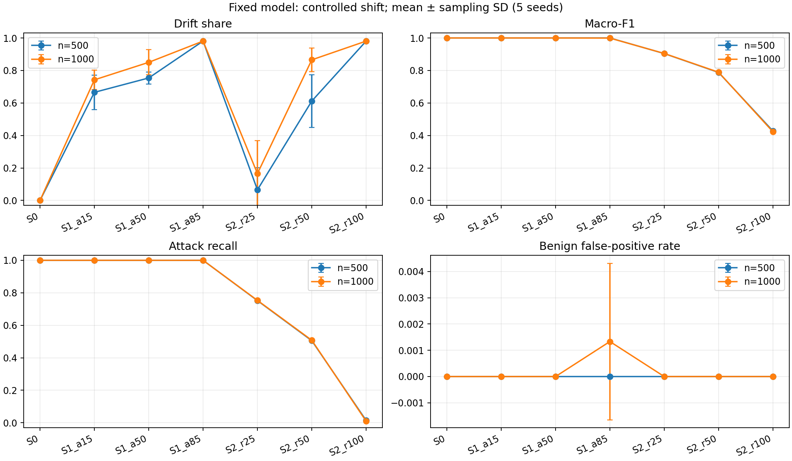
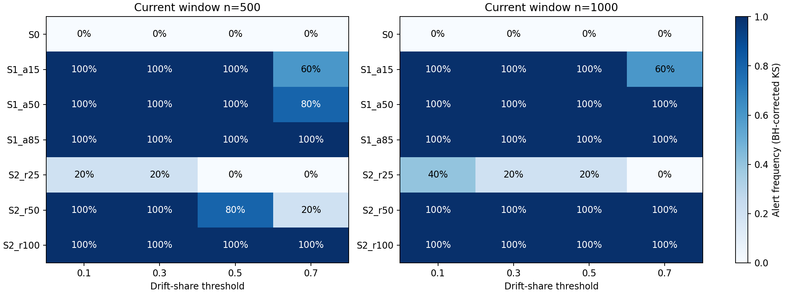

# Cơ sở thực nghiệm CSoNet 2026: data drift và chất lượng NIDS

Ngày chạy: **26/09/2026**. Phục vụ chỉnh sửa short paper CSoNet; không thay manuscript hoặc kết quả cũ.

Đây là bản cơ sở ghi lại lượt chạy `run_20260926`. Nếu bổ sung hoặc thay đổi thiết kế, lưu thành lượt chạy mới và đối chiếu với bản này; không ghi đè số liệu để giữ khả năng truy vết.

## 1. Kết luận chính

Đã hoàn thành **120 cửa sổ đánh giá, 6.240 phép kiểm tra KS**, với một XGBoost cố định, hai kích thước cửa sổ và bốn ngưỡng cảnh báo. Kiểm tra độc lập đã chạy lại toàn bộ dự đoán, confusion matrix, KS và BH từ artifact lưu trên đĩa, đều đạt.

Kết quả hỗ trợ ba nhận định có thể đưa vào phần thực nghiệm:

1. **Data drift không đồng nghĩa với mô hình suy giảm.** Khi chỉ đổi tỷ lệ BENIGN/DDoS, nhiều đặc trưng bị đánh dấu drift nhưng macro-F1 vẫn gần 1.
2. **Có thể giảm recall đáng kể trong khi detector chưa cảnh báo.** Khi 25% số attack được thay bằng các họ tấn công model chưa học, attack recall còn khoảng 75%; với ngưỡng drift share 0,30, chỉ 1/5 cửa sổ được cảnh báo ở mỗi kích thước.
3. **Ngưỡng và kích thước cửa sổ ảnh hưởng kết quả.** Ví dụ ở mức thay 50% attack, ngưỡng 0,70 cảnh báo 1/5 cửa sổ 500 mẫu nhưng 5/5 cửa sổ 1.000 mẫu.

Đây là **thực nghiệm dịch chuyển có kiểm soát**, không phải chứng minh natural/temporal drift hay concept drift. Model được cố ý giới hạn ở BENIGN/DDoS để khảo sát giới hạn khi thành phần attack thay đổi; không thể diễn giải thành hiệu năng của một NIDS đã được huấn luyện đầy đủ mọi attack family.

## 2. Dữ liệu và kiểm tra chống trùng

Đầu vào thực tế: `data/reference_data.csv`, 209.865 dòng, 52 đặc trưng; BENIGN 100.000, DDoS 50.000, PortScan 50.000, BruteForce 8.150, WebAttacks 1.715. Tên file là vai trò trong pipeline cũ; trong thực nghiệm này file được chia lại thành bốn pool độc lập.

Nguồn nhóm đã cung cấp:

- [CICIDS2017 gốc tại UNB](https://www.unb.ca/cic/datasets/ids-2017.html).
- [Bản cleaned/preprocessed được nhóm sử dụng](https://www.kaggle.com/datasets/ericanacletoribeiro/cicids2017-cleaned-and-preprocessed).
- [Bản tách nhãn của nhóm](https://www.kaggle.com/datasets/hongtrnnguynvit/nids-reference-data).

Các URL mô tả lineage do nhóm xác nhận; chưa xác minh byte-level toàn bộ chuỗi từ dữ liệu gốc đến bản local. SHA-256 nguồn local được lưu trong manifest và README.

Kết quả audit:

- Không có dòng chứa giá trị số không hữu hạn trong nguồn local.
- Loại **20 dòng thuộc 10 nhóm có cùng vector đặc trưng nhưng khác nhãn**.
- Sau đó loại **1 dòng trùng vector đặc trưng** còn lại; giữ **209.844 dòng**.
- Chia 50/10/20/20% theo nhãn thành train/development/reference/evaluation. Hash dựa trên 52 giá trị số, không chứa nhãn. **Cả sáu cặp pool đều không có vector đặc trưng trùng chính xác**.
- Model thực sự học trên **74.994 dòng BENIGN/DDoS** thuộc train. Các nhãn khác trong train pool không được dùng để fit.
- Reference so sánh drift gồm 5.000 dòng từ reference pool; evaluation chỉ lấy từ evaluation pool.
- Audit các file cũ xác nhận reference cũ chồng lấp với các file train và drift. Ngược lại, `test_data.csv` cũ không có vector đặc trưng trùng chính xác với các CSV khác được audit. Vì vậy không nên kết luận mọi split cũ đều bị trùng.

| Pool | BENIGN | DDoS | PortScan | BruteForce | WebAttacks |
|---|---:|---:|---:|---:|---:|
| Train | 49.994 | 25.000 | 24.995 | 4.075 | 857 |
| Development | 9.998 | 5.000 | 4.999 | 815 | 171 |
| Reference | 19.997 | 10.000 | 9.998 | 1.630 | 343 |
| Evaluation | 20.000 | 10.000 | 9.998 | 1.630 | 344 |

Chống trùng chính xác chỉ xử lý một dạng leakage. Nó không loại được tương quan giữa flow cùng session/host, và không khắc phục việc chọn đặc trưng trên dữ liệu gộp ở bước tiền xử lý upstream.

## 3. Thiết kế đã chạy

XGBoost: 200 cây, max depth 6, learning rate 0,1; seed 42; ngưỡng dự đoán attack 0,5. Không scaler, không SMOTE, không tuning theo kết quả evaluation. Fit một lần và giữ cố định; không chạy continuous training.

Reference cố định: 70% BENIGN + 30% DDoS. Mỗi cửa sổ có 500 hoặc 1.000 dòng.

| Kịch bản | Thay đổi so với reference |
|---|---|
| S0 | Giữ 70% BENIGN + 30% DDoS |
| S1_a15 | Attack còn 15%, tất cả vẫn là DDoS |
| S1_a50 | Attack lên 50%, tất cả vẫn là DDoS |
| S1_a85 | Attack lên 85%, tất cả vẫn là DDoS |
| S2_r25 | Tổng attack vẫn 30%; thay 25% số attack bằng họ chưa học |
| S2_r50 | Tổng attack vẫn 30%; thay 50% số attack bằng họ chưa học |
| S2_r100 | Tổng attack vẫn 30%; thay toàn bộ attack bằng họ chưa học |

Họ chưa học là PortScan, BruteForce và WebAttacks, chia gần bằng nhau. Ví dụ S2_r25 ở cửa sổ 1.000 dòng gồm 700 BENIGN, 225 DDoS và 75 attack mới. Việc thay attack là thao tác thiết kế dữ liệu có nhãn, không phải diễn biến theo thời gian quan sát ngoài thực tế.

Detector độc lập sử dụng KS hai phía, p-value tiệm cận, BH correction trên 52 đặc trưng trong mỗi cửa sổ; đặc trưng được gắn cờ nếu q < 0,05. Drift share là tỷ lệ đặc trưng được gắn cờ. Cảnh báo khi drift share ≥ ngưỡng; khảo sát 0,10/0,30/0,50/0,70. Lưu cả phiên bản không hiệu chỉnh để so sánh. **Không coi đây là kiểm thử tích hợp của Evidently đang deploy.**

Mỗi tổ hợp có 5 seed lấy mẫu; riêng S0 bổ sung 25 seed, thành 30 cửa sổ mỗi kích thước. Không trùng dòng trong một cửa sổ; các cửa sổ khác nhau có thể dùng lại dòng cùng evaluation pool. Vì vậy không xem 120 cửa sổ là 120 quan sát độc lập ngoài thực tế.

## 4. Bảng kết quả chính

Trung bình trên **5 seed**, cửa sổ **1.000 dòng**. “Cảnh báo” dùng BH và ngưỡng 0,30; S0 trong cột này dùng toàn bộ 30 lượt kiểm tra ổn định.

| Kịch bản | Drift share TB | Macro-F1 TB | Attack recall TB | Cảnh báo |
|---|---:|---:|---:|---:|
| S0 | 0,00% | 1,0000 | 100,00% | 0/30 |
| S1_a15 | 74,23% | 1,0000 | 100,00% | 5/5 |
| S1_a50 | 85,00% | 1,0000 | 100,00% | 5/5 |
| S1_a85 | 98,08% | 0,9992 | 99,98% | 5/5 |
| S2_r25 | 16,54% | 0,9046 | 75,33% | 1/5 |
| S2_r50 | 86,54% | 0,7892 | 50,80% | 5/5 |
| S2_r100 | 98,08% | 0,4224 | 1,00% | 5/5 |

Ở S1_a85, benign FPR trung bình là 0,133%; các dòng còn lại trong bảng có FPR bằng 0 trên 5 lượt chính. Các giá trị hoàn hảo chỉ mô tả mẫu đã chạy, không chứng minh model hoàn hảo.

Trên **tất cả 30 cửa sổ S0** kích thước 1.000: macro-F1 trung bình 0,999881, attack recall 0,999889, FPR 0,000095; do đó không nên ghi “F1 luôn bằng 1”. Cả 60 cửa sổ S0 của hai kích thước đều không cảnh báo với BH ở các ngưỡng khảo sát; đây là tần suất quan sát trong thiết kế này, không phải bảo đảm false-alert rate bằng 0.

Ở S2_r100, recall PortScan và WebAttacks bằng 0; recall BruteForce trung bình 3% với cửa sổ 1.000. Điều này thể hiện giới hạn tổng quát hóa của baseline chỉ học DDoS, không phải kết luận về các model được học đầy đủ các họ tấn công đó.

Sai số trên hình là độ lệch chuẩn giữa 5 lần lấy cửa sổ với cùng model/reference, không phải confidence interval qua nhiều lần huấn luyện. S0, S1 và S2 là các kịch bản khác nhau; đường nối chỉ hỗ trợ đọc hình, không phải quỹ đạo thời gian.

## 5. Phân tích ngưỡng

Mỗi ô là tần suất cảnh báo: mẫu số **30** cho S0, **5** cho mỗi kịch bản còn lại. Số cửa sổ ít nên chỉ diễn giải mô tả.

- S2_r25, n=1.000: ngưỡng 0,10 cảnh báo 2/5; 0,30 là 1/5; 0,50 là 1/5; 0,70 là 0/5. Hạ ngưỡng có ích trong mẫu này nhưng chưa giải quyết hết việc bỏ sót.
- S2_r50, ngưỡng 0,70: n=500 cảnh báo 1/5, n=1.000 cảnh báo 5/5. Không thể suy ra cửa sổ lớn luôn tốt hơn hoặc độ trễ phát hiện thực tế, vì đây không phải chuỗi thời gian.
- Không hiệu chỉnh nhiều phép thử, S0 n=1.000 ở ngưỡng 0,10 có 3/30 cảnh báo, so với 0/30 khi BH. Tuy nhiên S2_r25 n=1.000 ở ngưỡng 0,30 có 5/5 cảnh báo nếu không hiệu chỉnh, so với 1/5 khi BH. Đây là trade-off cần công bố, không chọn detector theo kết quả đẹp nhất.
- S1_a85 và S2_r100 đều có drift share khoảng 98%, nhưng macro-F1 khác rất lớn. **Drift share không phải thước đo trực tiếp mức suy giảm mô hình.**

KS trên đặc trưng có nhiều giá trị trùng và BH trên các đặc trưng có phụ thuộc cần được diễn giải thận trọng. BH trong thiết kế này không tự bảo đảm kiểm soát false-alert rate ở mức toàn dataset.

## 6. Liên hệ với hai reviewer

| Ý kiến | Bằng chứng mới / phần còn thiếu |
|---|---|
| R1: evaluation chưa đo rõ tác động của shift | Có S0/S1/S2, model cố định, drift và metric có nhãn được đo song song; vẫn là controlled shift |
| R1: sensitivity của ngưỡng | Đã có 4 ngưỡng × 2 kích thước cửa sổ, nhiều seed và so sánh correction |
| R1: natural/temporal drift | Chưa giải quyết; nguồn hiện tại không có timestamp/capture metadata để làm temporal split đáng tin |
| R1: so sánh lifecycle/retraining | Chưa làm theo phạm vi chốt data drift; không được tuyên bố strategy retraining tốt hơn |
| R1: multi-model serving và novelty | Thực nghiệm offline này chưa trả lời; cần thu hẹp claim hoặc có bằng chứng bổ sung riêng |
| R2: provenance, reuse benign và near-perfect scores | Bổ sung checksum, manifest, exclusion, split không trùng chính xác; giải thích giới hạn của score cao. Upstream lineage và preprocessing chưa được kiểm chứng đầy đủ |
| R2: reproducible artifact | Có runner, config, model, membership và kiểm tra độc lập local; vẫn cần đóng gói/public dữ liệu hoặc quy trình tải có version |
| R2: security, scalability, citation integrity | Không thuộc thực nghiệm này; vẫn phải xử lý trong camera-ready, đặc biệt rà soát từng trích dẫn |

Không nên xem toàn bộ yêu cầu reviewer đã hoàn thành, hoặc bỏ qua reviewer 2 vì recommendation ban đầu là reject.

## 7. Đề xuất đưa vào bản camera-ready

Với deadline 30/09, dùng kết quả này để làm rõ **điều kiện drift và giới hạn của cảnh báo**, thay vì mở thêm case study hoặc triển khai CT vội:

1. Thêm một đoạn provenance + preprocessing + split không trùng, nói rõ dữ liệu đã được tiền xử lý bởi bên thứ ba.
2. Dùng bảng n=1.000 ở trên và một hình kết hợp drift/performance; đưa đủ n=500, per-feature và threshold sensitivity vào artifact nếu thiếu trang.
3. Nêu rõ một model được cố định, chưa từng học ba họ attack mới; không gọi đây là deployment evaluation hoặc natural drift.
4. Rút gọn phần mô tả architecture để dành dung lượng cho protocol, kết quả và limitations. Không thay số của thí nghiệm cũ bằng số mới mà giữ nguyên mô tả cũ.
5. Chính sách có thể đề xuất từ bằng chứng: drift là tín hiệu yêu cầu kiểm tra; dùng ground-truth performance khi có nhãn để xác nhận suy giảm. Không tự động suy luận phải retrain chỉ từ drift. Đây là khuyến nghị thiết kế, chưa phải policy đã được đánh giá bằng thực nghiệm CT.
6. Trước khi nộp: rà citation integrity, claims về production/scalability, giới hạn trang và public artifact. Những việc này vẫn cần làm ngoài lượt chạy hiện tại.

Đoạn diễn giải tiếng Anh có thể chỉnh để dùng trong paper:

> Under controlled composition shifts in a preprocessed CICIDS2017-derived dataset, a fixed XGBoost baseline trained on BENIGN and DDoS exhibited strong input-distribution drift without a comparable loss of classification performance when only attack prevalence changed. Conversely, replacing one quarter of attack samples with held-out attack families reduced mean attack recall to 0.7533 for 1,000-sample windows, while the BH-corrected KS monitor raised an alert in only one of five windows at a drift-share threshold of 0.30. These results show that this marginal input-drift signal is neither a direct measure nor a reliable standalone gate for predictive degradation under the evaluated shifts. The experiment does not establish natural temporal drift, concept drift, or the effectiveness of retraining.

## 8. Artifact và kiểm chứng

- [Hướng dẫn chạy lại](README.md).
- [Cấu hình đã chạy](results/run_20260926/config.json).
- [Bảng đầy đủ mean/SD](results/run_20260926/scenario_summary.csv).
- [Bảng ngưỡng](results/run_20260926/threshold_summary.csv).
- [Kiểm chứng độc lập: passed](results/run_20260926/verification.json).

Verifier tải lại model đã lưu, tái tính metric của 120 cửa sổ, chạy lại 6.240 KS test và đối chiếu BH bằng hàm SciPy độc lập với hàm của runner. Mọi checksum CSV nguồn giữ nguyên. Không chỉnh file paper, model phục vụ đang có hoặc dữ liệu gốc.
