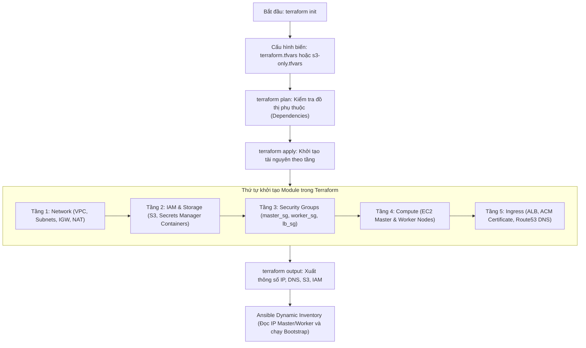

# Hạ tầng Đám mây AWS — Terraform (Infrastructure as Code)

Thư mục `infra/` chứa toàn bộ mã nguồn **Hạ tầng dưới dạng mã (Infrastructure as Code - IaC)** viết bằng Terraform, tự động hóa việc khởi tạo, cấu hình và quản trị toàn bộ tài nguyên trên **Amazon Web Services (AWS)** cho nền tảng MLOps PaaS.

---

## 1. Giới thiệu

### 1.1. Vai trò trong hệ thống
Trong kiến trúc tổng thể của MLOps PaaS, Terraform đóng vai trò là **Nền tảng IaaS cơ sở (Cloud Foundation)**:
- Chịu trách nhiệm khởi tạo toàn bộ hạ tầng mạng, bảo mật, lưu trữ, định tuyến, cấp phát quyền hạn IAM và máy chủ tính toán trên AWS trước khi bất kỳ phần mềm nào được cài đặt.
- Thiết lập ranh giới mạng an toàn với VPC đa vùng (Multi-AZ), phân tách rõ ràng giữa **Public Subnet** (dành cho Master Node, NAT Gateway, ALB) và **Private Subnet** (dành cho Worker Nodes, không có Public IP).
- Sau khi khởi tạo xong, Terraform cung cấp các thông số đầu ra (**Terraform Outputs**) về địa chỉ IP, DNS, ARN quyền hạn và tên bucket để **Ansible** tự động tiếp quản việc cấu hình hệ điều hành và khởi tạo cụm Kubernetes K3s.

```
+-----------------------------------------------------------------------------------+
|                                 Terraform (AWS)                                   |
|                             Tự động khởi tạo IaaS                                 |
+-----------------------------------------------------------------------------------+
     │                │                 │                  │                │
     ▼                ▼                 ▼                  ▼                ▼
[1. Network]     [2. Storage]     [3. Compute]       [4. Security]    [5. Services]
- VPC 10.0.0.0   - S3 Artifacts   - EC2 Master       - master_sg      - ALB (Public)
- Public Subnets - S3 Logs        - EC2 Workers (x2) - worker_sg      - ACM SSL Cert
- Private Subnet - SQS / Queues   - EBS gp3 Disks    - lb_sg          - Route53 DNS
- NAT / IGW      - CORS Rules     - InstanceProfile  - IAM / OIDC     - Secrets Manager
                                        │
                                        ▼ (terraform output)
                        +--------------------------------+
                        |      Ansible Dynamic Inv       |
                        | (Tự động đọc IP Master/Worker) |
                        +--------------------------------+
```

---

### 1.2. Các thành phần chính (Kiến trúc 9 Modules)

Hệ thống được thiết kế theo dạng **module hóa (Modular Architecture)** cao, cho phép bật/tắt linh hoạt các thành phần thông qua các cờ tính năng (*Feature Flags*):

1. **Network (`modules/network/`):**
   - **VPC** CIDR `10.0.0.0/16`.
   - **Public Subnet 1a** (`10.0.1.0/24`): Chứa K3s Master node và NAT Gateway.
   - **Public Subnet 1b** (`10.0.3.0/24`): Kết hợp với 1a để Application Load Balancer hoạt động ở chế độ Multi-AZ.
   - **Private Subnet 1a** (`10.0.2.0/24`): Chứa các K3s Worker nodes được bảo vệ hoàn toàn khỏi Internet.
   - Internet Gateway, Elastic IP, NAT Gateway và các Route Table tương ứng.

2. **Compute (`modules/compute/`):**
   - **K3s Master Node**: Máy ảo EC2 `t3.medium`, ổ cứng gốc 40GB EBS gp3, nằm ở Public Subnet.
   - **K3s Worker Nodes**: 2 máy ảo EC2 `t3.large`, ổ cứng gốc 40GB EBS gp3, nằm ở Private Subnet.
   - Tự động gắn IAM Instance Profile để máy chủ có quyền tương tác với S3, Secrets Manager và EBS CSI driver.

3. **Security (`modules/security/`):**
   - `master_sg`: Chỉ mở cổng 6443 (Kubernetes API) và 22 (SSH) từ dải mạng an toàn.
   - `worker_sg`: Mở cổng 80/443 (Traefik Ingress) nhận traffic từ ALB, và các cổng giao tiếp nội bộ Flannel/K3s giữa các node.
   - `lb_sg`: Nhận traffic HTTP/HTTPS công khai từ Internet vào ALB.

4. **IAM & OIDC (`modules/iam/`):**
   - **EC2 Node Profile** (`mlops-ec2-node-profile`): Cho phép các node K8s đọc Secrets Manager, toàn quyền trên S3 bucket và tạo/gắn động ổ đĩa EBS qua AWS EBS CSI driver.
   - **Karpenter Controller Role & Node Profile**: Cho phép bộ điều phối Karpenter tự động cấp phát/hủy bỏ các máy ảo EC2 đàn hồi cho các tác vụ huấn luyện mô hình (Training workloads).
   - **SQS Interruption Queue**: Hàng đợi nhận tín hiệu cảnh báo thu hồi máy ảo Spot (Spot Interruption) từ AWS EventBridge để xử lý graceful draining cho Karpenter.
   - **GitHub Actions OIDC Provider & Role**: Cho phép pipeline CI/CD (GitHub Actions) xác thực ngắn hạn không cần Access Key tĩnh để cập nhật Secrets hoặc đẩy image.

5. **Storage (`modules/storage/`):**
   - **S3 Bucket `mlops-paas-artifacts`**: Lưu trữ models, dữ liệu huấn luyện, build artifacts và báo cáo drift của Evidently (bật Versioning, cấu hình CORS cho Presigned Upload).
   - **S3 Bucket `mlops-paas-runtime-logs`**: Lưu trữ log hệ thống và log container tập trung của Loki trong 7 ngày (kèm quy tắc vòng đời tự hủy sau 10 ngày).
   - Cả 2 bucket đều được cấu hình `force_destroy = true` để hỗ trợ teardown hạ tầng sạch sẽ.

6. **Load Balancer (`modules/alb/`):**
   - Application Load Balancer công khai (`mlops-api-lb`) gắn chứng chỉ SSL ACM.
   - Target Group chuyển tiếp lưu lượng vào cổng 80 (Traefik Ingress) của các Worker nodes với idle timeout `600s`.

7. **DNS & Certificate (`modules/dns/`):**
   - **Private Route53 Hosted Zone** (`internal.mlops-nids-nt114.id.vn`): Cung cấp DNS nội bộ ổn định `k3s-api` cho các node Karpenter tự động kết nối vào Master.
   - **AWS Certificate Manager (ACM)**: Quản lý chứng chỉ SSL/TLS công khai cho domain hệ thống kèm bản ghi xác thực DNS.

8. **Secrets Manager (`modules/secrets/`):**
   - Khởi tạo các thùng chứa bí mật (Secret Containers) trên AWS:
     - `mlops/production-secrets`: Chứa mật khẩu CSDL, JWT keys, OAuth, webhook tokens.
     - `mlops/aws-secrets`: Chứa IAM credentials cho môi trường phát triển local.
     - `mlops/github-actions-secrets`: Chứa robot account Harbor và Cosign keys.
     - `mlops/k3s-agent-token`: Chứa token join cụm K3s cho Karpenter (do Ansible đẩy lên sau khi dựng Master).
   - *Lưu ý:* Terraform chỉ tạo container metadata; giá trị bí mật thực tế do script bảo mật hoặc Ansible nạp vào, không lưu trong file tfstate.

---

### 1.3. Luồng hoạt động (Workflow Lifecycle)



---

## 2. Cấu trúc cây thư mục

```text
infra/
├── main.tf                     # File điều phối trung tâm: kích hoạt các module theo cờ tính năng
├── variables.tf                # Khai báo các biến cấu hình toàn cục và các feature flag
├── outputs.tf                  # Định nghĩa giá trị đầu ra (IPs, DNS, S3 name, IAM ARNs)
├── provider.tf                 # Khai báo AWS Provider và phiên bản Terraform yêu cầu (>= 1.5)
├── s3-only.tfvars              # File cấu hình mẫu: Chỉ khởi tạo S3 Bucket cho Local Docker Compose
├── terraform.tfstate           # File lưu trữ trạng thái tài nguyên thực tế (được gitignore)
└── modules/                    # Thư mục chứa các module chức năng độc lập
    ├── network/                # Module quản lý VPC, Subnets, Gateways, Routing
    ├── compute/                # Module quản lý máy ảo EC2 Master & Workers
    ├── security/               # Module quản lý Security Groups cho Master, Worker, ALB
    ├── iam/                    # Module quản lý Roles, Instance Profiles, OIDC, SQS Karpenter
    ├── storage/                # Module quản lý S3 Buckets (Artifacts & Runtime Logs)
    ├── alb/                    # Module quản lý Application Load Balancer và Target Groups
    ├── dns/                    # Module quản lý Route53 Private Zone và ACM SSL Certificate
    └── secrets/                # Module quản lý các container AWS Secrets Manager
```

---

## 3. Hướng dẫn khởi chạy và các lệnh cần thiết

### 3.1. Yêu cầu chuẩn bị
- Đã cài đặt **Terraform CLI >= 1.5** (`terraform version`).
- Đã cài đặt và cấu hình **AWS CLI v2** (`aws configure`) với tài khoản có quyền quản trị hạ tầng (Administrator hoặc PowerUser).
- Đã tạo sẵn **EC2 Key Pair** tên `mlops-keypair` trên AWS vùng `ap-southeast-1` (dùng để SSH vào các node).

---

### 3.2. Kịch bản 1: Triển khai toàn bộ hạ tầng Production (Full Cluster)

Dùng khi bạn muốn dựng toàn bộ hệ thống production trên AWS EC2 & K3s:

```bash
cd infra/

# 1. Khởi tạo Terraform và tải các module, provider
terraform init

# 2. Tạo file cấu hình tham số production (terraform.tfvars)
cat > terraform.tfvars << 'EOF'
aws_region            = "ap-southeast-1"
domain_name           = "mlops-nids-nt114.id.vn"
key_name              = "mlops-keypair"
master_instance_type  = "t3.medium"
worker_instance_type  = "t3.large"
worker_instance_count = 2
enable_karpenter      = true
EOF

# 3. Xem trước kế hoạch triển khai
terraform plan

# 4. Áp dụng triển khai hạ tầng
terraform apply

# 5. Xuất các thông số đầu ra để phục vụ Ansible
terraform output
```

---

### 3.3. Kịch bản 2: Chỉ tạo S3 Bucket cho môi trường Local (Docker Compose)

Khi bạn chạy hệ thống MLOps PaaS ở máy cá nhân bằng `docker-compose.yml` nhưng muốn lưu trữ Artifacts/Models trực tiếp lên AWS S3 thật:

```bash
cd infra/

# 1. Khởi tạo nếu chưa chạy
terraform init

# 2. Xem trước kế hoạch (chỉ tạo duy nhất S3 bucket mlops-paas-artifacts)
terraform plan -var-file="s3-only.tfvars"

# 3. Triển khai
terraform apply -var-file="s3-only.tfvars"
```

*Trong file `s3-only.tfvars`, toàn bộ các thành phần EC2, VPC, NAT Gateway, ALB, Secrets Manager đều được tắt (`false`), chỉ giữ lại duy nhất `enable_artifact_storage = true`.*

---

### 3.4. Quy trình Hủy hạ tầng an toàn (Teardown & Cleanup)

Để tránh phát sinh chi phí khi không sử dụng:

```bash
cd infra/

# Hủy toàn bộ tài nguyên do Terraform quản lý
terraform destroy
```

> [!TIP]
> **Xử lý tài nguyên tồn dư do Kubernetes tạo động:**
> Khi cụm K3s hoạt động, Kubernetes EBS CSI driver có thể đã tự động tạo thêm các ổ đĩa **EBS Volume động** theo PersistentVolumeClaim (cho Postgres, Redis, Redpanda, Loki, Harbor). Các ổ cứng này không nằm trong file `terraform.tfstate`. 
> Sau khi chạy `terraform destroy`, bạn có thể dùng AWS CLI kiểm tra và dọn dẹp nốt:
> ```bash
> # Kiểm tra xem còn ổ đĩa EBS nào ở trạng thái available không
> aws ec2 describe-volumes --query "Volumes[?State=='available'].VolumeId" --output json
> 
> # Xóa các ổ đĩa tồn dư nếu có
> aws ec2 delete-volume --volume-id <VOLUME_ID>
> ```

---

## 4. Các chú ý quan trọng (Important Notes)

> [!CAUTION]
> **Bảo mật State File (`terraform.tfstate`):**
> Tuyệt đối không commit file `terraform.tfstate` hay `terraform.tfstate.backup` lên Git repository. File state chứa toàn bộ sơ đồ hạ tầng thực tế và các metadata nhạy cảm. Trong dự án, file này đã được thêm vào `.gitignore`.

> [!WARNING]
> **Ràng buộc phụ thuộc giữa các cờ tính năng (Feature Flag Assertions):**
> Trong `main.tf`, hệ thống đã cấu hình sẵn các khối `check` để kiểm tra logic giữa các cờ:
> - `enable_k3s_compute = true` bắt buộc phải có `enable_network = true`, `enable_nat_gateway = true`, `enable_artifact_storage = true` và `enable_secrets_manager = true`.
> - `enable_alb = true` bắt buộc phải có `enable_network = true`, `enable_k3s_compute = true` và `enable_acm_certificate = true`.
> Nếu cấu hình sai tổ hợp cờ, Terraform sẽ báo lỗi ngay ở bước `plan` để bảo vệ hệ thống.

> [!IMPORTANT]
> **Cơ chế Force Destroy cho S3 Buckets:**
> Cả 2 bucket `artifacts_bucket` và `runtime_logs` đều được cấu hình thuộc tính `force_destroy = true`. Khi bạn chạy `terraform destroy`, Terraform sẽ tự động dọn sạch toàn bộ models và file log bên trong bucket trước khi gửi lệnh xóa bucket lên AWS, tránh được lỗi `409 BucketNotEmpty`.

> [!NOTE]
> **Ranh giới trách nhiệm Secrets Manager:**
> Terraform chỉ khởi tạo **khung chứa (Container metadata)** cho các Secret trên AWS Secrets Manager nhằm cung cấp ARN cố định cho Kubernetes và CI/CD. Terraform không lưu mật khẩu thật vào code. Dữ liệu mật khẩu thực tế được sinh và đồng bộ qua script:
> ```bash
> python scripts/create_and_push_secrets_to_aws.py
> ```
