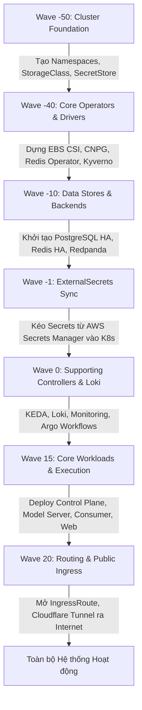

# Kubernetes (K8s) - Quản trị Hạ tầng Khai báo & GitOps (Declarative GitOps Platform)

Thư mục `k8s/` chứa toàn bộ cấu hình khai báo (Declarative Manifests) quản lý toàn bộ vòng đời hạ tầng phần mềm, các dịch vụ nền tảng (Platform Services), pipeline thực thi MLOps (Argo Workflows/Events) và các ứng dụng vi dịch vụ (Microservices) của hệ thống MLOps PaaS theo mô hình **GitOps**.

---

## 1. Giới thiệu

### 1.1. Vai trò trong hệ thống
Trong kiến trúc tổng thể, `k8s/` đóng vai trò là **Nguồn chân lý duy nhất (Single Source of Truth - SSOT)** cho toàn bộ cụm Kubernetes:
- Mọi tài nguyên trong cụm Kubernetes (Namespace, StorageClass, CRD, RBAC, NetworkPolicy, StatefulSet, Deployment, Service, IngressRoute) đều được mô tả tường minh bằng code (Kustomize & Helm Charts).
- **Argo CD** đóng vai trò là Controller liên tục đối soát trạng thái mong muốn (*Desired State*) trên nhánh Git `main` với trạng thái thực tế (*Live State*) trên cụm K3s. Bất kỳ sự sai lệch (*Drift*) nào sẽ được tự động đồng bộ hóa (*Self-heal*).
- Không có bất kỳ thay đổi nào được tạo ra bằng các lệnh `kubectl apply/edit` thủ công ngoài môi trường sản xuất; mọi cập nhật đều phải thông qua Git Commit / Pull Request.

```
+-----------------------------------------------------------------------------------+
|                                 GitHub Repository                                 |
|                               (Nhánh main / k8s/)                                 |
+-----------------------------------------------------------------------------------+
                                         │
                         Tự động phát hiện thay đổi (GitOps)
                                         ▼
+-----------------------------------------------------------------------------------+
|                        Argo CD (Root App: mlops-paas-system)                      |
|                  Điều phối đồng bộ theo 5 Mặt phẳng (5 Planes)                    |
+-----------------------------------------------------------------------------------+
     │                │                 │                  │                │
     ▼                ▼                 ▼                  ▼                ▼
[1. Cluster]    [2. Addons]       [3. Platform]      [4. Execution]   [5. Workloads]
- Namespaces    - EBS CSI         - Postgres HA      - EventBus       - Control Plane
- StorageClass  - ExternalSecrets - Redis HA         - EventSource    - Celery Worker
- SecretStore   - CNPG Operator   - Redpanda Kafka   - Sensors        - Model Server
- Kyverno       - Redis Operator  - Harbor Registry  - Templates      - Consumer
- Karpenter     - KEDA / Loki     - MLflow Server    - Pipelines      - Web Frontend
```

---

### 1.2. Các thành phần chính (Kiến trúc 5 Mặt phẳng - System Planes)

Hệ thống được chia thành 5 mặt phẳng độc lập tương ứng với 5 **Argo CD AppProject**:

| Mặt phẳng (Plane) | Đường dẫn mã nguồn | Argo CD AppProject | Trách nhiệm chính |
|---|---|---|---|
| **GitOps Control Plane** | `k8s/gitops/production` | `default` | Ứng dụng gốc `mlops-paas-system` quản lý AppProject và 34 Child Application. |
| **Cluster Plane** | `k8s/cluster` | `mlops-cluster` | Cấu hình nền tảng cấp cụm: Namespace, StorageClass (`ebs-gp3`), `ClusterSecretStore`, Kyverno Policies, Karpenter Capacity. |
| **Add-ons Plane** | Charts upstream được ghim | `mlops-addons` | Các Controller/CRD cơ sở: AWS EBS CSI, External Secrets Operator (ESO), CloudNative-PG, Redis Operator, KEDA, Prometheus Stack, Loki, Alloy, Kyverno, Kubeflow Training. |
| **Platform Plane** | `k8s/platform` | `mlops-platform` | Các dịch vụ dữ liệu & chia sẻ dùng chung: CSDL PostgreSQL HA, Redis HA + Sentinel, Redpanda Kafka, Harbor Registry, MLflow, Traefik Routing & Cloudflare Tunnel. |
| **Execution Plane** | `k8s/argo` | `mlops-execution` | Động cơ pipeline MLOps: Argo Events (EventBus, EventSource, Sensor) và các mẫu Argo WorkflowTemplates (Build, Deploy, Delete, Drift, Training). |
| **Workloads Plane** | `k8s/apps/overlays/production` | `mlops-workloads` | Các microservices nghiệp vụ của tenant và hệ thống: Control Plane API, Celery Worker, Model Server, Redpanda Consumer, Web Frontend. |

---

### 1.3. Luồng hoạt động & Thứ tự đồng bộ (Sync Wave Ordering)

Để tránh xung đột phụ thuộc (ví dụ: Service khởi động trước khi có Namespace hoặc Database), Argo CD thực hiện đồng bộ theo các **Sync Wave** nghiêm ngặt:



- **Wave -50:** `mlops-prod-cluster-namespaces`, `mlops-prod-cluster-storage` (tạo toàn bộ namespace và StorageClass trước).
- **Wave -40:** Cài đặt các operator hạ tầng (`redis-operator`, `cloudnative-pg`, `external-secrets`, `aws-ebs-csi`).
- **Wave -10:** Khởi tạo các cụm lưu trữ dữ liệu nền tảng (`mlops-prod-platform-postgres`, `mlops-prod-platform-redis`, `mlops-prod-platform-redpanda`).
- **Wave -1:** Đồng bộ các `ExternalSecret` tương ứng tại từng workload để sẵn sàng nạp mật khẩu/token.
- **Wave 15:** Triển khai các ứng dụng chính (`control-plane`, `consumer`, `model-server`, `web`) và pipeline `execution-argo`.
- **Wave 20:** Kích hoạt routing ngoài (`routing`, `cloudflare`), mở cổng cho người dùng truy cập.

---

## 2. Cấu trúc cây thư mục

```text
k8s/
├── kustomization.yaml                  # Kustomize entrypoint gốc của toàn bộ kho mã nguồn
├── argocd/                             # Định nghĩa ứng dụng gốc Argo CD
│   ├── application.yaml                # Manifest Root Application (mlops-paas-system)
│   └── values.yaml                     # Helm values tùy chỉnh cho Argo CD server
├── cluster/                            # Cấu hình cụm dùng chung (Cluster Configuration)
│   ├── namespaces/                     # Định nghĩa toàn bộ production namespaces
│   ├── storage/                        # Khai báo AWS EBS gp3 StorageClass
│   ├── secret-store/                   # ClusterSecretStore liên kết AWS Secrets Manager
│   ├── policies/                       # Chính sách bảo mật kiểm tra chữ ký ảnh (Kyverno)
│   └── karpenter/                      # EC2NodeClass & NodePools mở rộng tài nguyên tính toán
├── gitops/                             # Định nghĩa cấu trúc phân tầng Argo CD (App-of-Apps)
│   └── production/                     # Môi trường production
│       ├── kustomization.yaml          # Tổng hợp projects, repositories và applications
│       ├── projects/                   # 5 AppProject kiểm soát phạm vi và quyền hạn
│       ├── repositories/               # Cấu hình Git repository nguồn
│       └── applications/               # Định nghĩa 34 Argo CD Child Application
│           ├── cluster/                # Ứng dụng cấu hình cụm
│           ├── addons/                 # Ứng dụng cài đặt các Helm Chart bên thứ ba
│           ├── platform/               # Ứng dụng dịch vụ nền tảng (DB, Cache, Broker, Logging)
│           ├── execution/              # Ứng dụng quản lý pipeline Argo Events/Workflows
│           └── workloads/              # Ứng dụng nghiệp vụ người dùng (API, Web, Model Server)
├── platform/                           # Manifest chi tiết của các dịch vụ dùng chung
│   ├── postgres/                       # CloudNative-PG Cluster HA, Pooler, ScheduledBackup
│   ├── redis/                          # Redis HA Replication (2 nodes) + Redis Sentinel (3 nodes)
│   ├── redpanda/                       # Redpanda Kafka Broker StatefulSet & Services
│   ├── harbor/                         # Cấu hình Container Registry nội bộ Harbor
│   ├── mlflow/                         # MLflow Tracking Server Deployment & Services
│   ├── observability/                  # ServiceMonitors, PodMonitors, PrometheusRules
│   ├── cloudflare/                     # Cloudflare Tunnel Daemon kết nối ra ngoài an toàn
│   └── routing/                        # Traefik IngressRoute, Middleware định tuyến tên miền
├── argo/                               # Hạ tầng điều phối tác vụ MLOps (Argo Events & Workflows)
│   ├── event-bus.yaml                  # NATS EventBus cho Argo Events
│   ├── event-source.yaml               # Webhook tiếp nhận tín hiệu từ Control Plane / GitHub
│   ├── sensor.yaml                     # Bộ lọc sự kiện và kích hoạt Workflow tương ứng
│   ├── external-secrets.yaml           # Secret kết nối và token xác thực webhook
│   └── workflow-templates/             # Mẫu template pipeline: build, deploy, delete, drift, training
├── apps/                               # Mã nguồn Kubernetes của các Microservices ứng dụng
│   ├── base/                           # Manifest cơ sở (environment-agnostic, dùng chung)
│   │   ├── control-plane/              # Deployment Django API, Celery Worker, Beat
│   │   ├── consumer/                   # Deployment Redpanda consumer tiếp nhận sự kiện
│   │   ├── model-server/               # Deployment model-server điều phối suy luận
│   │   └── web/                        # Deployment ReactJS frontend dashboard
│   └── overlays/                       # Cấu hình ghi đè theo môi trường (Environment Overlays)
│       └── production/                 # Overlay cụ thể cho Production (Image tags, Ingress, Secrets)
├── security/                           # Các chính sách bảo mật NetworkPolicy dự phòng mở rộng
└── validate/                           # Bộ kiểm thử tự động xác thực tính toàn vẹn Manifest
    ├── tests/                          # 14 bài test tự động với pytest
    ├── validate_gitops.py              # Kiểm tra cấu trúc phân rã GitOps
    ├── validate_redis_ha.py            # Kiểm tra ràng buộc cấu hình Redis HA
    └── validate_secrets_contract.py    # Kiểm tra tính hợp lệ của hợp đồng Secrets
```

---

## 3. Hướng dẫn khởi chạy và các lệnh cần thiết

### 3.1. Kiểm tra tính hợp lệ trước khi đẩy mã nguồn (Local Validation)
Trước khi commit hoặc tạo PR thay đổi cấu hình Kubernetes, bắt buộc phải chạy bộ kiểm tra tĩnh:

```bash
# 1. Kiểm tra cú pháp Kustomize và Helm rendering
kubectl kustomize --enable-helm k8s >/dev/null

# 2. Chạy toàn bộ 14 bài kiểm tra tự động (Validators test suite)
python -m pytest k8s/validate/tests/
```

Bộ kiểm tra tự động sẽ xác thực:
- Ràng buộc cấu hình Redis HA (đúng tên secret, đúng số replica, không lộ mật khẩu).
- Tính nhất quán của các ExternalSecret (không xung đột thuộc tính defaulting của ESO).
- Ràng buộc cấu hình Argo CD AppProject và Application destination.
- Cấu trúc thư mục Kustomize base và overlay.

---

### 3.2. Giám sát và Quản trị ứng dụng qua Argo CD CLI / Kubectl

Kết nối trực tiếp tới cụm K3s (hoặc qua SSH tunnel):

```bash
# 1. Liệt kê toàn bộ các Application cùng trạng thái Sync và Health:
kubectl get applications -n argocd -o custom-columns=NAME:.metadata.name,SYNC:.status.sync.status,HEALTH:.status.health.status

# 2. Xem chi tiết trạng thái hoặc lỗi của một Application cụ thể:
kubectl get application mlops-prod-workload-control-plane -n argocd -o yaml

# 3. Yêu cầu Argo CD kiểm tra lại mã nguồn Git ngay lập tức (Hard Refresh):
kubectl annotate application mlops-paas-system -n argocd argocd.argoproj.io/refresh=hard --overwrite

# 4. Kích hoạt đồng bộ thủ công có dọn dẹp tài nguyên thừa (Force Sync & Prune):
kubectl patch application <application-name> -n argocd --type merge -p '{"operation":{"sync":{"prune":true}}}'
```

---

### 3.3. Quy trình Triển khai / Nâng cấp (Deployment Workflow)

1. **Cập nhật mã nguồn hoặc Image Tag:**
   - Khi CI/CD xây dựng image mới, GitHub Actions sẽ chỉ cập nhật `newTag` trong file [k8s/apps/overlays/production/\<service\>/kustomization.yaml](file:///d:/AI%20Models/mlops-paas-system/k8s/apps/overlays/production/).
2. **Tạo Pull Request và Merge vào `main`:**
   - Tránh sửa trực tiếp trên nhánh `main`.
3. **Argo CD tự động đối soát:**
   - Trong vòng 3 phút (hoặc ngay lập tức nếu có Webhook), Argo CD sẽ phát hiện commit mới và tiến hành rolling update pod mà không làm gián đoạn dịch vụ.

---

## 4. Các chú ý quan trọng (Important Notes)

> [!CAUTION]
> **Không sửa trực tiếp trên Cụm (No Ad-hoc Mutations):**
> Tuyệt đối không dùng lệnh `kubectl edit` hay `kubectl apply` để sửa đổi tài nguyên do Argo CD quản lý trên cluster. Cơ chế `selfHeal: true` của Argo CD sẽ tự động phát hiện và ghi đè lại cấu hình từ Git, làm mất toàn bộ các chỉnh sửa thủ công của bạn.

> [!WARNING]
> **Bảo mật Secret và ExternalSecret:**
> - Tuyệt đối không commit file chứa dữ liệu mật (`Secret` thật với base64) vào Git.
> - Mọi mật khẩu và API token phải được đẩy lên **AWS Secrets Manager** bằng script `scripts/create_and_push_secrets_to_aws.py`.
> - Manifest trong Git chỉ khai báo `ExternalSecret` với 4 trường defaulting bắt buộc để tránh lỗi drift:
>   ```yaml
>   conversionStrategy: Default
>   decodingStrategy: None
>   metadataPolicy: None
>   nullBytePolicy: Ignore
>   ```

> [!IMPORTANT]
> **Chính sách Xác thực Chữ ký Ảnh Container (Kyverno Image Verification):**
> Toàn bộ image thuộc namespace hệ thống (`registry.mlops-nids-nt114.id.vn/mlops-paas/*`) bắt buộc phải được ký điện tử không khóa (**Keyless Cosign**) bởi GitHub Actions workflow `cd.yml` trên nhánh `main`. Kyverno sẽ từ chối khởi chạy (*Admission Denied*) bất kỳ container nào chưa được ký hoặc ký sai danh tính.

> [!TIP]
> **Bảo trì Cụm Redis HA & PostgreSQL HA:**
> - Cụm Redis HA sử dụng mô hình 2 Redis Data Nodes + 3 Sentinel Nodes. Sentinel đạt quorum khi có tối thiểu 2 node đồng thuận.
> - Cụm PostgreSQL sử dụng CloudNative-PG với 2 instance đồng bộ streaming replication.
> - Khi cần drain hoặc restart node bảo trì, chỉ được thao tác **từng node một** (`one node at a time`) và luôn kiểm tra quorum phục hồi trước khi chuyển sang node tiếp theo.
